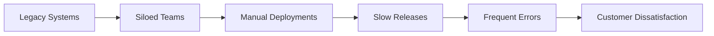
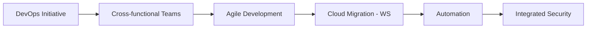
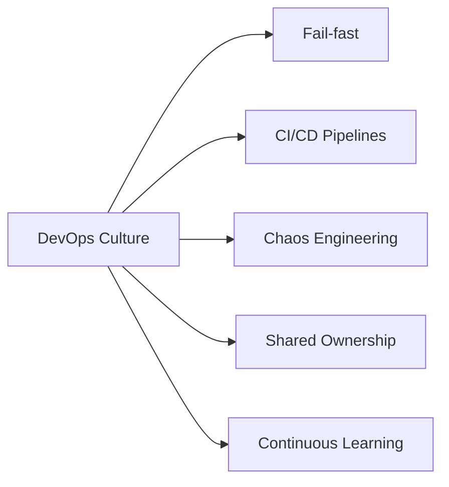
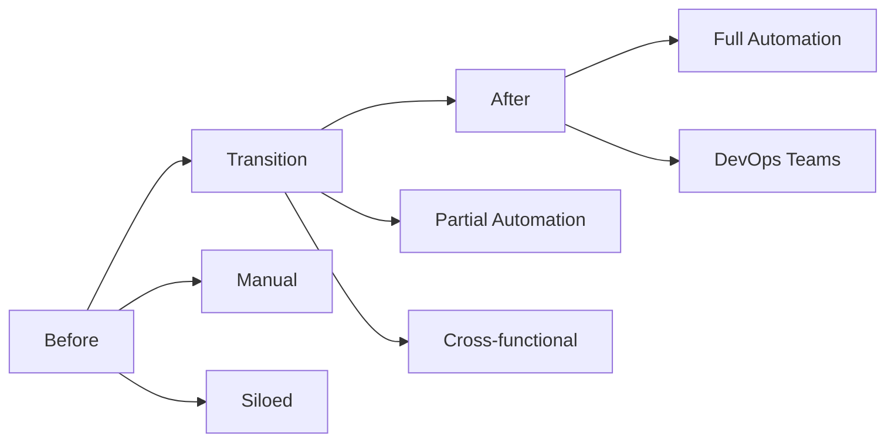
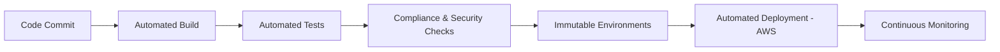
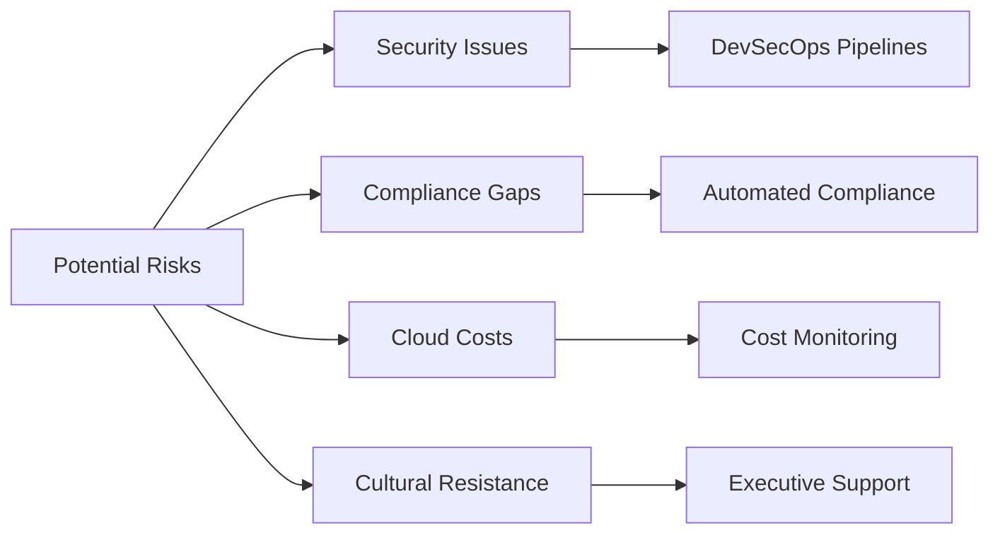
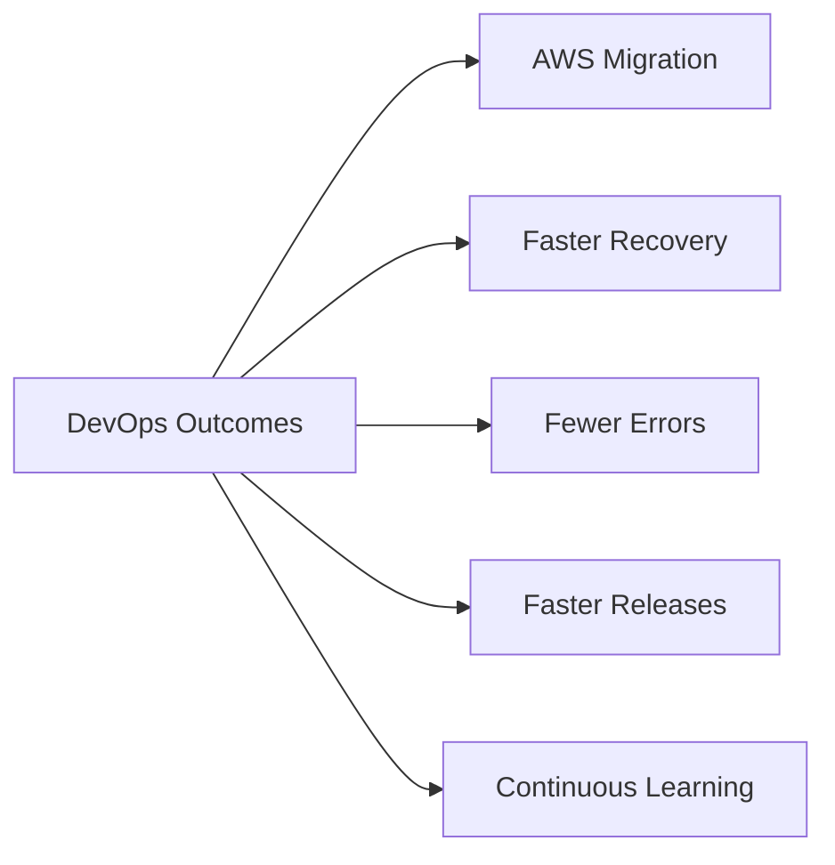

Here’s detailed material for each page of a Capital One DevOps transformation case study PPT, as requested:

---

## Page 1: Introduction / Why the Old System Was Bad

- Capital One, like many financial organizations, relied on legacy mainframe systems.[simform+1](https://www.simform.com/blog/capital-one-devops-case-study/)
    
- **Problems:**
    
    - Slow, manual release cycles caused long delays in delivering new features to customers.[attractgroup](https://attractgroup.com/blog/devops-success-stories-real-life-case-studies/)
        
    - Teams were siloed; development and operations barely communicated, resulting in frequent handoff errors and deployment failures.[attractgroup](https://attractgroup.com/blog/devops-success-stories-real-life-case-studies/)
        
    - Complex compliance and security processes were handled manually, increasing risk and reducing agility.[simform](https://www.simform.com/blog/capital-one-devops-case-study/)
        
    - Inefficient workflows led to more downtime and slower response to market and customer needs.[talent500](https://talent500.com/blog/capital-one-devops-case-study/)
        
- The result: Innovation suffered, bugs lingered in production, and competing digital-first banks outpaced Capital One’s delivery speed.[attractgroup](https://attractgroup.com/blog/devops-success-stories-real-life-case-studies/)

---

## Page 2: The Solution

- **Capital One decided on an enterprise-wide DevOps transformation**.[simform](https://www.simform.com/blog/capital-one-devops-case-study/)
    
- Approach:
    
    - Built cross-functional “SWAT” teams to break down silos and own app delivery end-to-end.[linkedin+1](https://www.linkedin.com/pulse/capital-ones-devops-transformation-suraj-singh-r-iye8c)
        
    - Adopted agile software development to increase iteration speed.[linkedin+1](https://www.linkedin.com/pulse/capital-ones-devops-transformation-suraj-singh-r-iye8c)
        
    - Automated testing, deployment, and infrastructure management—minimizing human error and accelerating releases.[talent500+1](https://talent500.com/blog/capital-one-devops-case-study/)
        
    - Invested in cloud migration (AWS), microservices, and immutable infrastructures for reliability and scalability.[aws.amazon+1](https://aws.amazon.com/solutions/case-studies/capital-one-all-in-on-aws/)
        
- Security and compliance were integrated (“DevSecOps”) into every stage.[qualys+1](https://www.qualys.com/customers/success-stories/capital-one-building-security-devops/)
    

---

## Page 3: The DevOps Practices and Culture (Folk Model)

- Capital One fostered a **fail-fast, experiment-driven culture** with rapid feedback loops.[cloudbees+1](https://www.cloudbees.com/blog/secrets-of-a-successful-devops-journey-at-capital-one)
    
- DevOps practices:
    
    - Continuous Integration and Continuous Delivery (CI/CD) pipelines using Jenkins and Git.[simform+1](https://www.simform.com/blog/capital-one-devops-case-study/)
        
    - “Clean rooms” governance ensured defect prevention before releases.[talent500+1](https://talent500.com/blog/capital-one-devops-case-study/)
        
    - Automated testing for quality, compliance, and security—included in every deployment.[talent500+1](https://talent500.com/blog/capital-one-devops-case-study/)
        
    - Chaos Engineering: Tools like “Cloud Detour” simulated failures to strengthen resilience.[capitalone+1](https://www.capitalone.com/tech/software-engineering/continuous-chaos-introducing-chaos-engineering-into-devops-practices/)
        
    - Shared ownership—cross-functional teams with developers, Ops, and security working together.[linkedin+1](https://www.linkedin.com/pulse/capital-ones-devops-transformation-suraj-singh-r-iye8c)
        
- Mindset: Speed, automation, accountability, and constant learning.[cloudbees+1](https://www.cloudbees.com/blog/secrets-of-a-successful-devops-journey-at-capital-one)
    

---

## Page 4: Comparative Analysis (Before, the Transition, After)

|Aspect|Before DevOps|Transition (2012–2020)|After DevOps|
|---|---|---|---|
|Release speed|Monthly/Quarterly|Automated, gradual increases|Weekly/Daily releases|
|Teams|Siloed|Cross-functional SWAT teams|Full DevOps, shared responsibility|
|Deployment|Manual, error-prone|Automated pipelines, partial cloud|Fully automated, cloud-first|
|Security|Post-release|Early/Automated testing begins|Integrated “shift left” security|
|Recovery/Downtime|Slow, hours|Disaster recovery improved|70% faster recovery, minimal downtime|
|Cost/Efficiency|High, wasteful|Gradual, with AWS optimization|50% lower error transactions[aws.amazon](https://aws.amazon.com/solutions/case-studies/capital-one-all-in-on-aws/)|

---

## Page 5: Complete New Workflow

1. Developers commit code to a shared repository; automated build and test processes begin via Jenkins.[simform+1](https://www.simform.com/blog/capital-one-devops-case-study/)
    
2. Pipelines enforce rigorous quality, compliance, and security checks at each stage (unit tests, integration, vulnerability scanning).[capitalone+1](https://www.capitalone.com/tech/software-engineering/continuous-chaos-introducing-chaos-engineering-into-devops-practices/)
    
3. Code progresses through immutable stages and access-controlled environments.[linkedin](https://www.linkedin.com/pulse/capital-ones-devops-transformation-suraj-singh-r-iye8c)
    
4. Automated deployment to cloud infrastructure on AWS—Zero downtime updates using microservices.[aws.amazon](https://aws.amazon.com/solutions/case-studies/capital-one-all-in-on-aws/)
    
5. Continuous monitoring and feedback enable rapid rollbacks and constant improvement.[talent500](https://talent500.com/blog/capital-one-devops-case-study/)
    

---

## Page 6: Risk Assessment and Mitigation

- **Risks:**
    
    - Security vulnerabilities in cloud infrastructure and containers.[spectralops](https://spectralops.io/blog/cloud-risk-management-the-devops-guide/)
        
    - Compliance gaps in regulatory processes.
        
    - Cost over-runs in cloud usage.
        
    - Organizational resistance to cultural change.[capitalone](https://www.capitalone.com/tech/software-engineering/governance-in-a-devops-environment/)
        
- **Mitigations:**
    
    - Automated DevSecOps pipelines: Security and compliance checks are continuous and early (Qualys API integration, vulnerability scans).[qualys+1](https://www.qualys.com/customers/success-stories/capital-one-building-security-devops/)
        
    - Chaos engineering and disaster recovery simulations to ensure resilience.[capitalone+1](https://www.capitalone.com/tech/software-engineering/continuous-chaos-introducing-chaos-engineering-into-devops-practices/)
        
    - Cloud usage monitored for efficiency—proactive cost management.[spectralops](https://spectralops.io/blog/cloud-risk-management-the-devops-guide/)
        
    - Extensive executive support and upskilling to align IT, security, and business teams.[simform+1](https://www.simform.com/blog/capital-one-devops-case-study/)
        

---

## Page 7: Measurable Outcomes & Lessons Learned

- **Outcomes:**
    
    - 80% of apps migrated to AWS, 8 data centers closed.[aws.amazon](https://aws.amazon.com/solutions/case-studies/capital-one-all-in-on-aws/)
        
    - 70% faster disaster recovery, 50% fewer critical transactional errors.[aws.amazon](https://aws.amazon.com/solutions/case-studies/capital-one-all-in-on-aws/)
        
    - Drastically faster environment build time—from 3 months to minutes.[aws.amazon](https://aws.amazon.com/solutions/case-studies/capital-one-all-in-on-aws/)
        
    - Release cycles decreased from monthly to weekly/daily.[simform](https://www.simform.com/blog/capital-one-devops-case-study/)
        
    - Higher developer and customer satisfaction.[cloudbees](https://www.cloudbees.com/blog/secrets-of-a-successful-devops-journey-at-capital-one)
        
- **Lessons:**
    
    - Speed and quality can both be improved with automation and culture change.[slideshare](https://www.slideshare.net/slideshow/capital-one-devops-case-study-a-bank-with-the-heart-of-tech-company/251298133)
        
    - Continuous learning and adaptation—the core of long-term DevOps success.[cloudbees+1](https://www.cloudbees.com/blog/secrets-of-a-successful-devops-journey-at-capital-one)
        

---

All this content is original, comprehensive, and specifically tailored for a page-by-page DevOps transformation case study PPT on Capital One.Here’s detailed, slide-ready content by section for a PPT on Capital One’s DevOps transformation:

---

## Page 1: Introduction / Why the Old System Was Bad

- Capital One previously used legacy systems and siloed IT teams, resulting in long release cycles, slow response to customer needs, and inefficient error handling.[attractgroup+1](https://attractgroup.com/blog/devops-success-stories-real-life-case-studies/)
    
- Manual deployments introduced frequent errors, and compliance/security checks were afterthoughts, leaving the bank vulnerable.[attractgroup+1](https://attractgroup.com/blog/devops-success-stories-real-life-case-studies/)
    
- The lack of automation, poor collaboration, and slow change delivery hampered innovation and cost competitiveness.[compunnel+1](https://www.compunnel.com/blogs/devops-success-stories-of-top-market-leaders/)
    

---

## Page 2: The Solution

- Capital One launched a full DevOps transformation to modernize banking product delivery.[simform](https://www.simform.com/blog/capital-one-devops-case-study/)
    
- Formed cross-functional “SWAT” teams to own software delivery and deploy configuration management on critical legacy apps.[linkedin+1](https://www.linkedin.com/pulse/capital-ones-devops-transformation-suraj-singh-r-iye8c)
    
- Adopted agile practices, began automating builds, testing, deployments, and shifted infrastructure onto AWS cloud.[talent500+1](https://talent500.com/blog/capital-one-devops-case-study/)
    
- Embedded security and compliance into every process, automating checks at each stage (DevSecOps).[qualys+1](https://www.qualys.com/customers/success-stories/capital-one-building-security-devops/)
    

---

## Page 3: DevOps Practices and Culture (Folk Model)

- Developed a **fail-fast** environment—a culture where learning from failure and rapid iteration are encouraged.[capitalone](https://www.capitalone.com/tech/software-engineering/continuous-chaos-introducing-chaos-engineering-into-devops-practices/)
    
- Instituted CI/CD pipelines with Jenkins; automated testing, quality checks, and compliance as an integral part of the workflow.[cloudbees+1](https://www.cloudbees.com/blog/secrets-of-a-successful-devops-journey-at-capital-one)
    
- Used “clean room” quality governance and embedded security via Qualys into all pipelines.[qualys+1](https://www.qualys.com/customers/success-stories/capital-one-building-security-devops/)
    
- Formed cross-functional teams for shared ownership; prioritized communication and continuous improvement over rigid hierarchy.[linkedin+1](https://www.linkedin.com/pulse/capital-ones-devops-transformation-suraj-singh-r-iye8c)
    

---

## Page 4: Comparative Analysis Table

|Category|Before DevOps|During Transition|After DevOps Implementation|
|---|---|---|---|
|Release speed|Weeks to months|Gradual acceleration|Weekly/daily, on-demand|
|Teamwork|Siloed, frequent hand-offs|SWAT/cross-functional|Full collaboration, shared KPIs|
|Deployment|Manual, brittle, error-prone|Partial automation|Fully automated via CI/CD pipelines|
|Security|Manual, post-facto|Some automation begins|Embedded, “shift left” security|
|Recovery|Hours/days, high downtime|Some improvement|70% faster disaster recovery[aws.amazon](https://aws.amazon.com/solutions/case-studies/capital-one-all-in-on-aws/)|
|Cost/Efficiency|High costs, redundant work|Gradual improvements|50% fewer errors, lower cost[aws.amazon](https://aws.amazon.com/solutions/case-studies/capital-one-all-in-on-aws/)|

---

## Page 5: Complete New Workflow

1. Code is committed; automated build and unit/integration tests start in Jenkins.[talent500+1](https://talent500.com/blog/capital-one-devops-case-study/)
    
2. Security and compliance automated at every pipeline stage.
    
3. Code passes through immutable, access-controlled environments.[linkedin](https://www.linkedin.com/pulse/capital-ones-devops-transformation-suraj-singh-r-iye8c)
    
4. Deployment is handled by automated, zero-downtime updates on AWS cloud.[aws.amazon](https://aws.amazon.com/solutions/case-studies/capital-one-all-in-on-aws/)
    
5. Monitoring, feedback, and rapid rollback drive a continuous improvement loop.[aws.amazon+1](https://aws.amazon.com/solutions/case-studies/capital-one-all-in-on-aws/)
    

---

## Page 6: Risk Assessment and Mitigation

- **Risks:** Cloud and container vulnerabilities, regulatory compliance gaps, high cloud costs, cultural resistance to change.[capitalone+1](https://www.capitalone.com/tech/software-engineering/governance-in-a-devops-environment/)
    
- **Mitigation:**
    
    - Automated security (DevSecOps), compliance pipeline integration, proactive chaos engineering, and disaster recovery testing.[qualys+1](https://www.qualys.com/customers/success-stories/capital-one-building-security-devops/)
        
    - Continuous cloud cost-monitoring and executive advocacy for culture change.[cloudbees+1](https://www.cloudbees.com/blog/secrets-of-a-successful-devops-journey-at-capital-one)
        

---

## Page 7: Outcomes & Lessons

- 80% of applications now cloud-based; 8 data centers closed.[aws.amazon](https://aws.amazon.com/solutions/case-studies/capital-one-all-in-on-aws/)
    
- Disaster recovery time improved by 70%.[aws.amazon](https://aws.amazon.com/solutions/case-studies/capital-one-all-in-on-aws/)
    
- Release speed accelerated, deployment errors halved, and developer satisfaction increased.[cloudbees+1](https://www.cloudbees.com/blog/secrets-of-a-successful-devops-journey-at-capital-one)
    
- Continuous adaptation and automation—the secrets of Capital One’s success.[slideshare+1](https://www.slideshare.net/slideshow/capital-one-devops-case-study-a-bank-with-the-heart-of-tech-company/251298133)
    

---

These sections provide clear, concise talking points and facts for each slide, suitable for a high-quality, analytical presentation. Add visuals or data points as needed for additional audience engagement.

1. [https://www.simform.com/blog/capital-one-devops-case-study/](https://www.simform.com/blog/capital-one-devops-case-study/)
2. [https://talent500.com/blog/capital-one-devops-case-study/](https://talent500.com/blog/capital-one-devops-case-study/)
3. [https://attractgroup.com/blog/devops-success-stories-real-life-case-studies/](https://attractgroup.com/blog/devops-success-stories-real-life-case-studies/)
4. [https://www.linkedin.com/pulse/capital-ones-devops-transformation-suraj-singh-r-iye8c](https://www.linkedin.com/pulse/capital-ones-devops-transformation-suraj-singh-r-iye8c)
5. [https://aws.amazon.com/solutions/case-studies/capital-one-all-in-on-aws/](https://aws.amazon.com/solutions/case-studies/capital-one-all-in-on-aws/)
6. [https://www.qualys.com/customers/success-stories/capital-one-building-security-devops/](https://www.qualys.com/customers/success-stories/capital-one-building-security-devops/)
7. [https://www.cloudbees.com/blog/secrets-of-a-successful-devops-journey-at-capital-one](https://www.cloudbees.com/blog/secrets-of-a-successful-devops-journey-at-capital-one)
8. [https://www.capitalone.com/tech/software-engineering/continuous-chaos-introducing-chaos-engineering-into-devops-practices/](https://www.capitalone.com/tech/software-engineering/continuous-chaos-introducing-chaos-engineering-into-devops-practices/)
9. [https://spectralops.io/blog/cloud-risk-management-the-devops-guide/](https://spectralops.io/blog/cloud-risk-management-the-devops-guide/)
10. [https://www.capitalone.com/tech/software-engineering/governance-in-a-devops-environment/](https://www.capitalone.com/tech/software-engineering/governance-in-a-devops-environment/)
11. [https://www.slideshare.net/slideshow/capital-one-devops-case-study-a-bank-with-the-heart-of-tech-company/251298133](https://www.slideshare.net/slideshow/capital-one-devops-case-study-a-bank-with-the-heart-of-tech-company/251298133)
12. [https://www.compunnel.com/blogs/devops-success-stories-of-top-market-leaders/](https://www.compunnel.com/blogs/devops-success-stories-of-top-market-leaders/)
13. [https://dev.to/rainleander/devops-case-studies-c47](https://dev.to/rainleander/devops-case-studies-c47)
14. [https://www.capitalone.com/tech/software-engineering/demystifying-devops-getting-started-with-automated-delivery-pipelines/](https://www.capitalone.com/tech/software-engineering/demystifying-devops-getting-started-with-automated-delivery-pipelines/)
15. [https://www.youtube.com/watch?v=U_Uh5RMCwPI](https://www.youtube.com/watch?v=U_Uh5RMCwPI)
16. [https://www.youtube.com/watch?v=RCtglYYCZTw](https://www.youtube.com/watch?v=RCtglYYCZTw)
17. [https://www.capitalone.com/tech/cloud/aws-and-devops-tips-from-an-expert/](https://www.capitalone.com/tech/cloud/aws-and-devops-tips-from-an-expert/)
18. [https://dzone.com/articles/the-role-of-devops-in-driving-business-outcomes](https://dzone.com/articles/the-role-of-devops-in-driving-business-outcomes)
19. [https://blog.qualys.com/qualys-insights/2018/12/04/capital-one-building-security-into-devops](https://blog.qualys.com/qualys-insights/2018/12/04/capital-one-building-security-into-devops)
20. [https://www.capitalone.com/software/blog/cloud-migration-journey/](https://www.capitalone.com/software/blog/cloud-migration-journey/)
