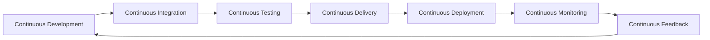

1. **Definition**:  DevOps is a set of practices, cultural philosophies, and tools that integrates software development (Dev) and IT operations (Ops) to increase an organization's ability to deliver applications and services at high velocity.
2. **Goals**: Accelerate software delivery, improve product quality, and enhance collaboration between development and operations teams.
3. **Core Principles**: Automation, collaboration, continuous improvement, and monitoring.
4. **Benefits**: Faster time-to-market, reduced risk, improved reliability, and better customer satisfaction.
## DevOps Lifecycle Stages

| Stage                  | Definition                                          | Key Activities                                                                 | Key Features                                                              | Benefits                                          | Common Tools                            |
| ---------------------- | --------------------------------------------------- | ------------------------------------------------------------------------------ | ------------------------------------------------------------------------- | ------------------------------------------------- | --------------------------------------- |
| Continuous Development | Ongoing planning, coding, and versioning            | Planning, coding, version control                                              | Version control, agile methods, collaboration, branching                  | Faster delivery, improved quality, reduced risk   | Git, GitLab, GitHub                     |
| Continuous Integration | Frequent code merging, automated builds and tests   | Merging code, automated builds, unit tests                                     | CI tools, automated pipelines, integration testing, feedback              | Early issue detection, higher reliability         | Jenkins, Travis CI, CircleCI            |
| Continuous Testing     | Automated tests throughout lifecycle                | Automated tests (unit, integration, performance, security)                     | Unit/integration/functional tests, coverage, reporting                    | Higher confidence, faster defect resolution       | Selenium, JUnit, TestNG, SonarQube      |
| Continuous Delivery    | Automated release preparation, ready for deployment | Automated release management, staging, manual approvals                        | Build/test/deploy pipelines, artifact management, IaC, approval gates     | Faster releases, reduced risk, scalability        | Docker, Kubernetes, Ansible, Helm       |
| Continuous Deployment  | Automated deployment to production                  | Automated deployment to production, configuration management, containerization | Full automation, real-time release, deployment tools, rollback mechanisms | Rapid delivery, faster feedback, less manual work | ArgoCD, Chef, Puppet, Terraform         |
| Continuous Monitoring  | Ongoing tracking of system and application health   | Performance tracking, logging, alerting, feedback                              | Metrics/logs, alerting, monitoring tools, event management                | Early issue detection, reliability, data-driven   | Prometheus, Grafana, ELK Stack, Datadog |
| Continuous Feedback    | Gathering and acting on user/system feedback        | User feedback, incident response, process improvement                          | User analytics, incident reviews, retrospectives, process integration     | Enhanced quality, faster improvement, learning    | New Relic, Datadog, ELK Stack           |
## Continuous Delivery (CD)
1. **Definition**: Continuous Delivery is the practice of automatically preparing code changes for release to production, ensuring that software can be reliably released at any time.
2. **Key Features**
    a. Automated build, test, and deployment pipelines
    b. Manual approval gates for production releases
    c. Infrastructure as Code (IaC) for environment consistency
    d. Frequent, small batch releases for reduced risk
3. **Benefits**
    a. Faster, safer releases
    b. Improved scalability and repeatability
    c. Reduced downtime and errors

| Phase   | Description                                                                 |
| ------- | --------------------------------------------------------------------------- |
| Code    | Developers write and organize code using version control tools              |
| Build   | Code is compiled and packaged into deployable format                        |
| Test    | Automated and manual tests ensure code quality and security                 |
| Release | Software is deployed in staging, then rolled out to production              |
| Deploy  | Infrastructure is provisioned, code is released to production               |
| Operate | Application is managed, configured, and maintained in production            |
| Monitor | System performance and user feedback are tracked for continuous improvement |

