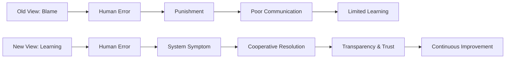
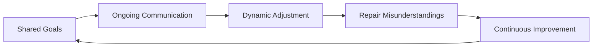

## A. Folk Model

1. **Definition of Folk Model**: Folk models are mental models or cognitive schemas shared by a group, but not always accurate, leading to miscommunication or erroneous decisions.
2. **Characteristics of Folk Models**
    a. Intersubjective sharing: Everyone in the group knows the schema, and knows that others know it too.
    b. Schemas help people understand and interpret the world by connecting specific events to conceptual roles (e.g., buyer, seller, merchandise in a buying schema).
3. **DevOps as a Folk Model**
    a. DevOps has become a folk model—used as a buzzword, often referring to CICD, automation, and testing, but not always understood deeply.
    b. The model is learned informally, pieced together from observations, leading to gaps and inefficiencies in practice.
    c. Different groups use the term with different intent, causing miscommunication.
4. **Implications**
    a. Folk models are not inherently bad, but become problematic when intent and understanding diverge between groups.
    b. Behind the buzzword, DevOps is a cultural phenomenon focused on collaboration, empathy, and sustainable work practices.

## B. The Old View vs The New View

| Aspect                | Old View (Blame Culture)                  | New View (Learning Culture)                |
|----------------------|-------------------------------------------|--------------------------------------------|
| Error Handling       | Blame individuals, punish mistakes        | Treat errors as system symptoms, learn     |
| Communication        | Poor, fear-driven                         | Open, transparent, trust-based            |
| Team Dynamics        | Defensive, siloed                         | Collaborative, cross-functional           |
| Improvement          | Focus on eliminating human error          | Focus on system/process improvement       |
| Knowledge Sharing    | Limited, fear of repercussions            | Active, stories shared for learning       |

## C. The DevOps Compact

1. **Definition**: The DevOps Compact is an agreement among teams to work together, communicate intentions and issues, and dynamically adjust to achieve shared goals.

2. **Core Principles**
    a. Shared, clearly defined goals
    b. Ongoing communication
    c. Dynamic adjustment and repair of understanding

3. **Key Features**
    a. Teams operate with mutual understanding and trust
    b. Issues and misunderstandings are repaired collaboratively
    c. Continuous feedback and improvement
    d. Example: Two employees from different teams (developer and operations) communicate expectations, check each other's work, and maintain safety and trust

4. **Benefits**
    a. Increased transparency and trust
    b. Faster problem resolution
    c. More innovation and learning
    d. Alignment with organizational goals

