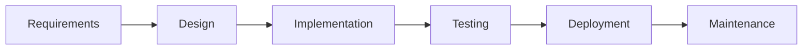
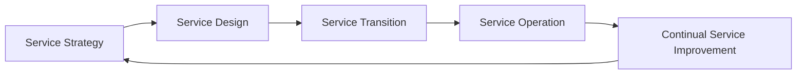
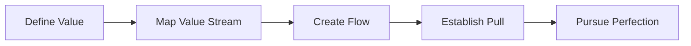

## A. Software Development Methodologies
1. **Definition** : Structured approaches to organizing, planning, and executing software development work, often split into distinct phases or cycles.
2. **Major Methodologies**  
    a. **Waterfall**: Sequential progression through stages (requirements, design, implementation, integration, testing, installation, maintenance). Each stage must be completed before moving to the next.  
    b. **Agile**: Emphasizes flexibility, collaboration, and iterative development. Values individuals and interactions, working software, customer collaboration, and responding to change. Includes frameworks like Scrum.  
    c. **Scrum**: Agile framework using sprints (1–4 weeks), daily standups, sprint planning, reviews, and retrospectives. Scrum Master facilitates team progress and removes blockers.
3. **Key Concepts**  
    a. **Version Control**: Tracks changes, enables collaboration, supports branching/merging, and rollback.  
    b. **Test-Driven Development (TDD)**: Write tests before code, ensuring clear requirements and higher code quality.  
    c. **Continuous Integration (CI)**: Frequent code merges, automated builds/tests, rapid feedback, avoids "merge hell".
    d. **Continuous Delivery/Deployment (CD)**: Automated release preparation and deployment, frequent and reliable releases.  
    e. **Minimum Viable Product (MVP)**: Build minimal product to validate ideas and reduce waste.

## B. Operations Methodologies

1. **Definition**: Frameworks and practices for managing IT services, infrastructure, and operational processes.
2. **Major Methodologies**  
    a. **ITIL (Information Technology Infrastructure Library)**: Best practices for IT service management, organized into five core sections:  
	    i. Service Strategy: Align IT with business goals  
	    ii. Service Design: Design services and supporting elements  
	    iii. Service Transition: Manage changes and releases  
	    iv. Service Operation: Daily management and support  
	    v. Continual Service Improvement: Ongoing process optimization.  
    b. **COBIT (Control Objectives for Information and Related Technology)**: Governance and management framework for aligning IT and business goals, holistic approach, separates governance from management.
3. **Key Concepts**  
    a. **Configuration Management**: Maintain consistency of system attributes and performance throughout lifecycle.  
    b. **Infrastructure Automation**: Provision and manage infrastructure as code, reduce manual work, increase repeatability.
    c. **Monitoring & Alerting**: Track system health, performance, and generate alerts for issues.
    d. **Capacity Management**: Ensure resources meet current/future needs cost-effectively.

## C. Systems Methodologies

1. **Definition**: Approaches that focus on the system as a whole, optimizing value and minimizing waste across all components.
2. **Major Methodologies**  
    a. **Lean**: Maximize customer value, minimize waste. Five principles:  
	    i. Define Value  
	    ii. Map Value Stream  
	    iii. Create Flow  
	    iv. Establish Pull  
	    v. Pursue Perfection.  
    b. **Lean IT/Lean Software Development**: Apply Lean principles to IT/software, eliminate waste (e.g., unnecessary features, delays, defects).
3. **Key Concepts**  
    a. **Waste Elimination**: Remove non-value-adding activities (e.g., overproduction, defects, delays).  
    b. **Continuous Improvement**: Ongoing process optimization and learning.  
    c. **Flow Optimization**: Ensure smooth, uninterrupted progress of work.

|Category|Methodology|Key Features|Typical Benefits|
|---|---|---|---|
|Software Development|Waterfall|Sequential phases, rigid structure|Predictability, clear documentation|
|Software Development|Agile|Iterative cycles, collaboration, flexibility|Rapid response to change, customer focus|
|Software Development|Scrum|Sprints, daily standups, reviews, retrospectives|Fast feedback, team alignment|
|Operations|ITIL|Service lifecycle, best practices, process focus|Service quality, efficiency, compliance|
|Operations|COBIT|Governance, business-IT alignment, holistic approach|Risk management, strategic alignment|
|Systems|Lean|Value focus, waste elimination, continuous improvement|Efficiency, reduced cost, higher value|
|Systems|Lean IT/Software|Lean principles applied to IT/software, waste mapping|Faster delivery, less waste, improved flow|

