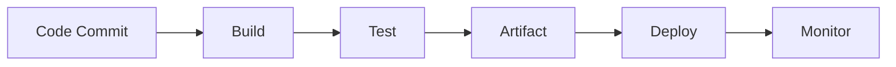

## A. Development, Release, and Deployment Concepts

| Concept               | Key Features                                  | Benefits                               |
| --------------------- | --------------------------------------------- | -------------------------------------- |
| Version Control       | Track changes, merge, restore, collaboration  | Risk reduction, rollback, teamwork     |
| TDD                   | Write tests first, clarify requirements       | Higher code quality, faster feedback   |
| CI                    | Frequent merges, automated builds/tests       | Early bug detection, avoids merge hell |
| CD                    | Automated release pipeline, frequent releases | Reliable, fast deployments             |
| Continuous Deployment | Automated prod deployment, rapid feedback     | Fast learning, customer satisfaction   |
| MVP                   | Minimal product, fast validation              | Reduced waste, quick iteration         |
| Artifact Management   | Store/manage build outputs, versioning        | Dependency control, repeatable builds  |
| Build Automation      | Automate build/test/lint/artifact steps       | Consistency, reliability               |
| Deployment Automation | Automate deployment/configuration             | Speed, error reduction                 |

## B. Infrastructure Concepts

| Concept                   | Key Features                                | Benefits                               |
| ------------------------- | ------------------------------------------- | -------------------------------------- |
| Configuration Mgmt        | Consistency, policies, lifecycle management | Reliable systems, reduced drift        |
| Cloud Computing           | On-demand, scalable, cost-effective         | Flexibility, rapid iteration           |
| Infrastructure Automation | Automated provisioning/configuration        | Repeatability, efficiency, reliability |
| Containers                | Isolated, fast, consistent environments     | Portability, reduced overhead          |
| Artifact Management       | Central repo, access control, versioning    | Dependency control, build promotion    |
| Cluster/OS Config         | Automated cluster/OS setup, reusable images | Scalability, consistency               |
| Monitoring/Alerting       | Metrics, logs, automated alerts             | Early issue detection, reliability     |
| Capacity Management       | Resource planning, cost optimization        | Performance, cost savings              |

## Cultural Concepts Table

|Concept|Key Features|Benefits|
|---|---|---|
|Retrospective|Regular review, discuss success/failure|Local learning, process improvement|
|Postmortem|Incident review, timeline, debrief, remediation|Organizational learning, systemic fixes|
|Blamelessness|Learning focus, open sharing, no punishment|Transparency, trust, better solutions|
|Organizational Learning|Continuous, deliberate, knowledge sharing|Company-wide improvement, adaptability|
|Generative Culture|Trust, collaboration, open communication|Innovation, rapid problem-solving|
|Open Source Collaboration|Sharing, contribution, transparency|Cooperation, learning, better solutions|
|Standardization of Tools|Consistency, flexibility, improved communication|Reduced duplication, effective collaboration|

