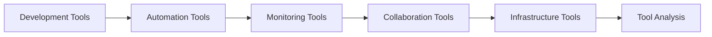
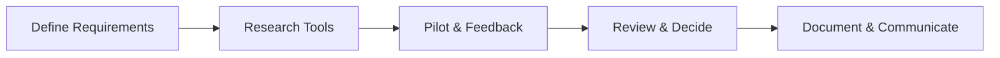

## A. Tools Ecosystem Overview
1. **Definition**  
    a. The tools ecosystem is the collection of software, platforms, and processes used to support development, automation, monitoring, and operations in an organization.
2. **Key Features**  
    a. Includes development, automation, monitoring, collaboration, and infrastructure tools.  
    b. Should be adaptable, scalable, and support organizational goals.

## B. Software Development Tools
1. **Version Control**: Git, GitHub, GitLab: Track changes, enable collaboration, support branching/merging.
2. **IDE & Editors**: VS Code, IntelliJ, Eclipse: Code writing, debugging, and refactoring.
3. **Build Tools**: Maven, Gradle, Ant: Automate compilation, testing, and packaging.
## C. Automation Tools
1. **CI/CD Platforms**: Jenkins, Travis CI, CircleCI: Automate build, test, and deployment pipelines.
2. **Configuration Management**: Ansible, Puppet, Chef: Automate infrastructure provisioning and configuration.    
3. **Containerization**: Docker, Kubernetes: Package and deploy applications in isolated environments.    
## D. Monitoring Tools
1. **Metrics & Logging**  
    a. Prometheus, Grafana: Collect and visualize system metrics.  
    b. ELK Stack (Elasticsearch, Logstash, Kibana): Aggregate and analyze logs.  
2. **Alerting**: PagerDuty, Opsgenie: Notify teams of incidents and outages.

## E. Right Tools for Real Problem

| Step                 | Description                                 |
| -------------------- | ------------------------------------------- |
| Problem Analysis     | Define the real issue                       |
| Requirement Mapping  | List must-have features                     |
| Tool Evaluation      | Compare tools against requirements          |
| Pilot & Feedback     | Test tool in real scenario, gather feedback |
| Adoption/Elimination | Decide to keep or remove tool               |

## F. Embracing Open Source
1. **Benefits**: Cost-effective, community-driven innovation, rapid updates, and transparency.
2. **Risks**: Support and security concerns, need for active maintenance/
## G. Standardization of Tools
1. **Definition**: Adopting a common set of tools across teams to improve consistency, communication, and support.
2. **Benefits**: Easier onboarding, reduced duplication, better collaboration, and streamlined support.
## H. Consistent Processes for Tool Analysis

## I. Exception to Standardization
1. **When Exceptions Are Needed**: Unique team needs, legacy systems, or specialized requirements may justify deviation from standard tools.
2. **Managing Exceptions**: Document rationale, ensure support, and review periodically.
## J. Selection and Elimination of Tools

|Criteria|Selection Example|Elimination Example|
|---|---|---|
|Fit for Purpose|Meets team needs|No longer solves problems|
|Usability|Easy to learn/use|Too complex/confusing|
|Support|Active community/vendor|Abandoned, no updates|
|Security|Secure, well-maintained|Vulnerable, unpatched|
|Cost|Affordable, value|Too expensive, low ROI|

