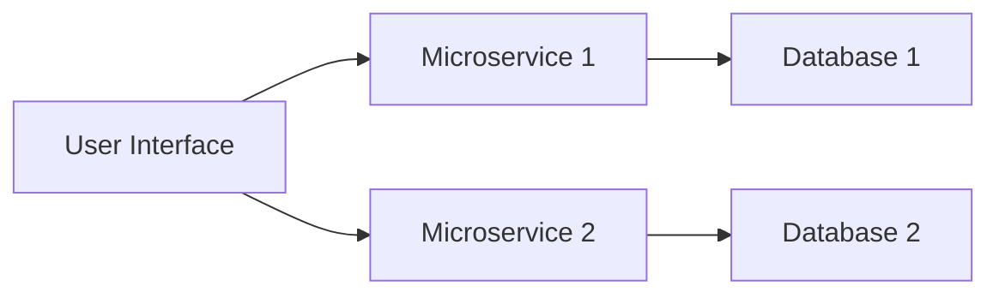
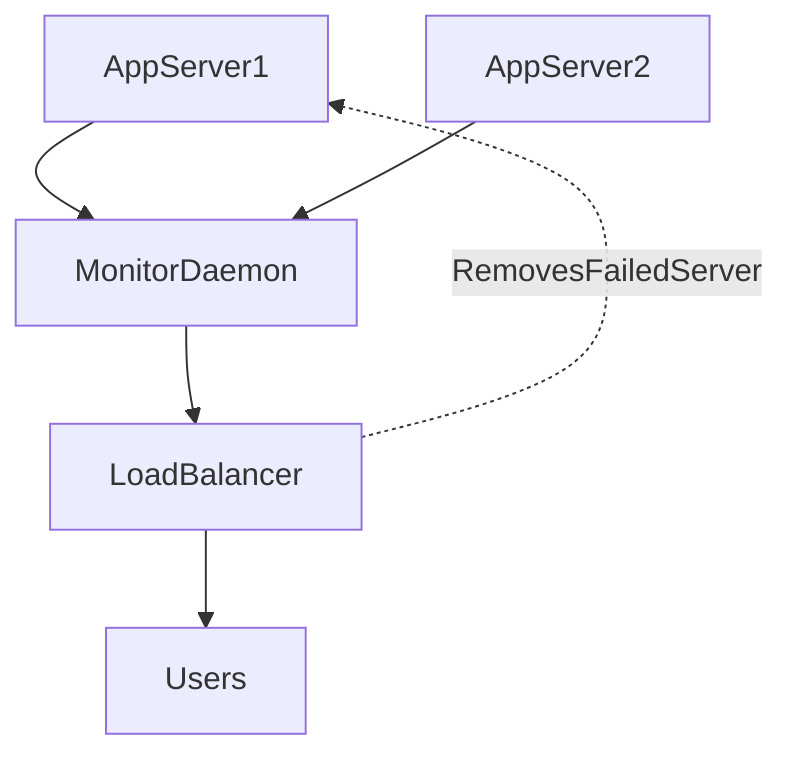

| Aspect          | Three-Tier Systems                              | Microservices Architecture                                |
| --------------- | ----------------------------------------------- | --------------------------------------------------------- |
| Composition     | Single application divided into 3 layers        | Multiple small independent services                       |
| Deployment      | Whole app or big parts deployed together        | Independent deployments of services                       |
| Data Management | Often single shared database                    | Independent or shared databases, complex data consistency |
| Communication   | Internal function calls                         | Language-agnostic protocols (HTTP/JSON REST)              |
| DevOps Fit      | Moderate, can lead to monolith issues           | High, facilitates continuous delivery                     |
| Resilience      | Lower failure points but harder to troubleshoot | Many failure points, needs monitoring and failover        |

## A. Three-Tier Systems
1. **Definition**: Architectural pattern dividing applications into three layers: Presentation, Logic, and Data tiers.
2. **Layers Description**:
    a. Presentation Tier: User interface layer, e.g., web frontend implemented with React, deployed as JavaScript and static HTML files.
    b. _Logic Tier_: Backend business logic implemented using languages/frameworks like Clojure on Java platform, Ruby, or Python.
    c. _Data Tier_: Database layer, typically using relational DBMS like PostgreSQL or Oracle, responsible for data storage and CRUD operations.
3. **Benefits**: Separation of concerns enables independent deployment and scaling of each tier.
4. **Challenges**:   
    a. Tighter coupling between Logic and Data tiers can occur if interfaces are not kept lean, risking monolithic behavior.  
    b. Database schema changes require special handling to preserve state, e.g., using migration tools like Liquibase, Flyway, or Migratus.
5. **Rolling Upgrades**:  
    a. Strategy to upgrade services and databases with minimal downtime by staggering deployments across servers and load balancing

## B. Microservices
1. **Definition**: Architectural style where the Logic tier comprises multiple small, independently deployable services communicating via language-agnostic protocols (often HTTP/JSON REST).
2. **Characteristics**:
    a. Each microservice can be developed, deployed, and scaled independently.  
    b. Promotes modularity and aligns well with Continuous Delivery practices.
3. **Microservices and Data**: Each service may manage its own data store, increasing separation but complicating data modeling.
4. **Benefits for DevOps**  
    a. Faster deployment cycles.  
    b. Smaller deployment units reduce risk.
5. **Challenges**  
    a. Increased points of integration introduce potential failure modes.  
    b. Requires robust automated testing and monitoring.

## C. Conway’s Law
1. **Definition**:The organizational structure of a team designing software is reflected in the architecture of the software.
2. **Implications**:
    a. Traditional IT organizational divisions (DBA team, backend devs, frontend devs, operations) mirror the three-tier architecture.  
    b. DevOps encourages cross-functional teams, whose structure tends to be mirrored by microservices-based architectures.
## D. DevOps Architecture and Resilience
1. **Speed and Modularity**: Microservices enable faster feature delivery by allowing small, incremental deployments.
2. **Resilience Challenges**  
    a. More services mean higher chance of individual failures.  
    b. Requires automated testing to ensure quality.  
    c. Real-time monitoring and automated failover needed for reliability.
3. **Example Resilience Strategy**  
    a. Multiple application servers running services.  
    b. Application-specific monitoring interfaces (e.g., JSON REST endpoints).  
    c. A monitoring daemon polls services and detects failures.  
    d. Load balancers automatically exclude failed servers from serving traffic.
4. **Why Application-Specific Monitoring?**  
    a. Generic system metrics (CPU, memory) are insufficient to detect service health.  
    b. Service interfaces can report status of dependencies (e.g., database connectivity).

