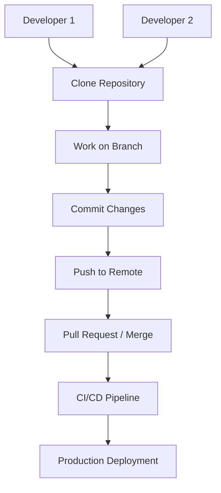

## A. The Need for Source Code Control
1. **Foundation of DevOps and Modern Development**: Nearly everything in modern software (code, infrastructure, documentation, even configuration and hardware descriptions) can be expressed and managed as code.​
2. **Central Role of the Repository** : The source code repository is a central hub through which all products (applications, scripts, configuration, docs) pass during their development and deployment lifecycle.​
3. **Teamwork and Collaboration**: Multiple roles—developers, operations, QA, documentation writers—depend on SCM to coordinate work and maintain a single source of truth.​
4. **Change Tracking and Accountability**: Tracks every modification, enabling review, audit trails, and the ability to revert unintended changes.​
5. **Supporting Automation and Deployment**: Enables reliable automated testing, CI/CD, configuration management, and tailored deployments.​
6. **Disaster Recovery and Versioning**: Keeps full history; allows restoration from mistakes, access to older working states, and prevention of data loss.​
## B. Source Code Management (SCM) Tools

1. **Definition**: SCM tools are specialized systems for storing, tracking, managing, and collaborating on code and other artifacts.​
2. **Key Features**  
    a. Versioning (history and rollback)
    b. Branching and merging (for parallel feature or bugfix development)
    c. Collaboration (multiple contributors with merge/pull requests)
    d. Distributed workflow support (most modern SCMs)
    e. Integration with other tooling (automation, CI/CD, review tools)
3. **Modern SCM Systems**  
    a. **Git** (dominant)  
    - Distributed Version Control System (DVCS): every user has a full copy of the repository, can work offline, and push/pull changes when connected.​  
    - Fast operations, protects against single points of failure, supports multiple remotes.  
    - Slightly complex, but widespread, with many user-friendly GUIs available.
    b. **Bazaar**  
    - Another DVCS, supported by Canonical and used in Ubuntu projects.​  
    - Hosted on Launchpad; less popular than Git but still used for some open source projects.
    c. **Mercurial**  
    - DVCS used by notable open source projects (e.g., Firefox, OpenJDK).​  
    - Focuses on simplicity and performance; popular in some communities.

| Feature          | Centralized Systems     | Distributed Systems (DVCS)     |
| ---------------- | ----------------------- | ------------------------------ |
| Example Tools    | SVN, CVS                | Git, Bazaar, Mercurial         |
| Repository Model | Single central server   | Each user has full copy        |
| Offline Work     | Limited                 | Full (commits, branching etc.) |
| Failure Recovery | More risk (central pt.) | Less risk (multiple copies)    |
| Speed            | Slower (server relay)   | Faster (local ops)             |
| Collaboration    | Uses locks/checkouts    | Parallel, supports many models |
## C. Migration and Strategy
1. **Migration Considerations**  
    a. Moving between SCM systems (e.g., from SVN to Git) often requires deciding whether to preserve full history or only migrate active code.​
    b. Some migrations are complex (keeping all history), while others are straightforward.
2. **Role of SCM in DevOps**  
    a. Central point for all automation, configuration, and documentation; supports cross-functional DevOps workflows.​    
    b. Good SCM practices form the backbone of safe, rapid, and resilient deployment pipelines.
