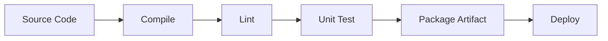
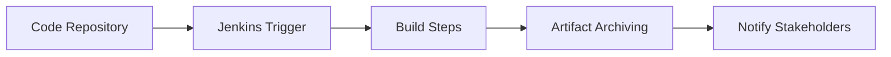
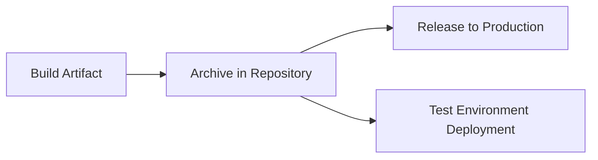

## A. Building the Code
1. **Definition**  
    a. Software build: transforms source code into executable or deployable artifacts by compiling (to native or bytecode), linting with static analysis, running unit tests, and packaging for deployment.
2. **Build Activities**  
    a. Compilation  
    b. Linting (code pattern checking)  
    c. Unit testing  
    d. Generation of deployable artifacts
3. **Major Build Systems**  
    a. For Java: Maven, Gradle, Ant  
    b. For C/C++: Make  
    c. For JavaScript: Grunt  
    d. For Scala: sbt  
    e. For Ruby: Rake

---

## B. Jenkins Build Server

1. **Definition**: Jenkins is a popular open-source build automation server, used to orchestrate and automate building, testing, and deploying software projects.
2. **Setup Steps**  
    a. Create a new job > Select "Build a free-style software project"  
    b. Connect to SCM (e.g., Git, SVN)  
    c. Set up triggers for builds (e.g., polling SCM, scheduled)  
    d. Define build steps (shell script, Maven/Ant, etc.)  
    e. Archive artifacts and record documentation/test results  
    f. Notify stakeholders of build results (email, IM, tracker)
3. **Jenkins Master-Slave Architecture**  
    a. Master server coordinates builds; slaves execute builds (supports builds on different OS and parallelizing jobs).  
    b. Communication can use SSH or Java Network Launch Protocol (JNLP).

---

## C. Managing Build Dependencies

1. **Definition**: Dependencies are external libraries, tools, or resources needed for successful builds.
2. **Automatic Dependency Management**  
    a. Maven: Uses POM (Project Object Model) file to declare and auto-fetch dependencies.  
    b. Grunt: Has build description file for JavaScript builds.  
    c. Golang: Can directly link to needed repositories.  
    d. C/C++: Often uses Autotools and configures builds based on system-available dependencies, less explicit than Java/Maven.
3. **POM File Example (Maven)**  
    a. XML structure defines dependencies, source/test directories, and plugins to run.  
    b. Ensures repeatable builds by standardizing dependency versions and build phases.

| Build Tool | Dependency Handling                                  |
| ---------- | ---------------------------------------------------- |
| Maven      | POM file declares dependencies fetched automatically |
| Grunt      | Build config file lists dependencies                 |
| Golang     | Imports dependencies via URLs/repos                  |
| Autotools  | Adapts to system available dependencies              |

---

## D. The Final Artifact

1. **Definition**: The "artifact" is the output of the build process: deployable files such as JAR, EAR, Zip, etc.
2. **Deployment Packaging**  
    a. Rules of thumb: Prefer OS-level packaging (RPM, DEB) for ease of deployment and system integration.  
    b. Artifacts may be deployed using OS package managers (RPM, for Linux) or application server mechanisms (JBoss, Glassfish).
3. **Artifact Repository**  
    a. Stores built artifacts for future deployment (Nexus, Artifactory, Docker Registry)  
    b. Supports versioning and retrieval by deployment servers

---

## E. Continuous Integration (CI)
1. **Definition**: CI is the automated process of frequently integrating code changes into a shared repository, immediately building and testing those changes.
2. **Benefits**  
    a. Early detection of integration issues  
    b. Prevents "merge hell" (hard-to-resolve diverging branches)  
    c. Encourages frequent commits  
    d. Uses more rigorous builds than local developer testing
3. **Build Server Role**  
    a. Automates compiling, running tests, and reporting results with hardware sufficient for larger team workloads.  
    b. Visualizes build status for team awareness (dashboards, monitors, status lamps)
## F. Continuous Delivery (CD)
1. **Definition**: Automated delivery of built, tested, production-ready artifacts to staging or release repositories, enabling immediate deployment if desired.
2. **Process**  
    a. After CI, successful builds are deployed to artifact repositories, test environments, and can be promoted to production.  
    b. CD allows deployment pipelines (build > test > release > deploy > monitor) to flow with minimal manual intervention.
3. **Common Tools**  
    a. Jenkins (build and deploy)  
    b. Nexus/Artifactory (artifact management)  
    c. SonarQube (quality metrics)
