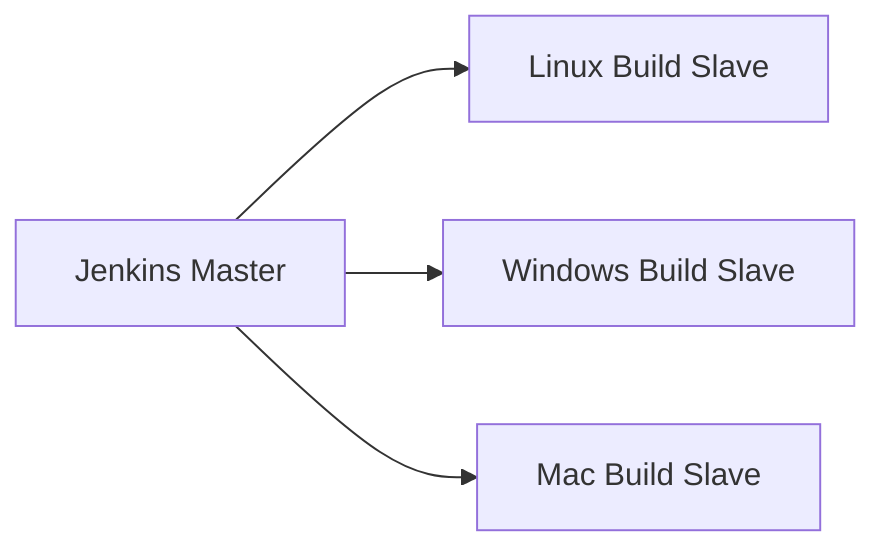
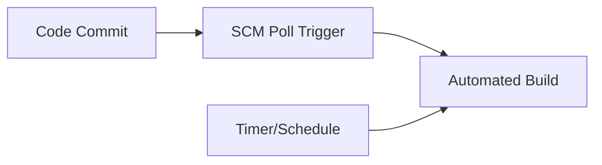
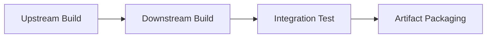
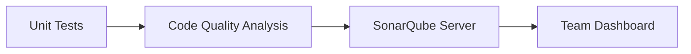

## A. The Host Server
1. **Definition**: The build server is a dedicated, high-spec machine responsible for integrating, building, and testing code from various contributors before release.
2. **Key Features**  
    a. Requires fast CPU, ample RAM, and disk space for frequent, intensive builds.  
    b. Central hub for collaboration—where contributions from all teams are integrated and validated.
## B. Build Slaves
1. **Purpose**: Build slaves are additional servers that the build master delegates specific builds to—often based on OS or project requirements.
2. **Benefits**  
    a. Increases build parallelism, reducing queues and speeding up testing.  
    b. Enables builds across diverse platforms (Linux, Windows, Mac), facilitating cross-platform compatibility.

## C. Software on the Host

1. **Requirements**  
    a. Must install relevant build tools (Maven, Gradle, Ant, Make, etc.) and dependencies.  
    b. Jenkins typically triggers builds; actual compilation and testing handled by language-specific build tools.  
    c. Linux hosts preferred (build tools easy to install).  
    d. Use familiar deployment tools for regular updates of build server.
## D. Triggers
1. **Trigger Types**  
    a. SCM polling (e.g., Git commits) for automatic builds.  
    b. Timed builds (nightly or scheduled for more stringent tests).  
    c. Upstream/downstream build chaining—successful build of one project triggers another.
2. **Practice**: Combination of SCM polling and timed builds maximizes code quality and early bug detection.

## E. Job Chaining and Build Pipelines
1. **Job Chaining**  
    a. Automate sequences—when one job succeeds, it triggers the next.  
    b. Simple chains often suffice, but complex dependencies require explicit build pipeline modeling.
2. **Jenkins Pipelines**  
    a. **Declarative Pipelines**: Pipeline as Code, written in `Jenkinsfile`, checked into source control.  
    b. **Scripted Pipelines**: Groovy-based, more flexible but harder to maintain; pipeline code managed in Jenkins UI.  
    c. Plugins (Multijob, Workflow) provide visualization and advanced control.

## F. Build Servers and Infrastructure as Code

1. **Impedance Mismatch**  
    a. GUI-based tools like Jenkins default to manual configuration, not reproducible as code—contrasting with DevOps best practices.  
    b. Advanced tools (e.g., GitLab CI) treat pipeline definitions as code from the start supporting code-based infrastructure.
2. **Recommendation**: Prefer codified job descriptions (Jenkinsfile, YAML) to enable repeatability, versioning, and scripting.
## G. Build Phases
1. **Maven Build Phases (Example)**  
    a. Validate project  
    b. Compile source  
    c. Run unit tests  
    d. Package binaries (e.g., JAR, ZIP)  
    e. Integration test  
    f. Verify results  
    g. Install package locally  
    h. Deploy to remote repository
2. **Standardization**: Tools like Maven enforce standardized build order, increasing reliability and simplifying onboarding.
## Build Phase Table

|Phase|Description|
|---|---|
|Validate|Check project correctness|
|Compile|Build executable code|
|Test|Run unit tests|
|Package|Assemble deployable artifact|
|Integration Test|Test combined modules|
|Verify|Final checks for release|
|Install|Save locally|
|Deploy|Release to repository|
## H. Collating Quality Measures
1. **Automation**  
    a. Build servers run tests and static analysis tools, automatically capturing code quality metrics.  
    b. Jenkins supports out-of-the-box visualization for test results; advanced metrics collected by SonarQube and similar tools.
2. **Best Practice**: Run thorough code quality checks regularly (e.g., nightly builds) to avoid slowing weak builds and maximize actionable feedback.

## I. Build Status Visualization
1. **Visualization Tools**  
    a. Shared displays (monitors, lava lamps, LED notifiers) indicate build health and failure immediately.  
    b. Jenkins plugins offer kiosk/job overviews.
2. **Benefits**  
    a. Immediate feedback boosts engagement and rapid error response.  
    b. Visual cues (e.g., brightly lit lamp on error) help teams spot issues quickly.
## J. Robustness
1. **Repeatability**: Builds should be repeatable anywhere—even if the main build server fails (portable build scripts, documented dependencies).
2. **Resilience**  
    a. Use platform-independent build tools, avoid hidden OS dependencies.  
    b. Build queues and distribution (using slaves) minimize bottlenecks and maximize reliability.
3. **Goal**: Build and deployment processes must not halt if a single server goes offline; robust scripting and infrastructure-as-code help ensure recovery.

| Concept                    | Description                                                               |
| -------------------------- | ------------------------------------------------------------------------- |
| Host server                | Powerful build hub for code integration                                   |
| Build slaves               | Added nodes for parallel, multi-OS builds                                 |
| Software on host           | Build tools and dependencies required for compilation                     |
| Triggers                   | Events or timers that launch builds                                       |
| Job chaining/pipeline      | Automated, controlled sequences of build/test/deploy                      |
| Infra as code              | Prefer codified infrastructure descriptions over GUI/manual configuration |
| Build phases               | Standardized steps enforced for quality and traceability                  |
| Collating quality measures | Automated collection/visualization of code metrics                        |
| Build status visualization | Immediate shared feedback on build health/errors                          |
| Robustness                 | Portability, repeatability, and minimal downtime in build process         |
