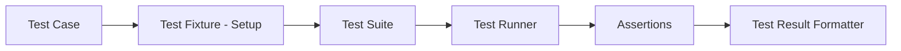
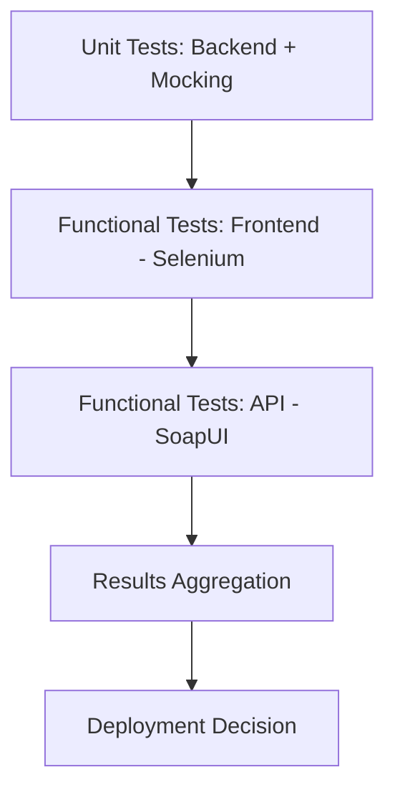

## A. Pros and Cons of Test Automation
1. **Pros**  
    a. Higher software quality: Automated tests catch bugs early and consistently, raising confidence in releases.4.3-Module_testing.pdf​    
    b. Supports Continuous Delivery: Automation is necessary for fast, reliable deployment cycles; manual testing slows everything down.4.3-Module_testing.pdf​
    c. Less tedious work: Reduces repetitive, monotonous manual testing.4.3-Module_testing.pdf​
    d. Early bug detection: Automated suites can run on every build, catching regressions before release.
2. **Cons**  
    a. Cheap tests may have low value: Superficial or poorly written tests give little real assurance.4.3-Module_testing.pdf​
    b. Test maintenance cost: As programs change, automated tests must adapt—this requires ongoing effort.4.3-Module_testing.pdf​
    c. Hard to write robust tests: Crafting maintainable, meaningful automation is a real skill and can be challenging across build scenarios.4.3-Module_testing.pdf​
    d. Difficult integration: Creating realistic test setups (cradles) for integration testing is often complex.
## B. JUnit: Java Test Automation Framework
1. **Overview**  
    a. JUnit is a popular framework for defining and running unit tests in Java code.
    b. Well integrated with Java build tools (Maven, Gradle); test cases can be discovered, executed, and their results reported automatically.4.3-Module_testing.pdf​
2. **Key Concepts**  
    a. **Test Case**: Fundamental unit—tests a specific function or scenario.
    b. **Test Fixture**: Sets up known state before each test case (using `@Before` and `@After` annotations).
    c. **Test Suite**: Group of related test cases, often sharing a fixture.
    d. **Test Runner**: Tool that finds, executes, and records results of test cases (e.g., Maven Surefire).4.3-Module_testing.pdf​
    e. **Assertions**: Statement that checks a condition; failure signals a test error. Example methods: `assertEquals`, `assertTrue`, `assertFalse`.
    f. **Result Formatter**: Provides machine- or human-readable test result output (usually XML or HTML).

## C. Mocking in Test Automation

1. **Definition**: Mocking means simulating complex system dependencies (databases, services) by providing fake or stub objects that behave like real ones.​
2. **Why Mock?** Enables isolated unit testing without needing external systems online—tests are faster and more reliable.
3. **Mocking Tools**: Mockito (Java), unittest.mock (Python) are common frameworks for creating mocks.
4. **Example**: Instead of requiring a live database, a mock object returns expected data structures for backend tests.

## D. Test Coverage
1. **Definition**: Percentage of code executed by the test suite; higher coverage usually means more thorough testing.4.3-Module_testing.pdf​
2. **Measurement**  
    a. Tools instrument the code base and collect execution data during test runs.
    b. **Java Tools**: Cobertura, jcoverage, Clover.4.3-Module_testing.pdf​
3. **Cobertura Workflow**: Injects measurement code into compiled bytecode, tracks executed lines/functions during tests, and generates coverage reports.
4. **Cautions**: 100% coverage is ideal but not always practical; focus on meaningful coverage, not just raw numbers.
## Test Coverage Table

| Tool        | Language | Usage                    |
| ----------- | -------- | ------------------------ |
| Cobertura   | Java     | Bytecode instrumentation |
| Clover      | Java     | Line/function coverage   |
| Coverage.py | Python   | Source instrumentation   |
## E. A Complete Test Automation Scenario
1. **Example: Web Application Stack** -  Application includes: Web frontend, JSON/REST API, backend application logic, and database.
2. **Testing Phases**  
    a. **Unit Testing (Backend)**: Test backend code in isolation, using JUnit and mock objects for databases.
    b. **Functional Testing (Frontend)**: Use Selenium to simulate user interactions and validate UI flow.
    c. **Functional Testing (API)**: Use tools like SoapUI to automate REST interface tests.
3. **Pipeline Execution**  
    a. All tests run in sequence—unit first, then functional (UI, API).
    b. Results are collected (by runner tools, e.g., Surefire, Selenium output, SoapUI reports) and visualized for team review.
    c. Only if all automated tests pass is the change considered healthy enough for deployment.

## F. Key Takeaways
- Test automation is indispensable for fast, error-free software delivery, supporting CI/CD and developer confidence.
- Good automation requires meaningful, maintainable tests (not just "cheap" tests), regular updates, and solid mocking practices.
- Tools like JUnit, Mockito, Selenium, Cobertura enable layered testing and reliable test reporting for modern applications.

