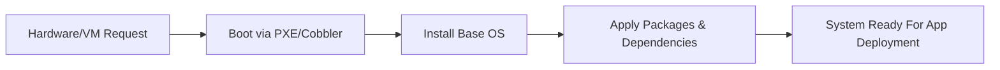
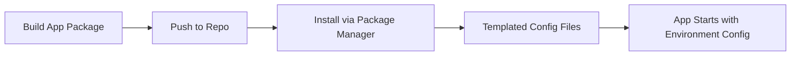

## A. Need for Many Deployment Systems and Challenges
1. **Diverse Infrastructure**: Modern organizations operate hundreds of servers (physical, virtual, containerized) requiring different deployment and configuration methods.
2. **Complex Requirements**: Applications are deployed on various stacks (web server, app server, database server); each may have unique dependencies, update cycles, and configurations.
3. **Manual vs Automated Deployment**  
    a. Manual installs may work for tiny deployments (rare annual releases), but scale poorly and are error-prone.  
    b. Automated tools (Puppet, Ansible, Salt, PalletOps, etc.) are needed to reduce human error, speed up deployments, and maintain consistency.5.1-Deployment.pdf​
4. **Evolution of Execution Units**: Executable code may run on a physical machine, a VM, or inside containers—requiring tools that handle each scenario.
5. **Common Challenges**: Different OS/platform requirements, scaling from single to cluster deployments, maintaining consistency and security, and managing dependencies        
## B. Configuring the Base OS

1. **Approach 1: Bare Metal/VM Provisioning**  
    a. Tools like Red Hat Satellite and Cobbler install an OS from scratch and then add required dependencies for organizational standards.  
    b. Cobbler can PXE-boot a server, then install packages based on network MAC addresses.
2. **Approach 2: Pre-baked Images**  
    a. Popular in cloud (AWS, Azure, OpenStack) and container environments.  
    b. New VMs/containers are spawned from standardized base images, ensuring consistency and speed.
3. **OS Configuration Flexibility**  
    a. Languages like Java/Python/Ruby abstract the OS, but for low-level integrations (e.g., telecoms), OS choice and precise configuration matter greatly.

---

## C. Describing Clusters

1. **Cluster Definition**: Most real-world applications are deployed across multiple servers (clusters), not just single machines.
2. **Role-Based Descriptions**: Tools like Puppet, Ansible, and Salt allow roles (e.g., web, db, app server). Each role brings relevant packages, settings, and permissions.
3. **Container/Cloud Cluster Descriptors**: Docker Compose and cloud orchestration tools define clusters of containers/services and deploy them to hosts.
4. **Cluster Descriptor Dual Role**: Often also describes the app/service layer (what runs where, what talks to what).

## D. Delivering Packages to a System
1. **Package-Based Installation**: Most code is installed as packages (RPM, DEB). Package managers (yum, apt) handle dependencies, updates, and verify file checksums for integrity and security.
2. **Configuring Applications**: Configuration is usually managed via text files (XML, YAML, JSON, INI) which can be templated for different environments (test, prod). Tools can edit files directly or use templates to set environment-specific values.
3. **Alternate Delivery Methods**: Configuration data might be managed by application APIs or stored in databases (less flexible, often an anti-pattern).
4. **DNS and Env Awareness**: DNS aliases or config file changes point apps to the right backend systems for different stages (test vs. prod).
5. **Dev vs. Operations Flexibility**: Developers may manage configs using Git or direct file edits; configuration management tools (like Puppet) need declarative, file-based state for automation benefits.

