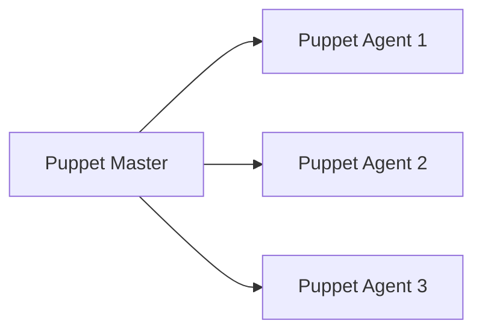
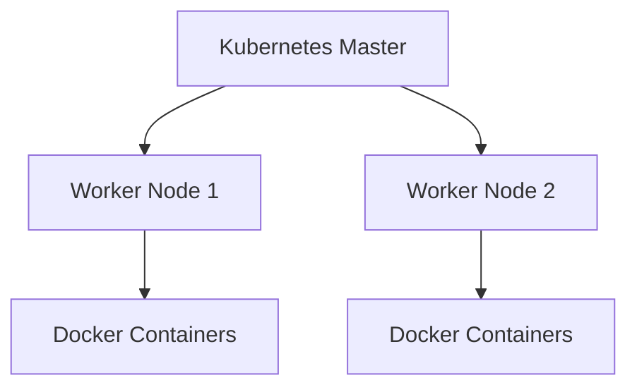
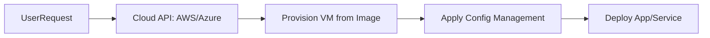

## A. Executing Code on the Client
1. **Definition**: Code execution happens on various client types: physical servers, virtual machines, or containers.
2. **Client-Side Automation**: Modern deployment tools automate installation and configuration directly on the target (client), often by running scripts, agents, or declarative manifests.
3. **Approaches**  
    a. Manual installs: simple but only feasible for small, infrequent deployments.  
    b. Automated installs: required for scalability, speed, and reliability across larger infrastructure.
## B. Configuration Management Tools
## 1. Puppet: Master-Agent Model
a. **Architecture**: Central Puppet Master server defines desired states; Puppet Agents run on client nodes, regularly check in with the master to pull configuration manifests and apply required changes.
b. **Strengths**: Good for large, complex, and heterogeneous environments; supports expressive DSL for configuration; mature role-based system for different server roles (web, app, db, etc.). 
c. **Drawbacks**: Requires agent installed on each node; communication needs to be secured; more initial setup and overhead for small/simple cases

## 2. Ansible: Agentless Automation
a. **Architecture**: Uses SSH to push configuration or run tasks directly—no agent required on target hosts (only Python interpreter needed).
b. **Strengths**: Simpler setup; easy to use for quick automation or smaller deployments; human-friendly playbooks (YAML). 
c. **Drawbacks**: Can be slower for very large infrastructures; relies on network and SSH performance.
## 3. Chef: Client-Server or Solo
a. **Architecture**: Similar to Puppet, Chef Server manages configs (cookbooks/recipes), clients (Chef Client) pull configurations and apply changes.
b. **Strengths**: Flexible language (Ruby); works well for complex application stacks and dynamic infrastructure. 
c. **Drawbacks**: Ruby-based DSL has a learning curve; requires agents and can be complex to set up
## 4. SaltStack: Flexible Modes
a. **Architecture**: Supports master-agent (Salt Master to Salt Minion) and agentless operation (using SSH). Can "push" or "pull" configurations.
b. **Strengths**: Flexible, good for event-driven automation and large infrastructures; high speed; easy remote execution. 
c. **Drawbacks**: Learning curve for states and event system.

| Tool      | Agent Required | Main Protocol  | Strengths             | Typical Use        |
| --------- | -------------- | -------------- | --------------------- | ------------------ |
| Puppet    | Yes            | Custom (HTTPS) | Mature, robust        | Large enterprises  |
| Ansible   | No             | SSH            | Simple, quick setup   | Small/medium teams |
| Chef      | Yes            | HTTPS          | Flexible, app configs | Cloud/devops shops |
| SaltStack | Optional       | ZeroMQ/SSH     | Fast, event-driven    | Large infra, ops   |
## C. Container and Orchestration Solutions
1. **Kubernetes**  
    a. Orchestration platform for deploying, scaling, and managing clusters of containers (usually Docker containers).5.23-Execution_Monitoring.pdf​  
    b. Automates deployment, scaling, monitoring, and self-healing of containerized applications.
2. **Deploying with Docker**  
    a. Docker images define the runtime environment; containers run consistent app instances on any host with Docker installed.  
    b. Kubernetes deploys and coordinates groups of containers (Pods) and manages networking, config, and failures.5.23-Execution_Monitoring.pdf​
## Kubernetes/Docker Deployment (Mermaid)

## D. Cloud Solutions: AWS and Azure

1. **Provisioning VMs**  
    a. **AWS/Azure**: When a new server is requested, the system clones it from a standard disc image (AMI for AWS, managed image in Azure).  
    b. Ensures base OS and initial configs are consistent and fast to provision.
2. **Configuration**  
    a. After VM creation, tools like Puppet, Ansible, or Chef may apply further configurations, install packages, and deploy applications.  
    b. Supports large-scale, repeatable infra deployments (infrastructure as code).
3. **Cluster Descriptions**: Both AWS and Azure let you describe and deploy clusters (e.g., scalable sets of VMs, load balancers, managed clusters like AWS ECS or Azure AKS for containers).
4. **Hybrid and Multi-Cloud**: Most tools (Puppet, Ansible, Kubernetes) work with cloud and on-prem systems, supporting hybrid deployments.

