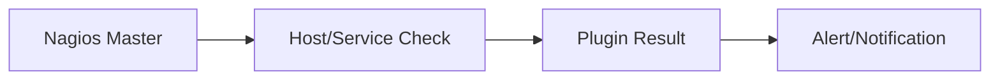
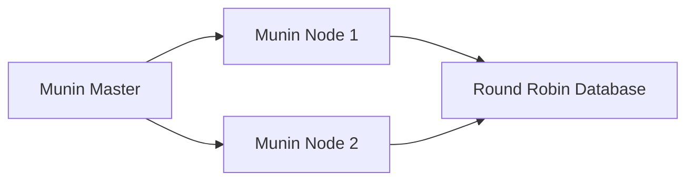
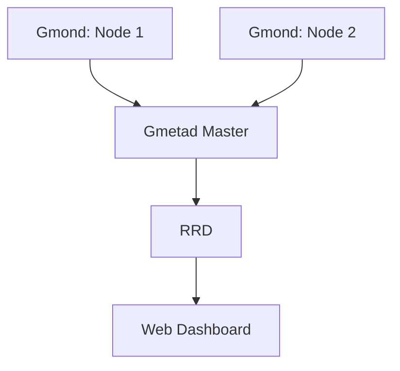
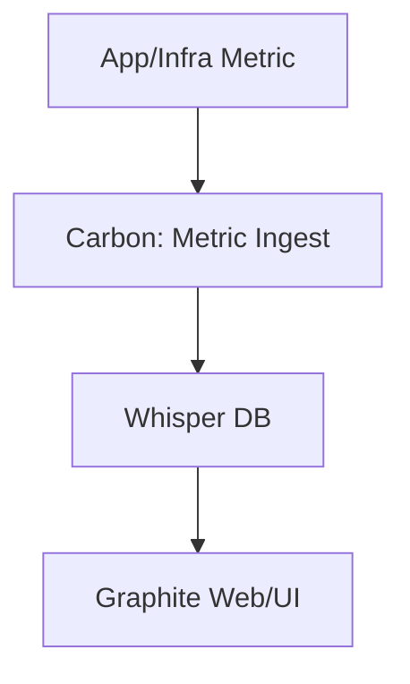
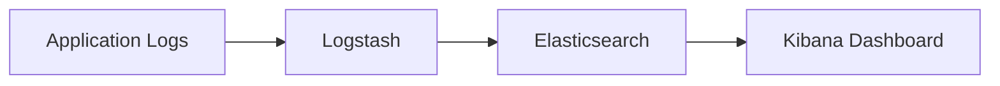

## A. Nagios – Service Health Monitoring
1. **Definition**: Nagios is a powerful monitoring system focused on the high-level binary health (up/down state) of hosts and services, such as whether a server or process is alive.5.23-Execution_Monitoring.pdf​
2. **Key Features**  
    a. Checks service/host availability with active and passive plugins.  
    b. Triggers notifications and alerts when services or hosts are down.  
    c. Highly extensible via custom plugins for diverse service checks.  
    d. Configurable escalation and scheduling of checks.
3. **Best Use Cases**  
    a. Monitoring system/service uptime  
    b. Alerting operations teams to outages quickly

## B. Munin – Statistics and Trend Graphing

1. **Definition**: Munin is a network-oriented monitoring tool designed primarily to graph server statistics (CPU, memory, disk, users, processes) over time.5.23-Execution_Monitoring.pdf​
2. **Key Features**  
    a. Central Munin master collects data from Munin nodes (installed on monitored servers).  
    b. Data is gathered periodically and stored in round-robin database (RRD), which also generates time-series graphs.  
    c. Easy plugin system for custom metric collection.  
    d. Provides trend analysis, forecasting infrastructure problems.
3. **Benefits**  
    a. See resource trends before issues become critical.  
    b. Early warning from visual graphs—detect overloads, memory leaks, etc.
4. **Architecture**  
    a. Central server (Munin master) pulls metrics from Munin nodes and creates graphs using RRD.

## C. Ganglia – Scalable Cluster Monitoring
1. **Definition**: Ganglia is engineered for large-scale cluster and grid monitoring, aggregating metrics for many servers in logical groups called "grids".5.23-Execution_Monitoring.pdf​
2. **Key Features**  
    a. Uses Gmond daemons on each node to collect system stats.  
    b. Gmetad (meta daemon) collects, aggregates, and forwards metrics.  
    c. Uses RRD for storage and graphing, similar to Munin.  
    d. Clusters can be grouped by role or application, viewed as a single grid.
3. **Architecture**: "Nerve cell network" — Gmonds on every node, Gmetad for aggregation, web UI frontend for visualization.
4. **Scalability Advantage**: Gmetad can distribute load, enabling efficient monitoring of very large infrastructures.

## D. Graphite – Real-Time Metric Graphing
1. **Definition**" Graphite provides near real-time graphing of numeric time-series data, used for infrastructure, app, or custom metrics.
2. **Key Features**  
    a. Three main components:  
    - Carbon: metric processor  
    - Whisper: time-series database  
    - Graphite Web: graphing/UI  
    b. Metrics are sent to Carbon, stored in Whisper, displayed in Web UI.
3. **Comparison**: Unlike Munin or Ganglia, Graphite supports closer-to-real-time metrics and interactive dashboards.    

## E. Log Handling

1. **Definition**: Log handling involves capturing, storing, filtering, and analyzing log messages generated by code, servers, or applications for debugging, auditing, and monitoring.
2. **Traditional Logging**: Simple print/debug statements (e.g., `printf` in C) help trace program flow but are crude for post-deployment scenarios.
3. **Disadvantages of Basic Logging**  
    a. Not flexible for filtering or destination handling.  
    b. Can overwhelm or under-inform if not carefully designed.
4. **Modern Logging Frameworks**  
    a. Support log levels (Debug, Info, Warning, Error), filtering by level, and output to files, databases, or network streams.  
    b. Support log rotation and archiving.  
    c. Examples: Log4j (Java), Log4net (.NET), logback, SLF4J, ELK stack (Elasticsearch, Logstash, Kibana).
5. **Centralized Log Handling with ELK**  
    a. The ELK stack enables ingestion (Logstash), indexing (Elasticsearch), and dashboarding/visualization (Kibana).  
    b. Centralized logs are essential for diagnosing issues across distributed systems.

