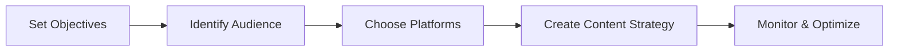

## 1. **Defining Social Media Marketing**

- Social media marketing (SMM) is the use of social media platforms—like Facebook, Instagram, Twitter, LinkedIn, TikTok, and YouTube—to promote a brand, product, or service to connect with audiences, build brand awareness, drive traffic, and increase sales.​
- Activities include creating, publishing, and sharing content (posts, videos, stories, ads) and engaging with followers/customers through comments, messages, and communities.​
- SMM integrates both organic (unpaid) and paid content strategies to engage users at various stages in the customer lifecycle.

## 2. **Pros and Cons of Social Media Marketing**

|**Pros**|**Cons**|
|---|---|
|Broad audience reach (global scale)|Risk of negative exposure|
|Direct, real-time customer interaction|Time-consuming content creation|
|Cost-effective promotion|Requires continuous management|
|Increased brand visibility/awareness|Difficult to measure all returns|
|Community building/loyalty|Can be hard to cut through noise|
|Targeted advertising options|Vulnerable to changing algorithms|
|Data and analytics for optimization|Potential privacy/data concerns|

## 3. **Developing a Strategic Social Media Marketing Plan**

## Key Steps:

- **Set clear objectives:** Increase brand awareness, drive sales, build community, or foster customer support.​
- **Understand the target audience:** Research demographic traits and interests; define personas.
- **Select the right platforms:** Use those where your audience is most active (e.g., Instagram for youth, LinkedIn for professionals).
- **Content planning:** Decide on types, frequency, and mix (images, video, stories, polls, articles). Mix paid and organic tactics.​
- **Community engagement:** Respond to comments and messages; foster discussions.
- **Analytics/measurement:** Use platform analytics for monitoring performance (engagement, reach, conversions).
- **Iterate and refine:** Adapt strategy based on analytic insights and audience feedback.
## 4. **Segmenting B2C Market**

| **Segmentation Criteria** | **Examples**                                    |
| ------------------------- | ----------------------------------------------- |
| Demographics              | Age, gender, income, education                  |
| Psychographics            | Lifestyle, values, interests, personality       |
| Behavior                  | Usage patterns, purchase frequency, loyalty     |
| Geography                 | Location, language, region                      |
| Media Preferences         | Preferred platforms (Instagram, WhatsApp, etc.) |
Segmenting allows targeted messaging and more effective platform/content choices for each consumer group    
## 5. **Researching B2B Markets**

| **Research Factor**  | **Application in B2B SMM**                   |
| -------------------- | -------------------------------------------- |
| Industry             | Identifying key sectors to target            |
| Company Size         | Tailoring messaging for SMEs vs. enterprises |
| Decision Maker Roles | Engaging C-suite, managers, influencers      |
| Pain Points/Needs    | Understand unique business challenges        |
| Channel Usage        | Use LinkedIn, Twitter, industry forums       |
B2B SMM research emphasizes building relationships, sharing expertise, and direct engagement with business decision-makers.    
## 6. **Conducting Other Types of Market Research Online**

| **Method**              | **Description**                              | **Benefits**                |
| ----------------------- | -------------------------------------------- | --------------------------- |
| Surveys/polls           | Gathers feedback, opinions, preferences      | Fast, scalable insights     |
| Social listening        | Tracks brand/topic mentions and sentiment    | Real-time, unfiltered data  |
| Competitor analysis     | Reviews competitor activity, engagement, ads | Identifies gaps, benchmarks |
| Online panels/groups    | Targeted discussions, niche insights         | Qualitative deep dives      |
| Google Trends/Analytics | Finds search trends, content topics          | Guides strategy/tactics     |
Combining social media data with other online tools gives a full picture of market and audience behavior.    

