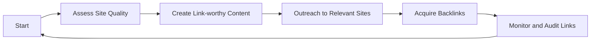
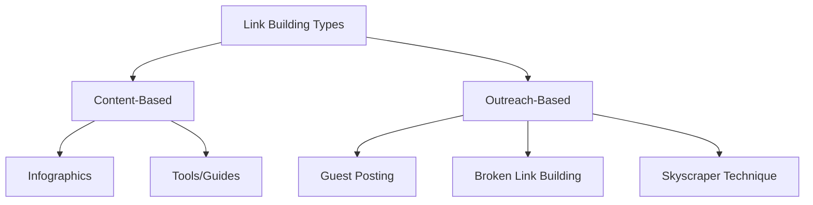

# Link Building & SEO Analytics: Detailed Notes

## Precursors to Link Building
- **Site Quality:** Ensure your website is technically sound (mobile-friendly, fast, secure) and has valuable content.
- **Content Value:** Develop resources that are useful, unique, and worth referencing (guides, data, tools, infographics).
- **Audience & Niche Research:** Identify relevant websites, forums, and influencers where your audience is active.
- **Competitor Analysis:** Study competitors' backlink profiles to find link opportunities and gaps.

## Types of Link Building (& Visual Table)
| **Type**                  | **Description**                                                          | **Example/Tools**                        |
|--------------------------|-------------------------------------------------------------------------|------------------------------------------|
| Guest Posting            | Writing articles for other sites in exchange for a link.                  | Contact blogs in your niche.              |
| Broken Link Building     | Replacing dead/outdated links on external sites with your content's link. | Use tools: Broken Link Checker, Ahrefs.   |
| Skyscraper Technique     | Creating better content than top-ranking pages, then pitching it to those linking to originals. | BuzzSumo, Ahrefs.                        |
| Resource Page Links      | Getting listed as a valuable resource on curated link pages.               | Search "keyword + resources".            |
| Niche Edits              | Inserting your link into an existing relevant article/post.                | Email outreach, negotiation.              |
| Unlinked Mentions        | Turning brand/content mentions into actual backlinks.                      | Monitor with Google Alerts, Ahrefs.       |
| Content Syndication      | Republishing your content on other platforms with attribution/link.         | Medium, LinkedIn, RSS feeds.              |
| Image/Multimedia Links   | Creating shareable visuals (infographics, videos, podcasts) for backlinks. | Canva, YouTube, infogram, podcast apps.   |
| Blog Commenting          | Engaging thoughtfully in discussions on niche blogs (not spam).            | Manual research, niche forums.            |
| Directory Submission     | Listing site in trusted, niche-relevant directories.                       | Moz Local, pro niche directories.         |

## Choosing a Link-Building Strategy
- **Goal Alignment:** Decide if you want brand awareness, referral traffic, authority, or improved SEO rankings.
- **Resource Assessment:** Choose strategies based on your team's capacity and expertise (e.g., content creation vs outreach).
- **Industry & Niche Fit:** Target strategies suited to your audience's platforms, behaviors, and preferred content formats.
- **Risk Analysis:** Avoid spam tactics; focus on techniques compliant with search engine guidelines.

## Elements of Link Building
| **Element**     | **Role/Impact**                                       |
|----------------|-------------------------------------------------------|
| Relevance      | Links from related, high-quality domains count most.  |
| Authority      | Sites with higher authority/value provide better links.|
| Diversity      | Mix of types (news, blogs, directories, multimedia).  |
| Placement      | Contextual, editorially-placed links are strongest.   |
| Anchor Text    | Descriptive, relevant keywords are best; avoid spammy text.|
| Link Velocity  | Build links naturally over time (not all at once).    |
| No-follow/Do-follow | Both have value (SEO, traffic); prefer do-follow for rankings.|

## Content-Based Link Acquisition Approaches
- **Original Research & Data:** Publish studies or industry reports others will reference and link to.
- **Infographics & Visual Content:** Develop visually compelling resources that bloggers and journalists embed.
- **Long-Form Content (Skyscraper):** Create comprehensive, authoritative guides that outshine competitors, then outreach to sites linking to outdated/inferior versions.
- **Tangential Content:** Produce materials slightly outside your core niche to attract wider links (e.g., broader industry trends, myth busting).
- **Multimedia (Videos, Podcasts, Interactive Tools):** Leverage video or audio formats, interactive calculators, or tools that sites naturally reference.
- **Resource & Reference Pages:** Get your content listed on curated resource pages relevant to your field.
- **Blog Commenting & Community Engagement:** Add value to discussions and forums within your industry; links from meaningful engagement.
- **Content Syndication:** Reshare your best pieces on trusted platforms with proper attribution.
- **Trending Topics:** Rapidly develop content on emerging trends to earn timely backlinks.

## Table: Link Marketing vs Content-Based Link Acquisition
| **Aspect**     | **Content-Based Link Acquisition**                    | **Link Marketing**                                       |
| -------------- | ----------------------------------------------------- | -------------------------------------------------------- |
| Approach       | Earn links for valuable content, naturally referenced | Promote linkable assets directly to targeted audiences   |
| Tactics        | Research, infographics, multimedia, guides            | Outreach, email marketing, influencer campaigns          |
| Sustainability | Usually more organic, long-term                       | Can be faster, but may require ongoing promotion         |
| Risks          | Lower risk if content is high quality                 | Higher risk if outreach is aggressive or poorly targeted |

## Fighting Link Spam
- **Identifying Spam Links:** Watch for low-quality domains, irrelevant content, over-optimized anchor text, or link farms.
- **Disavowing Harmful Links:** Use Google Search Console's Disavow Tool to ignore spammy or toxic backlinks.
- **Manual Removal:** Contact webmasters to request removal of dubious links.
- **Building Real Relationships:** Focus on genuine engagement, editorial placements, and thought leadership.
- **Audit Regularly:** Use SEO analytics tools (Ahrefs, SEMrush, Moz) to monitor your backlink profile for spam or negative SEO attacks.

