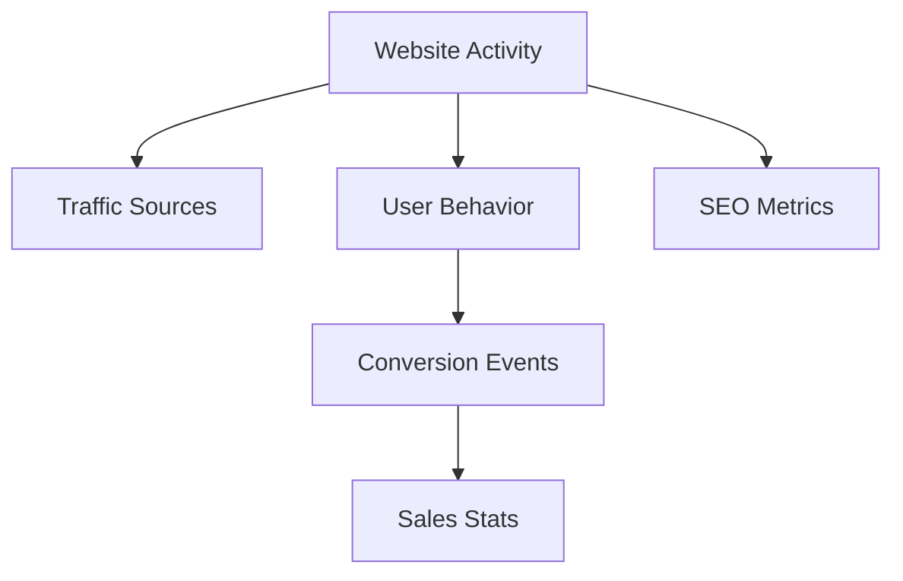
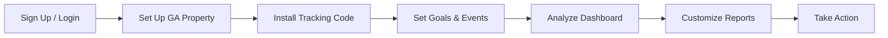
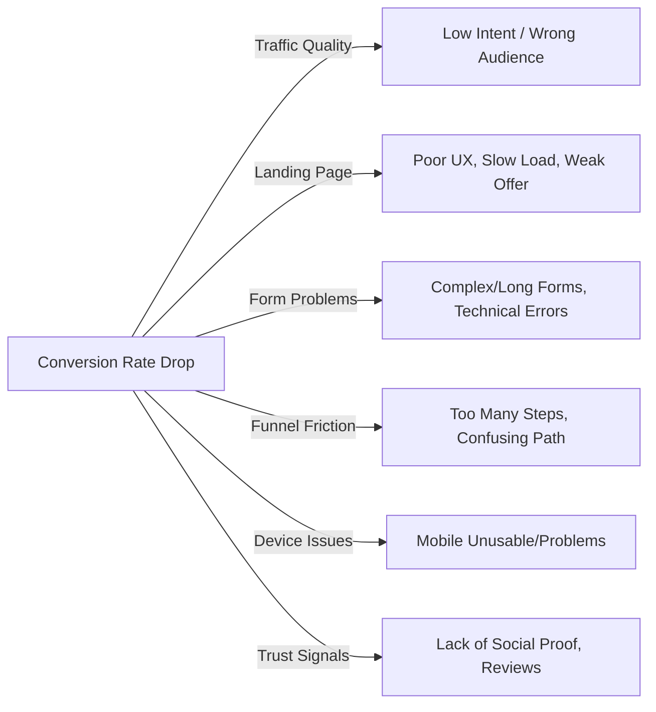

## Website Activity: What to Track

|**Parameter**|**Definition**|**Why It Matters**|
|---|---|---|
|Users / New Users|Unique visitors / first-time visitors.|Measures reach, audience growth|
|Sessions|Visits to your site; a user may have multiple sessions.|Gauges engagement, marketing effectiveness|
|Pageviews|Number of pages viewed in total.|Indicates content popularity|
|Traffic Source/Medium|Where users came from (organic, paid, referral, direct, social).|Identifies high-performing acquisition channels|
|Bounce Rate|% of sessions that end after one page without interaction.|Signals possible problems with content/UX|
|Avg. Session Duration|Average time users spend on the site.|Measures engagement quality|
|Goal Completions|Users completing defined actions (form fill, signup, download, etc.).|Tracks site effectiveness and user funnel|
|Conversion Rate|% of sessions leading to a desired action (sale, signup, etc.).|Key measure of ROI and marketing success|
|Exit Pages|Last page users see before leaving.|Diagnoses drop-off points|
|Top Landing Pages|Pages most users enter the site with.|Reveals SEO and ad campaign success|
|Device/Geo Metrics|User device, geographic location, platform.|Informs targeting and usability improvements|
|Backlink & SEO Metrics|Growth, quality, relevance of links; organic traffic and top keywords.|Improves search visibility and authority|

---

## Visual: Website Analytics Dashboard Flow (Mermaid)

## Interpreting Sales Statistics

|**Sales Metric**|**How to Interpret**|
|---|---|
|Total Sales / Revenue|Overall business success; identify trends and seasonality|
|Average Order Value|Larger values may signal high-value clients or successful upselling|
|Conversion Rate|Low rate suggests site, funnel, or traffic quality issues|
|Lead-to-Customer Rate|Indicates effectiveness of sales pipeline|
|Channel Revenue|Attribute sales to marketing sources to allocate budget efficiently|
|Customer Retention Rate|High values show satisfaction and repeat business|

## Getting Going with Google Analytics

- **Sign Up/Login:** Create a Google Analytics account or use your existing Google login.
- **Set Up Property:** Add your website as a property and note the tracking ID.
- **Install Tracking Code:** Place the tracking code snippet in your website's header/footer.
- **Set Goals & Events:** Define key conversions (purchases, downloads, contact forms) as goals.
- **Analyze Dashboard:** Review default reports (Audience, Acquisition, Behavior, Conversions).
- **Customize Reports:** Segment data by source, device, geography, behavior, and more.
- **Take Action:** Adjust site, content, or campaigns based on findings.
## Diagnosing Conversion Rate Troubles

- **Traffic Quality:** Ensure marketing attracts users with real purchase intent.
- **Landing Page Experience:** Check design, clarity of offer, page speed, and relevant messaging.
- **Form Issues:** Test all forms for length, clarity, and technical errors/barriers.
- **Funnel Friction:** Streamline user journey; reduce unnecessary steps.
- **Device Compatibility:** Confirm usability on mobile/tablet and major browsers.
- **Trust & Authority:** Add testimonials, reviews, security badges, and FAQs.
- **Analytics Deep-Dive:** Use GA segments—compare converting/non-converting users, analyze drop-off points.
- **Continuous Testing:** Apply A/B testing on forms, CTAs, and landing pages.
