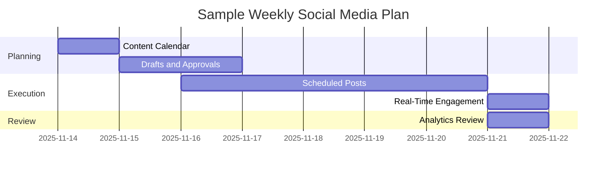
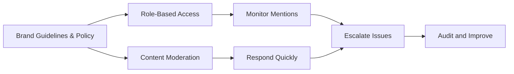

## Managing Social Media Schedule

| **Task/Step**      | **How & Why**                                                                                  |
| ------------------ | ---------------------------------------------------------------------------------------------- |
| Content Calendar   | Plan posts in advance for consistency and strategic timing; balance evergreen, promo, and UGC. |
| Scheduling Tools   | Use platforms (Hootsuite, Buffer) for bulk uploads and automated publishing.                   |
| Frequency Planning | Set post frequency by channel based on peak engagement times and campaign needs.               |
| Format & Mix       | Rotate between formats: stories, polls/quizzes, behind-the-scenes, promos, live sessions.      |
| Flexibility        | Keep spots in schedule open for timely, trending or reactive content as needed.                |
| Performance Checks | Regularly review analytics to optimize timing, format, and message.                            |

## Visual: Social Media Schedule (Mermaid)

## Creating a Social Media Marketing Policy

- **Purpose:** Sets rules and best practices for all admins to ensure brand, legal, and community standards    
- **Key Elements:**
    - Brand voice and tone guidelines (professional, friendly, etc.)
    - Content approval workflows for sensitive posts
    - Role-based access and clear permissions for staff or agencies
    - Moderation rules: how to address negative comments, trolls, or sensitive scenarios
    - Community guidelines and participation rules for followers
- **Crisis/Escalation Protocols:** Steps for handling PR issues, legal breaches, or viral negative events.
- **Continuous Auditing:** Regular monitoring and audits to catch policy deviations early.
## Staying on the Right Side of the Law

| **Legal/Compliance Area** | **What To Do**                                               |
| ------------------------- | ------------------------------------------------------------ |
| Copyright/Content Rights  | Only use owned/authorized images, videos, music, and quotes  |
| Advertising Disclosures   | Clearly tag paid/sponsored posts (e.g., #ad, “sponsored”)    |
| Data Privacy              | Do not collect/share user data without clear consent         |
| Brand Protection          | Secure official handles, monitor/immediately address misuse  |
| Platform Rules            | Follow channel standards (hate speech, promotions, contests) |
| Response Protocols        | Document complaint escalation, takedown, and apology steps   |
## Protecting the Brand
- **Consistent Voice & Visuals:** Use standardized logos, colors, and tone across all platforms.
- **Rapid Response:** Address negative feedback or misinformation promptly with empathy and clarity.
- **Role Security:** Enforce strong access controls (no public admin rights, audit regularly).
- **UGC (User Content) Handling:** Set guidelines for sharing/reposting user content, always credit creators, and pre-approve sensitive collaborations.
- **Community Engagement:** Foster positive culture with rules, highlight positive user contributions, celebrate advocates.
## Visual: Brand Protection Process (Mermaid)

