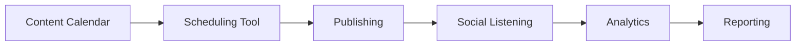
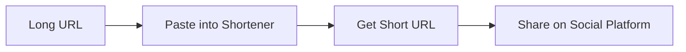
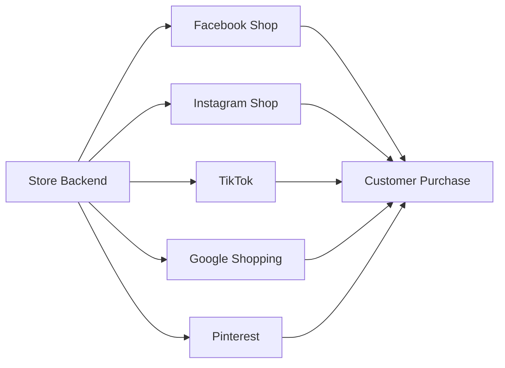

## 1. Keeping Track of the Social Media Scene

| **Tool/Function** | **Features & Benefits**                                                                                                                         | **Best For**                      |
| ----------------- | ----------------------------------------------------------------------------------------------------------------------------------------------- | --------------------------------- |
| Hootsuite         | All-in-one dashboard for scheduling, engagement, monitoring, analytics. AI-assist for strategy/timing; social listening for trends & sentiment. | Large teams, lead generation​     |
| Buffer            | Simple cross-platform scheduling, post management, free/affordable tiers.                                                                       | Individuals, small teams          |
| Sprout Social     | Unified publishing, analytics, team collaboration, customer care, influencer tracking; advanced analytics & reporting.                          | Agencies, enterprise​             |
| Vista Social      | Team features, messaging, social listening, link-in-bio, and task management                                                                    | Small teams, comprehensive needs​ |
| SocialPilot       | Scheduling, analytics, inbox, social listening, affordable solution                                                                             | Agencies, SMBs​                   |
| Zoho Social       | Post recommendations, CRM integration, stats, approval flow, dashboard inbox                                                                    | CRM users, detailed stats needs​  |
| Iconosquare       | Visual analytics (Instagram, TikTok, Pinterest), trends & performance                                                                           | Visual platforms​                 |

## 2. Saving Time with Content Distribution Tools
- **Automated Scheduling:** Batch content into queues and set future publish times (Buffer, Hootsuite, SocialBee).
- **Cross-platform Publishing:** Share posts to multiple accounts from one dashboard; tailor content for channel nuances.
- **Content Collaboration:** Drafts, approvals, shared calendars (Sprout Social, Planable).
- **Visual Content Management:** Iconosquare helps optimize Instagram/TikTok visuals; Canva integrates for quick design and scheduling​
- **Single Inbox:** Respond to all comments/messages within one centralized interface (SocialPilot, Zoho Social).
## 3. Notifying Search Engines About Updates

| **Tool/Method**          | **Purpose**                                        | **Automation?**                       |
| ------------------------ | -------------------------------------------------- | ------------------------------------- |
| Sitemap (XML/HTML)       | Alerts Google/Bing to new/updated pages            | Yes; submit via Google Search Console |
| Social Media Syndication | Shares content publicly; signals for crawl         | Yes; social API integrations          |
| Ping Services            | Notifies search engines of posts/updates           | Yes; plugin or manual ping            |
| E-Commerce Feeds         | Alerts product/content changes to shopping engines | Yes; via merchant center dashboard    |
**Pro tip:** Use Google Analytics & Search Console to validate indexing/speed of notifications.
## 4. Snipping Ugly URLs

|**Tool/Method**|**Feature/Benefit**|
|---|---|
|Bit.ly|Shortens URLs, tracks clicks, customizes links|
|Rebrandly|Custom branded URLs, analytics, campaign tracking|
|TinyURL|Simple, no-login required, quick sharing|
|Ow.ly (via Hootsuite)|Integrated with dashboard for easy sharing, analytics|
**Application:** Use clean short links in social posts, stories, ads, and bios for better engagement and click tracking.

## Visual: Link Shortening Flow (Mermaid)

## 5. Using E-Commerce Tools for Social Sites

|**Tool/Feature**|**Purpose/Benefit**|**Platforms**|
|---|---|---|
|Shopify Social Integration|Sync products to Facebook/Instagram Shops, TikTok, etc.|Instagram, Facebook, TikTok[planable+1](https://planable.io/blog/social-media-management-tools-for-agencies/)​|
|Google Shopping Feed|Publish product data to Google Shopping, enable ads|Google, YouTube, Pinterest[planable+1](https://planable.io/blog/social-media-management-tools-for-agencies/)​|
|Instagram Shopping Tags|Link products directly in posts/stories|Instagram|
|Facebook Catalogue|Connect products for paid/social ads, easy cart integration|Facebook, WhatsApp|
|Pinterest Buyable Pins|Generate sales directly from platform posts|Pinterest|
|Cart Plugins (Woo, Ecwid)|Add e-commerce to site/store, push data to social channels|Facebook, Instagram, Pinterest|
- **Benefits:** Drives social commerce; enables purchase from posts/stories; tracks product engagement and conversion.
- **Integration:** Connect store backends to official social channels for seamless inventory, analytics, and product sync. 

