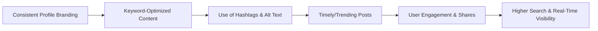

## 1. Social Media SEO: Key Strategies

|**Element**|**Tactics/Best Practices**|
|---|---|
|Profile Optimization|Use consistent usernames, profile photos, and branded bios on all platforms. Add main keywords in bio.|
|Link Inclusion|Add your website, blog, or portfolio link in bios and about sections. Promote shareable landing pages.|
|Keyword Usage|Research trending/search keywords for each platform. Use them in bios, captions, alt text, and hashtags.|
|Hashtags|Use 3-5 focused hashtags per post to boost SEO; keep them in the main caption (not comment).|
|Content Structure|Overlay keywords in video text, image text, subtitles. Say keywords in videos for voice search indexing.|
|Content Repurposing|Break long-form content into carousels, stories, or short posts, each targeting different keywords.|
|Trend Monitoring|Track trending topics/hashtags and create timely, relevant content for real-time search visibility.|
|Alt Text & Accessibility|Use descriptive, keyword-rich alt text for all images and video subtitles.|
|Tags/Categories|Use available tagging features (Pinterest boards, LinkedIn topics) for better discovery.|
|Engagement|Encourage sharing, saves, and comments for social proof—these boost platform and web search ranking.|
## 2. Gaining Visibility in Real-Time Search
- **Timely Content:** Post about trending events, news, or live happenings relevant to your audience.
- **Hashtag Hijacking:** Join real-time conversations by using trending hashtags (where appropriate) on X (Twitter), Instagram, or TikTok.
- **Frequency:** Consistent and regular posting increases the chance of showing up in real-time searches.
- **Cross-Platform Sharing:** Share new content across all social channels rapidly for bursts of engagement and real-time discovery.
- **Platform-Specific SEO:** Optimize for platform mechanics (e.g., YouTube: keywords in video titles, descriptions, chapters; Pinterest: keyword-focused boards; X: short, focused tweets with relevant hashtags).
- **Monitoring & Reacting:** Use social listening tools to catch emerging trends and join conversations quickly.

## 3. Social Content Optimization Process
1. **Profile Setup & Audit:**
    - Consistency across channels
    - Add all relevant business info
    - Use a clear, brand-aligned image
2. **Content Planning:**
    - Map keywords to topics
    - Align post timing with trending events/calendar
3. **On-Post Optimization:**
    - Natural keyword usage in captions, titles, alt text, and overlays
    - Limit to focused hashtags (avoid spammy overuse)
    - Include links and strong calls-to-action (CTAs)
4. **User Engagement Loop:**
    - Encourage shares, saves, comments
    - Cross-promote across accounts, collaborate with influencers
    - Respond promptly to comments/messages to increase visibility
5. **Measurement & Iteration:**
    - Track analytics (impressions, shares, engagement, referral traffic)
    - Adjust strategy based on performance and search trends
## 4. Table: Real-Time Search Visibility Factors

| **Factor**               | **Description/Action**                                                |
| ------------------------ | --------------------------------------------------------------------- |
| Posting Frequency        | More frequent, timely updates help you surface in "Live" feeds        |
| Trending Topics          | Engage with current trending hashtags/topics for instant boost        |
| Native Platform Features | Use stories, reels, live video, and platform news tabs                |
| User Engagement          | Higher engagement signals (likes, shares, comments) refresh your rank |
| Content Freshness        | Regular updates encourage both social and search engine recrawling    |
| Reactive Messaging       | Monitor and quickly join conversations or breaking news               |
## 5. Quick Examples & Tips
- **Repurpose blog content:** Break guides into Twitter threads, LinkedIn slides, or TikTok explainers.
- **Alt-text & captions:** Always write descriptive, keyword-rich alt text for images; add subtitles to videos for accessibility and search.
- **Monitor performance:** Use analytics within each platform to refine keywords, posting times, and engagement strategies.

