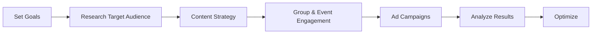

## 1. Creating a Page for Your Business

| **Step**                  | **Details / Actions**                                                                                                           |
| ------------------------- | ------------------------------------------------------------------------------------------------------------------------------- |
| Gather brand assets       | Prepare logo, cover image, brand colors, messaging, company/product images.                                                     |
| Personal profile required | Log into Facebook with a personal profile to set up and manage a Business Page.                                                 |
| Access Page creation      | Go to "Menu" → "Create" → "Page" or "Pages" section, then "Create New Page".                                                    |
| Enter page info           | Add business name (match official/legal name), choose categories, write an engaging description (up to 255 characters visible). |
| Add visuals               | Upload profile and cover photos (300 dpi or better); showcase brand professionalism.                                            |
| Complete details          | Set contact info (email, phone, website), location, hours, services, price range.                                               |
| Optimize About section    | Tell your brand/story, list services/products, mention awards or specialties, use keywords naturally.                           |
| Choose template & tabs    | Select the template that fits best (Standard, Services, Restaurant, etc.); adjust page tabs as needed.                          |
| Create username (URL)     | Claim a memorable "@username" for your page URL — match it to your business name if possible.                                   |
| Finalize setup            | Review all info for accuracy; do not invite followers or promote until finalized.                                               |
| Invite & connect          | Invite Facebook friends, cross-link from website (social icons), connect Messenger, enable instant replies for engagement.      |
## 2. Facing Facebook Groups
- **Purpose:** Facebook Groups serve as interactive spaces for customers and communities to connect, share, ask questions, and build loyalty around your brand or niche.
- **Actions:**
    - Join relevant groups as your business page (where allowed) to network and join discussions.
    - Start your own group to foster customer engagement, peer support, share updates, and nurture super-fans.
    - Use group features: polls, live videos, events, files, community moderation tools.
- **Best Practices:**
    - Provide value, not just promos: answer questions, share tips, facilitate connections.
    - Moderate discussions to ensure positive, safe, and brand-aligned interactions.
    - Encourage group members (customers) to share experiences and stories.
## 3. Hosting Facebook Events

| **Event Feature** | **Usage / Benefit**                                                          |
| ----------------- | ---------------------------------------------------------------------------- |
| Event creation    | Announce webinars, launches, sales, meetups, Q&As via your Page.             |
| Details section   | Set date, time, location (physical/virtual), event description, cover photo. |
| Guest invitations | Invite followers/friends, share in groups, promote publicly or privately.    |
| RSVP / Reminders  | Track attendance, send updates, and reminders to those interested.           |
| Interactivity     | Enable comments, posts, updates within the event page.                       |
| Integration       | Link events with Facebook Live, Messenger, external registration tools.      |
**Tips:** Use branded visuals, clear calls-to-action, and encourage social sharing for reach.    
## 4. Developing a Facebook Marketing Plan

|**Plan Element**|**How to Implement**|
|---|---|
|Goal setting|Define objectives: awareness, engagement, traffic, conversions.|
|Audience research|Use Facebook Insights, group/competitor research; document customer demographics, interests, needs.|
|Content strategy|Schedule regular posts: value tips, stories, visuals, promos, polls, live sessions.|
|Group/event leverage|Integrate group discussions and page-hosted events into your calendar.|
|Ad campaigns|Use Facebook Ads for targeted reach, retargeting, and driving action.|
|Engagement & response|Assign moderators/admins, set auto-reply rules, prompt two-way communication.|
|Analytics/measurement|Track reach, engagement, clicks, conversions; use results for plan tuning.|
## Quick Table: Important Setup & Growth Actions

|**Action**|**Benefits**|
|---|---|
|Complete all Page details|Boosts trust, search and discoverability|
|Custom username (URL)|Memorable, sharable Page address|
|Use branded visuals|Ensures recognition and professionalism|
|Join/Create Groups|Deepens engagement, builds community|
|Host events|Increases reach and real-time interaction|
|Set Page roles|Protects management, enables teamwork|
|Use analytics & insights|Tracks performance for smarter actions|
