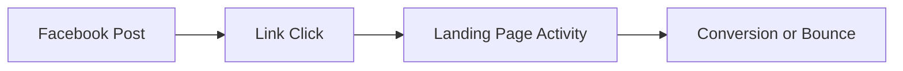
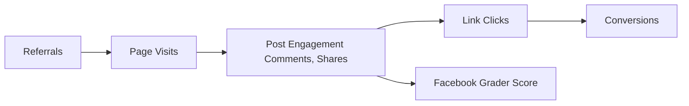

## 1. Checking Referrals from Websites

|**Metric/Source**|**What It Measures**|**How to Monitor**|
|---|---|---|
|Referral Traffic|Visits to Facebook from external sites (or vice versa)|Facebook Insights > Referrals; Google Analytics social referrals tracking|
|Top Referral Pages|Which outside websites drive most Facebook visits|Page Insights > Referral Source analysis|
|Conversion from Referrals|Actions (likes, follows, conversions) from web traffic|Custom UTM links, Analytics goal tracking|
**Interpretation:**
- High referral numbers show which websites/audiences are sending quality traffic.
- Analyze visitor behavior after arriving—do they engage, comment, like pages?
- Adjust link placement/partnerships to maximize effective referrals.
## 2. Monitoring Post Comments

| **Metric/Source**  | **What It Tells You**                   | **Best Practices**                          |
| ------------------ | --------------------------------------- | ------------------------------------------- |
| Comment Count      | Total number of comments per post/story | In Page Insights, post analytics            |
| Sentiment          | Tone/positivity (manual review/tools)   | Social listening tools/scheduled monitoring |
| Comment Engagement | Replies, comment likes, visitor replies | Track directly in engagement dashboards     |
**Analysis Tips:**
- High comment counts = strong engagement (especially questions, UGC, discussions).
- Monitor sentiment for PR issues or positive trends.
- Promptly respond to drive ongoing conversation and boost algorithmic reach.
## 3. Measuring Link Effectiveness

| **Metric**             | **Purpose/Use**                                      | **How to Track**                                               |
| ---------------------- | ---------------------------------------------------- | -------------------------------------------------------------- |
| Link Clicks            | Number of times a Facebook post link is clicked      | Page Insights, Bit.ly/Rebrandly analytics, custom UTM tracking |
| Click-Through Rate     | % of viewers who click the link                      | Facebook Insights: clicks/impressions x 100                    |
| Bounce/Exit Rate       | % who leave after clicking through from Facebook     | Google Analytics, Facebook conversion reports                  |
| Downstream Conversions | Purchases/form fills initiated from Facebook traffic | Google Analytics goals, Facebook Pixel events                  |

## 4. Making the Grade on Facebook Grader

|**Grader Metric**|**What It Evaluates**|
|---|---|
|Page Completeness|Filled bio, visuals, company info|
|Engagement Rate|Weighted engagement (likes, comments, shares)|
|Audience Growth|Net new followers/likes over time|
|Content Diversity|Mix of media types, stories, videos, links|
|Posting Consistency|Frequency and recency of posts|
|Response Rate|Speed and % of replies to user messages|
|Profile/User Verification|Official verification boosts trust factor|
|Integration/Connectivity|Cross-links, connected web/social platforms|
**Usage:**
- Tools or platform check-ups that score your Page on these elements provide improvement tips.
- Periodically “grade” your Page to spot gaps and benchmark against competitors or industry standards.
## 5. Facebook Analytics Dashboard: Key Metrics Table

| **Category**        | **Sample Metrics**                                             |
| ------------------- | -------------------------------------------------------------- |
| Audience Growth     | New likes, unlikes, net growth, demographics                   |
| Reach & Impressions | Organic/paid reach, total impressions, unique users            |
| Engagement          | Likes, comments, shares, click-actions, video watch time       |
| Content Performance | Top posts by engagement/reach, post types (photo, video, link) |
| Referral Sources    | Web/social traffic origin breakdown                            |
| Conversion          | Actions taken: sign-ups, purchases, downloads                  |

