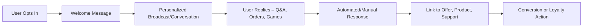

## 1. WhatsApp Marketing Overview

| **Feature**                          | **Benefit**                                    |
| ------------------------------------ | ---------------------------------------------- |
| Direct, personal communication       | Extremely high open rates (up to 98%)          |
| Opt-in, permission-based messaging   | High relevance, low spam complaints            |
| Multimedia support                   | Share rich content: images, video, audio       |
| Automation with business API/chatbot | Scale personalized engagement, instant replies |
| Group and broadcast functionality    | Targeted or mass messaging options             |
## 2. Case Study Table: Successful WhatsApp Campaigns

|**Brand/Campaign**|**Objective**|**Tactic**|**Outcome**|
|---|---|---|---|
|Navi (Fintech, India)|Upsell insurance to loan-seekers|Nurture leads via WhatsApp; send all details, answer queries in-app|Increased insurance conversions, seamless cross-sell|
|Segari (E-comm, Indonesia)|Boost customer engagement/loyalty|Broadcasts for new products/offers|90% customer reach, 60% engaged, higher loyalty|
|Netflix India|Personalized content suggestions|Show/movie recommendations via WhatsApp|Higher engagement, improved user satisfaction|
|Flipkart|Drive sales with chatbot|Gamified shopping via WhatsApp, emoji-based games|3.5x conversions, 7x quality visitors, $2.5M revenue|
|Omay Foods|Retarget, support & drive sales|WhatsApp buttons on site/social, instant order guidance|5x more inquiries, 3x repeat customers, reduced cycle|
|Hellmann’s (Unilever)|Drive product use/brand affinity|“WhatsCook” live chef tips, recipes via WhatsApp|50% site visitors joined, 5M direct interactions|
|Vodafone|Customer service automation|AI chatbot for support via WhatsApp|200,000+ customers/month, 52% query self-resolution|
## 3. WhatsApp Marketing Success Patterns

|**Success Factor**|**Why It Works**|
|---|---|
|Value-first approach|Solve real customer problems before selling|
|Interactive engagement|Two-way conversation drives response/brand loyalty|
|Personalization at scale|Tailored messages, recommendations boost conversion|
|Cross-channel integration|Use WhatsApp alongside site, social, email for full funnel|
|Multimedia|Voice, video, photos make messages stand out/entertaining|
|Automation/chatbots|Enables instant, 24x7 support and quick query closure|

## 4. Key Metrics for WhatsApp Marketing

| **Metric**                | **What It Shows**                                   |
| ------------------------- | --------------------------------------------------- |
| Open Rate                 | How many messages are viewed                        |
| Response Rate             | % of recipients who interact/reply                  |
| Click/Action Rate         | % who follow links, visit site, redeem offers       |
| Sales Conversion          | Purchases/leads directly traced to WhatsApp journey |
| Customer Satisfaction     | Ratings, NPS scores after chats                     |
| Speed of Query Resolution | How quickly issues are solved                       |
## 5. Best Practices Table

| **Best Practice**       | **Description/Example**                                                     |
| ----------------------- | --------------------------------------------------------------------------- |
| Get clear opt-in        | Always start with customer permission, e.g. via website opt-in or QR at POS |
| Message relevance       | Personalize messages, avoid spam—less frequency, higher value               |
| Multimedia storytelling | Use product demo videos, voice notes, catalogs                              |
| Automated reminders     | Drive event/webinar attendance, abandon cart follow-ups                     |
| Chatbot for FAQs/orders | Scale instant answers (with human handoff for exceptions)                   |
| Analytics & improvement | Track and iterate on timing, content type, response windows                 |
## 6. Lessons & Takeaways from Real Brands
- WhatsApp outperforms traditional email for open rate, speed, and engagement.
- Integration with CRM/web allows for context-specific, automated conversations.
- “Conversational commerce” (e.g., Flipkart shopping games) lifts conversion and brand affinity.
- Customer care teams save time (Vodafone’s chatbot), and brands build loyalty by being instantly helpful (Hellmann’s live cooking).
- Cross-channel retargeting works best—use WhatsApp DMs after interaction on your website, Instagram, or during checkout for reminders and feedback.
