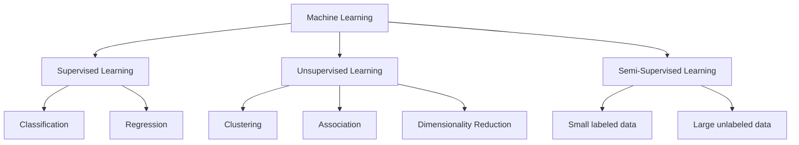

| Type            | Data Used                    | Main Goal                            | Common Algorithms                                           | Example Applications                         |
| --------------- | ---------------------------- | ------------------------------------ | ----------------------------------------------------------- | -------------------------------------------- |
| Supervised      | Labeled                      | Predict known outputs                | Decision Trees, SVM, Linear Regression, Logistic Regression | Email spam detection, house price prediction |
| Unsupervised    | Unlabeled                    | Discover patterns/groups             | K-Means, Hierarchical Clustering, PCA, Autoencoders         | Customer segmentation, anomaly detection     |
| Semi-Supervised | Few labeled + many unlabeled | Improve learning with limited labels | Self-training, Pseudo-labeling, Semi-supervised SVM         | Speech recognition, image classification     |

---
## Supervised Learning

- **Definition:** Model learns from labeled data (each input has a known output).
- **Process:**
    1. Split data into training and testing sets (commonly 80:20).
    2. Train model on labeled data, adjusting parameters to minimize error.
    3. Test model on unseen data to evaluate accuracy.
- **Types:**
    - **Classification:** Predicts categorical outcomes (e.g., spam vs. not spam).
    - **Regression:** Predicts continuous values (e.g., house prices).
- **Advantages:**
    - High accuracy with sufficient labeled data.
    - Clear evaluation metrics.
- **Challenges:**
    - Requires large labeled datasets (time-consuming, costly).
    - Model selection and resource requirements vary.

| Problem Type   | Input Features                   | Output          |
| -------------- | -------------------------------- | --------------- |
| Classification | Gender, Age, Salary              | Purchased (0/1) |
| Regression     | Dew Point, Temperature, Pressure | Wind Speed      |

---

## Unsupervised Learning

- **Definition:** Model learns from unlabeled data, finding hidden patterns or structures.
- **Process:**
    1. Input data is not labeled; algorithm explores data to find clusters, associations, or reduce dimensions.
    2. Human validation may be needed for interpreting results.
- **Main Tasks:**
    - **Clustering:** Grouping similar data points (e.g., customer segments).
    - **Association:** Finding rules about data relationships (e.g., market basket analysis).
    - **Dimensionality Reduction:** Simplifying data while retaining important information (e.g., PCA).
- **Advantages:**
    - Useful for exploratory analysis.
    - No need for labeled data.
- **Challenges:**
    - Harder to assess model quality.
    - Results may be less interpretable.

---
## Semi-Supervised Learning
- **Definition:** Combines a small amount of labeled data with a large amount of unlabeled data.
- **Process:**
    1. Train initial model on labeled data.
    2. Use model to assign pseudo-labels to unlabeled data.
    3. Retrain model with both true and pseudo-labeled data.
- **Advantages:**
    - Reduces dependency on large labeled datasets.
    - Improves accuracy over using labeled data alone.
    - Useful in real-world scenarios where labeling is expensive or impractical.
- **Applications:**
    - Fraud detection, 
    - sentiment analysis, 
    - document classification, 
    - speech/image recognition.