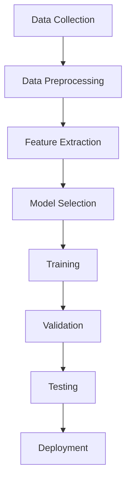

### 1. Model Families
- **Definition:** A model family is a group of algorithms sharing similar mathematical structures or approaches to learning from data.
- **Selection Criteria:**
  - Nature of the problem (classification, regression, clustering)
  - Data type (numerical, categorical, text, images)
  - Interpretability vs. complexity

| Model Family                  | Typical Use Case                  | Pros                                   | Cons                                    |
| ----------------------------- | --------------------------------- | -------------------------------------- | --------------------------------------- |
| Linear Models                 | Regression, simple classification | Easy to interpret, fast                | Limited to linear relationships         |
| Tree-Based Models             | Classification, regression        | Handles non-linear data, interpretable | Prone to overfitting                    |
| Neural Networks               | Image, speech, text               | Powerful, flexible                     | Requires large data, less interpretable |
| Support Vector Machines(SVMs) | Classification                    | Effective in high dimensions           | Computationally intensive               |

### 2. Loss Function
- **Definition:** A loss function quantifies the difference between the model's predictions and the actual target values. It guides the model during training to improve accuracy.
- **Common Loss Functions:**
  - **Mean Squared Error (MSE):** Used for regression tasks
  - **Cross-Entropy Loss:** Used for classification tasks
  - **Hinge Loss:** Used for SVMs
- **Role:** The loss function is minimized during training to improve model performance.

| Loss Function      | Formula                                   | Use Case         |
|-------------------|--------------------------------------------|------------------|
| MSE               | $$ \frac{1}{n} \sum_{i=1}^n (y_i - \hat{y}_i)^2 $$ | Regression       |
| Cross-Entropy     | $$ -\sum_{i=1}^n y_i \log(\hat{y}_i) $$           | Classification   |
| Hinge Loss        | $$ \max(0, 1 - y_i \cdot \hat{y}_i) $$            | SVM              |

### 3. Optimization
- **Definition:** Optimization is the process of adjusting model parameters to minimize the loss function.
- **Common Algorithms:**
  - **Gradient Descent:** Iteratively updates parameters in the direction that reduces loss
  - **Stochastic Gradient Descent (SGD):** Uses random samples for faster updates
  - **Adam, RMSprop:** Advanced optimizers for deep learning
- **Process:**
  1. Initialize model parameters
  2. Compute loss on training data
  3. Calculate gradients (how much each parameter affects the loss)
  4. Update parameters to reduce loss
  5. Repeat until convergence

```python
# Example: Gradient Descent for Linear Regression
for epoch in range(num_epochs):
    predictions = model(X)
    loss = mse_loss(predictions, y)
    gradients = compute_gradients(loss, model.parameters)
    update_parameters(model.parameters, gradients, learning_rate)
```

## Training Workflow Table
| Step                | Description                                      |
|---------------------|--------------------------------------------------|
| Data Collection     | Gather relevant, high-quality data                |
| Data Preprocessing  | Clean, normalize, and split data                  |
| Feature Extraction  | Select or engineer informative features           |
| Model Selection     | Choose suitable model family                      |
| Training            | Fit model to data by minimizing loss              |
| Validation          | Evaluate on unseen data to tune parameters        |
| Testing             | Assess final performance on independent data      |
| Deployment          | Use trained model for real-world predictions      |


