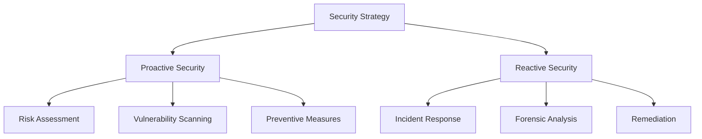

| Aspect               | Proactive Security                                  | Reactive Security                              |
| -------------------- | --------------------------------------------------- | ---------------------------------------------- |
| Timing               | Before threats materialize                          | After an incident or breach                    |
| Focus                | Risk assessment, vulnerability scanning, prevention | Incident response, forensics, remediation      |
| Goal                 | Prevent security incidents                          | Contain and mitigate damage                    |
| Process              | Continuous monitoring, audits, training             | Detection, analysis, recovery                  |
| Cost                 | Higher upfront, cost-effective long-term            | Can be expensive post-attack                   |
| Impact on Operations | Minimal disruption                                  | Can disrupt business operations                |
| Trust                | Builds customer trust                               | Can harm trust if attacks are frequent         |
| Compliance           | Improves regulatory compliance                      | May struggle to meet compliance after breaches |

---

## Proactive Security
- **Definition:** Prevents attacks before they occur by anticipating threats and addressing vulnerabilities.
- **Key Strategies:**
    - Regular security audits and penetration testing
    - Strong access controls and encryption
    - Continuous system monitoring for suspicious activity
    - Timely software and hardware updates
    - Employee cybersecurity awareness training
    - Risk analysis and layered protection
- **Benefits:**
    - Reduces overall risk and crisis situations
    - Cost-effective in the long run
    - Improves compliance with regulations
    - Prevents inside jobs and finds flaws early
    - Enables faster response to emerging threats

---

## Reactive Security
- **Definition:** Responds to threats and incidents after they have occurred, focusing on damage control and recovery.
- **Key Strategies:**
    - Incident detection and response plans
    - Forensic analysis to understand breaches
    - Remediation: patching systems, updating protocols
    - Threat detection and log monitoring
    - Restoring compromised systems
    - Communicating with stakeholders post-incident
- **Benefits:**
    - Limits damage after an incident
    - Helps identify weaknesses for future improvement
    - Essential for rapid recovery and business continuity

