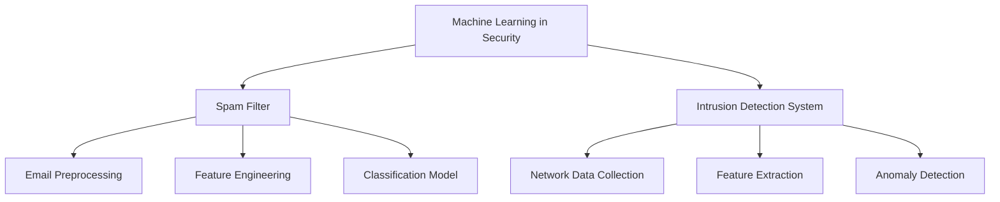

| Application                | Main Goal                 | Data Used               | Common Algorithms                                                    | Key Features/Techniques                    |
| -------------------------- | ------------------------- | ----------------------- | -------------------------------------------------------------------- | ------------------------------------------ |
| Spam Filter                | Detect and block spam     | Email content, metadata | Naive Bayes, SVM, Decision Trees, Logistic Regression, Random Forest | NLP, Feature Engineering, Keyword Analysis |
| Intrusion Detection System | Detect network intrusions | Network traffic, logs   | K-Means, SVM, Neural Networks, Decision Trees, Random Forest         | Anomaly Detection, Pattern Recognition     |
## Spam Filter
- **Purpose:** Automatically classify emails as spam or legitimate (ham) to protect users from scams, phishing, and unwanted content.
- **Key Steps:**
    - Data preprocessing: Clean and tokenize email text, remove non-alphabetic characters, handle missing values
    - Feature engineering: Extract features like sender, subject, body, keywords (e.g., 'free', 'call', 'txt')
    - Model selection: Algorithms such as Naive Bayes, SVM, Decision Trees, Logistic Regression, Random Forest
    - Model evaluation: Use metrics like accuracy, precision, recall, F1-score, ROC-AUC
    - Deployment: Integrate into email systems for real-time filtering
- **Example Algorithm:** 
```python
# Naive Bayes for Spam Detection
from sklearn.naive_bayes import MultinomialNB
model = MultinomialNB()
model.fit(X_train, y_train)
predictions = model.predict(X_test)
```
- **NLP Techniques:**
    - Tokenization, stemming, TF-IDF vectorization
    - Identifying spam keywords and patterns
- **Performance:**
    - High accuracy (often >95%) with well-engineered features and balanced datasets
    - Continuous updates needed to adapt to new spam tactics
---
## Intrusion Detection System (IDS)
- **Purpose:** Monitor network traffic and system logs to detect unauthorized access, malware, or abnormal behavior    
- **Types:**
    - **Signature-based IDS:** Detects known attack patterns
    - **Anomaly-based IDS:** Identifies deviations from normal behavior using machine learning
- **Key Steps:**
    - Data collection: Gather network packets, system logs
    - Feature extraction: Protocol type, source/destination IP, packet size, time intervals
    - Model selection: Algorithms such as K-Means (for clustering), SVM, Neural Networks, Decision Trees
    - Training: Use labeled data (normal vs. attack) or unsupervised methods for anomaly detection
    - Real-time monitoring: Flag suspicious activity for investigation
- **Example Algorithm:**
```python
# SVM for Intrusion Detection
from sklearn import svm
model = svm.SVC()
model.fit(X_train, y_train)
predictions = model.predict(X_test)
```
- **Challenges:**
    - High false positive rates if not tuned properly
    - Need for large, representative datasets
    - Evolving attack techniques require regular model updates
