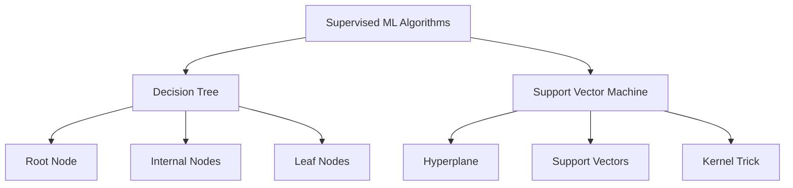

| Algorithm                    | Type       | Structure                   | Handles Non-linear Data | Interpretability      | Common Use Cases                                         |
| ---------------------------- | ---------- | --------------------------- | ----------------------- | --------------------- | -------------------------------------------------------- |
| Decision Tree                | Supervised | Tree (nodes/branches)       | Yes (with deep trees)   | High                  | Credit scoring, medical diagnosis, customer segmentation |
| Support Vector Machine (SVM) | Supervised | Hyperplane in feature space | Yes (with kernel trick) | Moderate (linear SVM) | Text classification, image recognition, bioinformatics   |

| Criteria           | Decision Tree         | SVM                             |
| ------------------ | --------------------- | ------------------------------- |
| Model Structure    | Tree (nodes/branches) | Hyperplane (linear/non-linear)  |
| Interpretability   | High                  | Moderate (linear), Low (kernel) |
| Data Preprocessing | Minimal               | Requires scaling/normalization  |
| Overfitting Risk   | High (deep trees)     | Lower (with regularization)     |
| Handles Non-linear | Yes (deep trees)      | Yes (kernel trick)              |
| Speed              | Fast (small trees)    | Slower (large datasets)         |

---

## Decision Trees
- **Fundamentals:**
    - Hierarchical, tree-like structure with root, internal nodes, branches, and leaf nodes.
    - Each internal node tests a feature; branches represent possible values; leaf nodes assign a class or value.
    - Uses a divide-and-conquer strategy to split data into homogenous subsets.
- **How it Works:**
    1. Start with the whole dataset (root node).
    2. Select the best feature to split the data (using criteria like Gini impurity or entropy).
    3. Recursively split subsets until reaching pure leaf nodes or stopping criteria.
    4. Use the tree for predictions by traversing from root to leaf based on feature values.
- **Advantages:**
    - Easy to interpret and visualize.
    - Handles both numerical and categorical data.
    - Requires minimal data preprocessing.
- **Disadvantages:**
    - Prone to overfitting with deep trees.
    - Can become unstable with small changes in data.
- **Algorithm Example:**
```python
# Decision Tree using scikit-learn 
from sklearn.tree import DecisionTreeClassifier 
model = DecisionTreeClassifier() model.fit(X_train, y_train) 
predictions = model.predict(X_test)
```

---
## Support Vector Machines (SVM)
- **Fundamentals:**
    - Finds the optimal hyperplane that separates classes in feature space.
    - Maximizes the margin between the closest data points (support vectors) and the hyperplane.
    - Can be extended to non-linear data using kernel functions (e.g., polynomial, RBF).
- **Key Concepts:**
    - **Hyperplane:** Decision boundary separating classes.
    - **Support Vectors:** Data points closest to the hyperplane, crucial for defining the margin.
    - **Margin:** Distance between support vectors and the hyperplane; SVM aims to maximize this.
    - **Kernel Trick:** Maps data to higher-dimensional space for non-linear separation without explicit transformation.
    - **Regularization (C):** Balances margin maximization and misclassification penalties.
    - **Hinge Loss:** Penalizes misclassified points or margin violations.
- **Advantages:**
    - Effective in high-dimensional spaces.
    - Robust to overfitting, especially with proper regularization.
    - Handles both linear and non-linear classification/regression.
- **Disadvantages:**
    - Less interpretable than decision trees.
    - Computationally intensive for large datasets.
- **Algorithm Example:**
```python
# SVM using scikit-learn 
from sklearn import svm 
model = svm.SVC(kernel='rbf') 
model.fit(X_train, y_train) 
predictions = model.predict(X_test)
```

