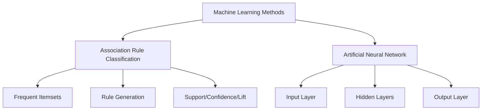

| Method                          | Learning Type | Main Goal                          | Typical Data               | Common Algorithms         | Key Metrics/Features        |
| ------------------------------- | ------------- | ---------------------------------- | -------------------------- | ------------------------- | --------------------------- |
| Association Rule Classification | Unsupervised  | Discover item relationships        | Transactional, categorical | Apriori, Eclat, FP-Growth | Support, Confidence, Lift   |
| Artificial Neural Network       | Supervised    | Model complex input-output mapping | Numeric, image, text       | Feedforward, CNN, RNN     | Layers, weights, activation |

| Criteria         | Association Rule Classification | Artificial Neural Network |
| ---------------- | ------------------------------- | ------------------------- |
| Interpretability | High                            | Low                       |
| Data Type        | Categorical, transactional      | Numeric, image, text      |
| Scalability      | Can be slow for large datasets  | Scales with hardware      |
| Output           | Rules (if-then)                 | Numeric/class labels      |
| Use Case         | Pattern discovery               | Prediction/classification |

---

## Association Rule Classification
- **Definition:** Finds patterns and relationships ("if-then" rules) between variables in large datasets, often used for market basket analysis, medical diagnosis, and web usage mining.
- **Rule Structure:**
    - **Antecedent (X):** The "if" part (items/conditions found in data)
    - **Consequent (Y):** The "then" part (items likely to occur with X)
    - Example: `{Bread,Butter}→{Milk}`
- **Key Metrics:**
    - **Support:** Frequency of itemset in data
    - **Confidence:** Probability of Y given X
    - **Lift:** Strength of association compared to random chance
- **Process:**
    1. Identify frequent itemsets using support threshold
    2. Generate rules from itemsets
    3. Evaluate rules using confidence and lift
    4. Refine rules by adjusting thresholds
- **Algorithms:**
```python 
# Apriori Algorithm (pseudo-code)
for k in range(1, max_itemset_size):
    candidate_itemsets = generate_candidates(frequent_itemsets[k-1])
    frequent_itemsets[k] = [itemset for itemset in candidate_itemsets if support(itemset) >= min_support]
    if not frequent_itemsets[k]:
        break

```
- **Applications:**
    - Market basket analysis
    - Medical diagnosis
    - Catalog design
    - Intrusion detection
- **Benefits:**
    - Reveals hidden relationships
    - Supports decision-making
- **Limitations:**
    - Can generate too many rules
    - Requires careful parameter tuning

---
## Artificial Neural Network (ANN)
- **Definition:** Computational models inspired by the human brain, consisting of interconnected nodes (neurons) organized in layers. Used for supervised learning tasks such as classification, regression, and pattern recognition.
- **Structure:**
    - **Input Layer:** Receives raw data
    - **Hidden Layers:** Extract features and learn representations
    - **Output Layer:** Produces predictions
- **Key Concepts:**
    - **Weights:** Parameters adjusted during training
    - **Activation Functions:** Introduce non-linearity (e.g., sigmoid, ReLU)
    - **Backpropagation:** Algorithm for updating weights based on error
- **Process:**
    1. Forward pass: Compute outputs from inputs
    2. Calculate loss (difference between prediction and target)
    3. Backward pass: Update weights using gradients
    4. Repeat until convergence
- **Algorithm Example:**
```python
# Simple Feedforward Neural Network (pseudo-code)
for epoch in range(num_epochs):
    for batch in data:
        output = forward_pass(batch)
        loss = compute_loss(output, target)
        gradients = backward_pass(loss)
        update_weights(gradients, learning_rate)
```
- **Types:**  
    - **Feedforward Neural Network:** Basic structure for tabular data
    - **Convolutional Neural Network (CNN):** For image data
    - **Recurrent Neural Network (RNN):** For sequential data
- **Applications:**
    - Image and speech recognition
    - Text classification
    - Fraud detection
    - Forecasting
- **Benefits:**
    - Handles complex, non-linear relationships
    - Learns hierarchical features
- **Limitations:**
    - Requires large datasets
    - Computationally intensive
    - Less interpretable than rule-based models

