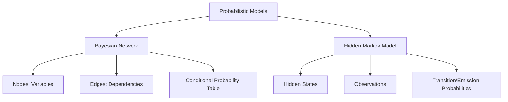

|Model|Learning Type|Structure|Data Type|Key Features|Common Applications|
|---|---|---|---|---|---|
|Bayesian Network|Supervised/Unsupervised|Directed acyclic graph (DAG)|Tabular, categorical, continuous|Conditional dependencies, inference|Diagnosis, risk analysis, decision support|
|Hidden Markov Model|Unsupervised|Sequence of hidden states|Sequential, time-series|Transition & emission probabilities|Speech recognition, bioinformatics, POS tagging|

| Criteria     | Bayesian Network          | Hidden Markov Model             |
| ------------ | ------------------------- | ------------------------------- |
| Structure    | DAG (static)              | Sequence (dynamic)              |
| Data Type    | Tabular, categorical      | Sequential, time-series         |
| Inference    | Probabilistic, causal     | Sequence decoding               |
| Learning     | Structure & parameter     | Parameter (transition/emission) |
| Applications | Diagnosis, risk, decision | Speech, bioinformatics, NLP     |

---

## Bayesian Network

- **Definition:** A Bayesian Network is a directed acyclic graph (DAG) where nodes represent random variables and edges represent conditional dependencies. Each node has a probability distribution conditioned on its parent nodes.
- **Fundamentals:**
    - Models joint probability distributions efficiently
    - Supports inference: given evidence, can compute probabilities of unknowns
    - Can be learned from data (structure and parameters)
- **Key Concepts:**
    - **Nodes:** Random variables (discrete or continuous)
    - **Edges:** Direct dependencies (cause-effect relationships)
    - **Conditional Probability Table (CPT):** Specifies probability of each node given its parents
- **Learning Methods:**
    - **Structure Learning:** Discovering the graph structure from data
    - **Parameter Learning:** Estimating CPTs from data
- **Algorithm Example:**
```python
# Bayesian Network using pgmpy (pseudo-code)
from pgmpy.models import BayesianNetwork
model = BayesianNetwork([('A', 'B'), ('B', 'C')])
model.fit(data)
prob = model.predict_probability({'A': 1, 'B': 0})
```
- **Applications:**
    - Medical diagnosis (symptoms to disease)
    - Risk analysis
    - Decision support systems
- **Benefits:**
    - Handles missing data
    - Explains causal relationships
    - Supports probabilistic inference
- **Limitations:**
    - Structure learning can be computationally intensive
    - Requires expert knowledge for manual design

---

## Hidden Markov Model (HMM)

- **Definition:** HMM is a statistical model for sequential data, where the system is assumed to be a Markov process with hidden (unobserved) states and observable outputs.
- **Fundamentals:**
    - Models the probabilistic relationship between a sequence of observations and a sequence of hidden states
    - Each hidden state emits observations according to an emission probability
    - State transitions are governed by transition probabilities
- **Key Concepts:**
    - **Hidden States:** Unobserved variables generating the data
    - **Observations:** Measured outputs
    - **Transition Probabilities:** Probability of moving from one hidden state to another
    - **Emission Probabilities:** Probability of observing a particular output from a hidden state
- **Algorithm Steps:**
    1. Define state and observation spaces
    2. Set initial state distribution
    3. Specify transition and emission matrices
    4. Train model (Baum-Welch algorithm for unsupervised learning)
    5. Decode most likely sequence of hidden states (Viterbi algorithm)
    6. Evaluate model performance
- **Algorithm Example:**
```python
# HMM using hmmlearn (pseudo-code)
from hmmlearn import hmm
model = hmm.MultinomialHMM(n_components=2)
model.fit(X)
hidden_states = model.predict(X)
```
- **Applications:**
    - Speech recognition (phonemes as hidden states, audio as observations)
    - Bioinformatics (gene sequence analysis)
    - Part-of-speech tagging in NLP
    - Financial market prediction
- **Benefits:**
    - Handles sequential and time-series data
    - Captures dependencies between observations
    - Flexible for discrete and continuous data
- **Limitations:**
    - Number of hidden states must be chosen carefully
    - Assumes Markov property (future depends only on present state)
    - Can be computationally intensive for long sequences
