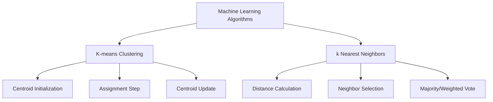

|Algorithm|Learning Type|Main Goal|Data Type|Key Features|Common Applications|
|---|---|---|---|---|---|
|K-means Clustering|Unsupervised|Partition data into k clusters|Numeric, vector|Centroids, Euclidean distance|Customer segmentation, image compression|
|k Nearest Neighbors|Supervised|Classify/regress based on nearest neighbors|Numeric, categorical|Distance metrics, majority vote|Handwriting recognition, recommendation systems|

| Criteria       | K-means Clustering        | k Nearest Neighbors        |
| -------------- | ------------------------- | -------------------------- |
| Learning Type  | Unsupervised              | Supervised                 |
| Output         | Cluster assignments       | Class/regression label     |
| Training Phase | Iterative centroid update | No explicit training       |
| Use Case       | Grouping, segmentation    | Classification, regression |
| Scalability    | Good for moderate data    | Slow for large datasets    |

---
## K-means Clustering
- **Definition:** Unsupervised algorithm that partitions data into k clusters by minimizing within-cluster variance.
- **Key Concepts:**
    - **Centroid:** Center of each cluster, updated as the mean of assigned points
    - **Distance Metric:** Usually Euclidean distance
    - **Initialization:** Centroids chosen randomly or via k-means++ for better convergence
- **Algorithm Steps:**
    1. Choose k (number of clusters)
    2. Initialize k centroids
    3. Assign each data point to the nearest centroid
    4. Update centroids as the mean of assigned points
    5. Repeat steps 3-4 until assignments do not change or max iterations reached
- **Choosing k:** Use the elbow method to plot inertia (sum of squared distances) and find the optimal k
- **Algorithm Example:**
```python
from sklearn.cluster import KMeans
kmeans = KMeans(n_clusters=3, init='k-means++')
kmeans.fit(X)
labels = kmeans.labels_
centroids = kmeans.cluster_centers_
```
- **Strengths:**
    - Simple, scalable, fast for moderate k and data size
    - Works well for spherical clusters
- **Limitations:**
    - Sensitive to initial centroids
    - Assumes clusters of similar size and density
    - Not suitable for non-globular clusters

---
## k Nearest Neighbors (k-NN)
- **Definition:** Supervised algorithm that classifies or predicts based on the k closest labeled data points in feature space
- **Key Concepts:**
    - **Distance Metric:** Euclidean, Manhattan, or other metrics
    - **Majority Vote:** For classification, assigns the most common label among neighbors
    - **Weighted Vote:** Optionally weights neighbors by distance
- **Algorithm Steps:**
    1. Choose k (number of neighbors)
    2. For each query point, compute distances to all training points
    3. Select k closest points
    4. For classification: assign the majority label; for regression: average the values
- **Algorithm Example:**
```python
from sklearn.neighbors import KNeighborsClassifier
knn = KNeighborsClassifier(n_neighbors=5)
knn.fit(X_train, y_train)
predictions = knn.predict(X_test)
```
- **Strengths:**
    - No training phase; simple and intuitive
    - Flexible for classification and regression
- **Limitations:**
    - Slow for large datasets (computes distance to all points)
    - Sensitive to irrelevant features and feature scaling
    - Requires storing all training data
