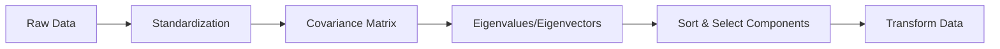

| Feature              | Description                                                                |
| -------------------- | -------------------------------------------------------------------------- |
| Type                 | Unsupervised learning, linear transformation                               |
| Goal                 | Reduce dimensionality, retain maximum variance                             |
| Principal Components | New axes (linear combinations of original features), uncorrelated          |
| Variance             | Each component captures decreasing amounts of variance                     |
| Orthogonality        | Components are perpendicular (uncorrelated)                                |
| Data Standardization | Required for fair comparison of features                                   |
| Applications         | Visualization, noise reduction, feature extraction, overfitting prevention |

## How PCA Works: Step-by-Step
1. **Standardize the Data**: Scale features to have mean 0 and standard deviation 1 so all contribute equally.
$$
Z = \frac{X - \mu}{\sigma}
$$
2. **Compute Covariance Matrix**
    - Measures how features vary together.
    - Covariance matrix C for data matrix X
    $$
C = \frac{1}{n-1} X^T X
$$

3. **Calculate Eigenvalues and Eigenvectors**
    - Eigenvectors: directions of maximum variance (principal components)
    - Eigenvalues: amount of variance captured by each component
4. **Sort Principal Components**
    - Rank components by eigenvalues (variance explained)
    - Select top k components that capture most variance
5. **Transform Data**
    - Project original data onto new axes (principal components)
	    - Reduced dataset: $$
X_{\text{PCA}} = X \cdot W_k
$$where $$W_k$$  is matrix of top k eigenvectors

## PCA Algorithm Example
```python
from sklearn.preprocessing import StandardScaler
from sklearn.decomposition import PCA
# Standardize features
X_std = StandardScaler().fit_transform(X)
# Fit PCA and transform data
pca = PCA(n_components=2)
X_pca = pca.fit_transform(X_std)
```

| Advantages                           | Limitations                             |
| ------------------------------------ | --------------------------------------- |
| Speeds up ML algorithms              | Linear method (not for non-linear data) |
| Improves visualization (2D/3D plots) | Components are hard to interpret        |
| Removes noise and redundancy         | Requires data standardization           |
| Prevents overfitting                 | Some information loss may occur         |
| Handles multicollinearity            |                                         |

## Applications of PCA
- **Medical Diagnosis:** Detects diseases using genetic/imaging data
- **Finance:** Simplifies stock market prediction models
- **Marketing Analytics:** Enhances customer segmentation
- **Image Processing:** Improves facial recognition, compression
- **Signal Processing:** Extracts key features from noisy signals

## PCA vs. Other Methods Table

| Feature        | PCA                      | LDA (Linear Discriminant Analysis) | Factor Analysis         |
| -------------- | ------------------------ | ---------------------------------- | ----------------------- |
| Purpose        | Dimensionality reduction | Classification                     | Identifying latent vars |
| Uses Variance? | Yes                      | No                                 | Yes                     |
| Output         | Principal Components     | Discriminant Functions             | Factors                 |


