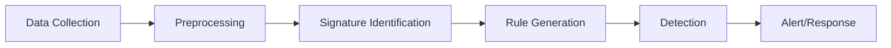

| Aspect                | Description                                                            |
| --------------------- | ---------------------------------------------------------------------- |
| Detection Method      | Matches data against known attack signatures                           |
| Signature             | Unique pattern (byte sequence, hash, rule, IOC) identifying a threat   |
| Data Sources          | Network traffic, audit logs, registry, files                           |
| Alert Trigger         | Match found between observed data and signature database               |
| Machine Learning Role | Automates pattern learning, rule generation, and adapts to new threats |
| Limitation            | Cannot detect unknown or novel attacks without updated signatures      |
| False Positives       | Legitimate activity may match a known attack pattern                   |
| False Negatives       | New attacks not in the database go undetected                          |

## How Signature Detection Works
- **Signature Creation:** Security experts analyze threats and extract unique patterns (signatures) from malware, attack behaviors, or suspicious files.
- **Signature Database:** Signatures are stored and regularly updated in a database used by security tools (IDS, antivirus).
- **Detection Process:** Incoming data (network packets, files, logs) is compared to the database. If a match is found, an alert is triggered and remediation actions may follow.
- **Rule-Based Matching:** Often implemented as "if-then" rules (e.g., if login name = "Sidra", then raise alert).

## Machine Learning for Misuse/Signature Detection
- **Supervised Learning:** Models are trained on labeled data (known attack patterns) to classify new data as benign or malicious.
- **Pattern Recognition:** ML algorithms learn complex attack patterns and automate rule generation, improving detection speed and accuracy.
- **Adaptive Rule Generation:** ML can update and refine rules as new attack signatures are discovered, reducing manual effort.
- **Feature Extraction:** ML helps select and extract relevant features from raw data (e.g., packet headers, file metadata) for better matching.
- **False Alarm Reduction:** ML models can learn to distinguish between legitimate and malicious activities, reducing false positives.
## Typical Workflow Table

| Step                     | Description                                               |
| ------------------------ | --------------------------------------------------------- |
| Data Collection          | Gather network logs, audit trails, registry entries       |
| Data Preprocessing       | Clean, normalize, and extract features from raw data      |
| Signature Identification | Use ML or manual analysis to find attack patterns         |
| Rule Generation          | Create matching rules or update signature database        |
| Detection/Response       | Apply rules to incoming data, trigger alerts, and respond |
```python 
from sklearn.ensemble import RandomForestClassifier
# Assume X_train contains features, y_train contains labels (attack/benign)
model = RandomForestClassifier()
model.fit(X_train, y_train)
predictions = model.predict(X_test)
```
## Advantages and Limitations Table

|Advantages|Limitations|
|---|---|
|High precision for known threats|Cannot detect unknown attacks|
|Fast and efficient matching|Requires frequent signature updates|
|Actionable alerts|May produce false positives/negatives|
|ML automates rule generation|ML needs labeled data and expert input|


