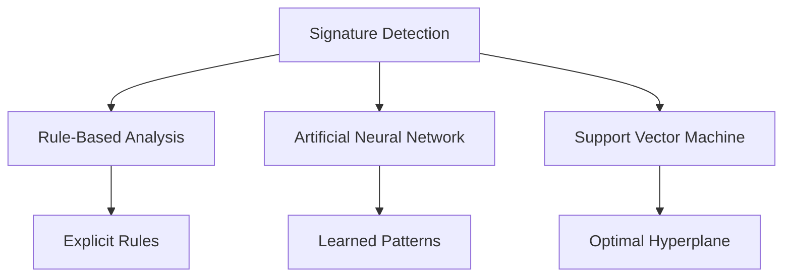

|Method|Approach|Input Data|Detection Level|Strengths|Limitations|
|---|---|---|---|---|---|
|Rule-Based Signature|Explicit rules (if-then)|System calls, logs|Host|Transparent, interpretable|High false positives, static rules|
|Artificial Neural Network|Supervised ML|TCP/IP packets|Host|Learns complex patterns|Needs large data, less interpretable|
|Support Vector Machine|Supervised ML|TCP/IP packets|Network|High accuracy, adapts to changes|Needs feature selection, slow for large data|

| Criteria           | Rule-Based Signature | Artificial Neural Network | Support Vector Machine |
| ------------------ | -------------------- | ------------------------- | ---------------------- |
| Approach           | Manual rules         | Learned patterns          | Learned boundaries     |
| Adaptability       | Low                  | High                      | High                   |
| Interpretability   | High                 | Low                       | Moderate               |
| Detection of Novel | Poor                 | Good (with retraining)    | Good (with retraining) |
| Data Requirement   | Expert knowledge     | Labeled data              | Labeled data           |

## Rule-Based Signature Analysis

- **Definition:** Uses expert-defined rules to match known attack patterns in data (e.g., system calls, network packets).
- **Process:**
    1. Data collection (logs, packets)
    2. Preprocessing (cleaning, feature extraction)
    3. Rule matching ("if condition then alert")
    4. Alert and response
- **Example Rule:**
```python
if login_name == "Sidra":
    raise_alert()
```
- **Strengths:** Simple, interpretable, fast for known attacks
- **Limitations:** Cannot detect novel attacks, high false positives, needs frequent updates

## Artificial Neural Network (ANN) for Signature Detection

- **Definition:** Supervised learning model with interconnected nodes (neurons) organized in layers, trained to classify data as benign or malicious.
- **Process:**
    1. Data preprocessing (feature extraction, normalization)
    2. Model training on labeled attack/benign data
    3. Prediction on new data
- **Features:** Learns complex, non-linear attack patterns; adapts to new threats
- **Algorithm Example:**
```python
from sklearn.neural_network import MLPClassifier
model = MLPClassifier(hidden_layer_sizes=(100,))
model.fit(X_train, y_train)
predictions = model.predict(X_test)
```
- **Strengths:** Handles complex data, can reduce false positives
- **Limitations:** Requires large labeled datasets, less interpretable, may overfit

## Support Vector Machine (SVM) for Signature Detection
- **Definition:** Supervised learning algorithm that finds the optimal hyperplane to separate attack and benign data, using kernel functions for non-linear patterns.
- **Process:**
    1. Feature selection and normalization
    2. Model training on labeled data
    3. Classification of new data
- **Features:** High accuracy, adapts to changing attack patterns, robust to overfitting
- **Algorithm Example:**
```python 
from sklearn import svm
model = svm.SVC(kernel='rbf')
model.fit(X_train, y_train)
predictions = model.predict(X_test)
```
- **Strengths:** Effective for high-dimensional data, adapts to new patterns
- **Limitations:** Needs careful feature selection, slower for large datasets

