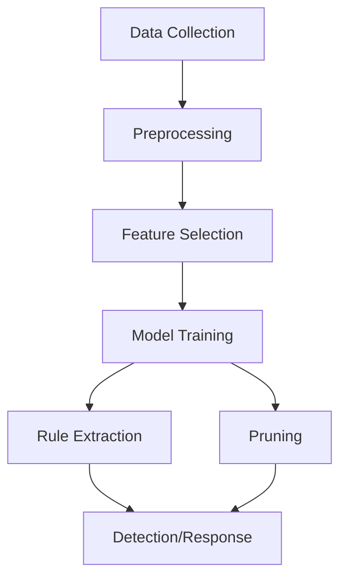

|Aspect|Description|
|---|---|
|Approach|Supervised learning, rule-based classification|
|Data Used|Network traffic, system logs, audit data, attack signatures|
|Output|Class label (benign or specific attack type)|
|Feature Selection|Information gain, entropy, wrapper methods|
|Strengths|High accuracy, interpretable rules, low false positives|
|Limitations|Needs frequent updates, cannot detect novel attacks, may overfit|

## Decision Tree in Misuse/Signature Detection

- **Signature-Based Detection:** Decision trees learn from labeled attack data, mapping features to known attack types. Each branch represents a test on a feature, and each leaf node assigns a class (benign or attack).
- **Rule Extraction:** Paths from root to leaf form IF-THEN rules, which are easy to interpret and deploy for real-time detection.
- **Feature Selection:** Algorithms like C4.5 use information gain or entropy reduction to select the best features for splitting nodes, improving detection accuracy and reducing false alarms.
- **Pruning:** Post-pruning removes unnecessary branches, optimizing the tree and reducing overfitting.
- **Performance:** Decision tree-based IDSs have achieved high accuracy (often >98%) and low false positive rates on benchmark datasets (e.g., KDDCUP99, NSL-KDD, CICIDS2017).

## Typical Workflow Table

|Step|Description|
|---|---|
|Data Collection|Gather network logs, system calls, audit trails|
|Data Preprocessing|Clean, normalize, and extract features from raw data|
|Feature Selection|Use information gain, entropy, or wrapper methods|
|Model Training|Build decision tree using labeled data|
|Rule Extraction|Convert tree paths to IF-THEN rules for detection|
|Detection/Response|Apply rules to new data, trigger alerts for matches|
|Pruning|Optimize tree by removing redundant branches|
```python
from sklearn.tree import DecisionTreeClassifier
model = DecisionTreeClassifier(criterion='entropy', max_depth=10)
model.fit(X_train, y_train)
predictions = model.predict(X_test)
```

| Advantages                       | Limitations                              |
| -------------------------------- | ---------------------------------------- |
| Interpretable, rule-based output | Needs frequent signature updates         |
| High accuracy for known attacks  | Cannot detect novel attacks              |
| Fast classification              | May overfit without pruning              |
| Low false positive rates         | Performance depends on feature selection |
## Applications
- Network Intrusion Detection Systems (NIDS)
- Host-based Intrusion Detection Systems (HIDS)
- Automated rule generation for signature-based IDS
- Real-time detection and alerting

