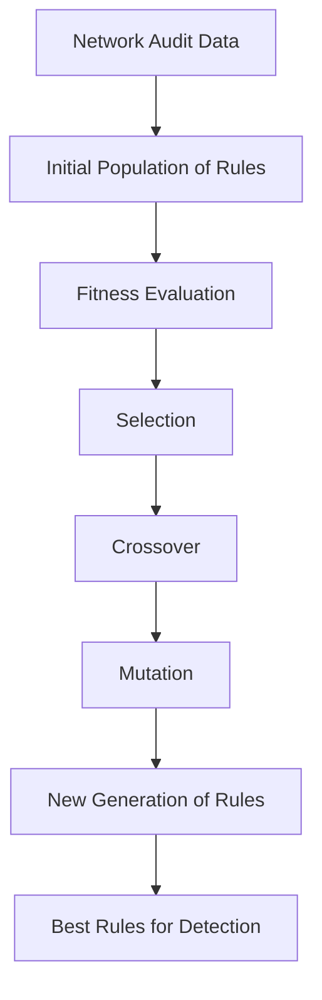

|Aspect|Description|
|---|---|
|Approach|Evolutionary computation, population-based search|
|Data Used|Network audit data, system logs, attack signatures|
|Output|Optimized rules/signatures for attack detection|
|Fitness Function|Measures rule quality (e.g., detection rate, false positives)|
|Operators|Selection, crossover, mutation|
|Strengths|Adaptive, can discover new rules, handles complex search spaces|
|Limitations|Computationally intensive, may require tuning, depends on quality of data|
## Genetic Programming/Algorithm in Misuse Detection
- **Rule Generation:** GP/GA evolves a population of candidate rules (chromosomes) to match attack patterns in audit data
- **Fitness Evaluation:** Each rule is scored based on its ability to correctly classify attacks and minimize false alarms
- **Selection:** Best-performing rules are selected for reproduction
- **Crossover:** Combines parts of two rules to create new offspring rules
- **Mutation:** Randomly alters parts of a rule to introduce diversity
- **Iteration:** The process repeats for multiple generations, improving rule quality
- **Deployment:** Optimized rules are used in real-time to classify network connections as normal or attack
## Example Chromosome Representation Table

| Feature Name     | Format  | Number of Genes |
| ---------------- | ------- | --------------- |
| Duration         | h:m:s   | 3               |
| Protocol         | Int     | 1               |
| Source_port      | Int     | 1               |
| Destination_port | Int     | 1               |
| Source_IP        | a.b.c.d | 4               |
| Destination_IP   | a.b.c.d | 4               |
| Attack_name      | Int     | 1               |

## Genetic Algorithm Steps for Rule Generation

```python
# Pseudocode for GA-based rule generation
initialize_population()
for generation in range(max_generations):
    evaluate_fitness(population)
    select_best_rules(population)
    apply_crossover(population)
    apply_mutation(population)
    if stopping_criteria_met:
        break
return best_rules
```
## Fitness Function Example
$$
\text{Fitness} = w_1 \times \frac{|A \cap B|}{|A|} + w_2 \times \frac{|A \cap B|}{|B|}
where \; |A| \; \text{is the number of connections matching the condition, } \; |A \cap B| \; \text{is the number matching the rule, and } \; w_1, w_2 \; \text{are weights.}
$$

## Advantages and Limitations Table

| Advantages                         | Limitations                      |
| ---------------------------------- | -------------------------------- |
| Can discover new attack rules      | Computationally expensive        |
| Adapts to changing attack patterns | Needs careful parameter tuning   |
| Reduces manual rule creation       | Quality depends on training data |
| Can optimize for multiple criteria | May overfit to training data     |

## Applications
- Network Intrusion Detection Systems (IDS)
- Automated signature generation and optimization
- Adaptive security systems for evolving threats