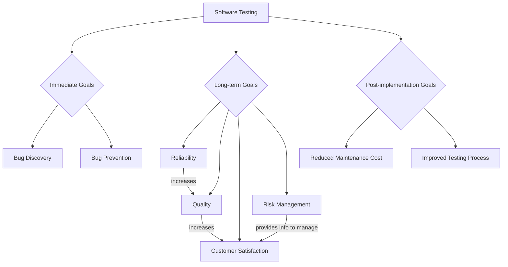
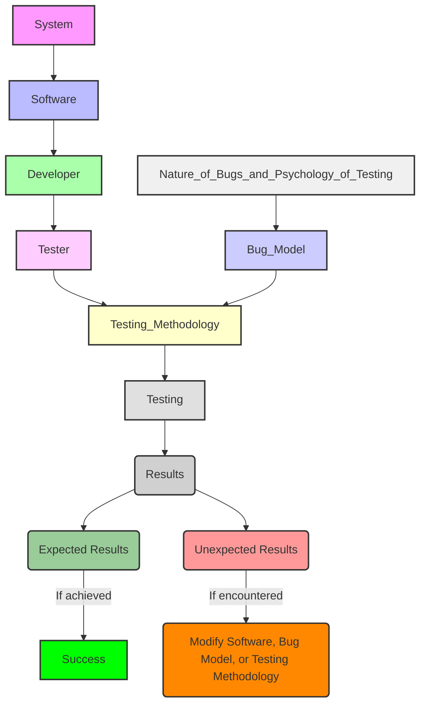
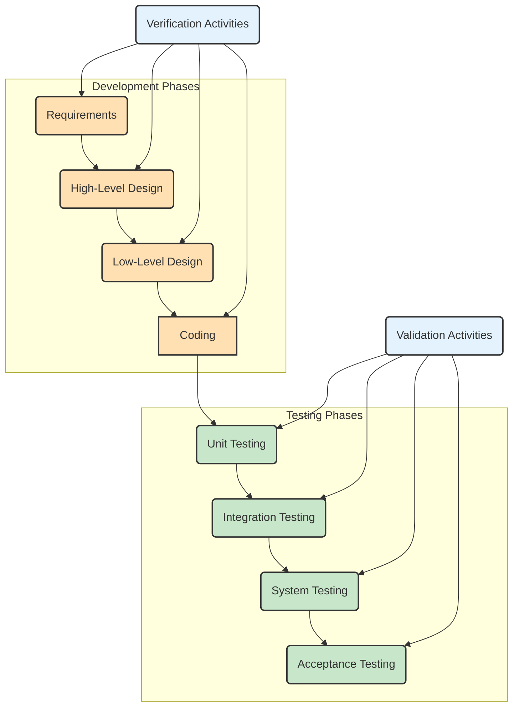
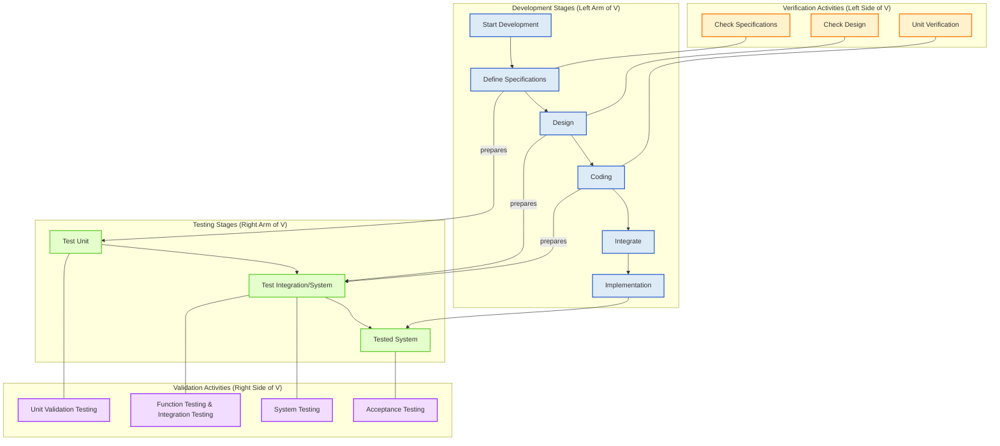
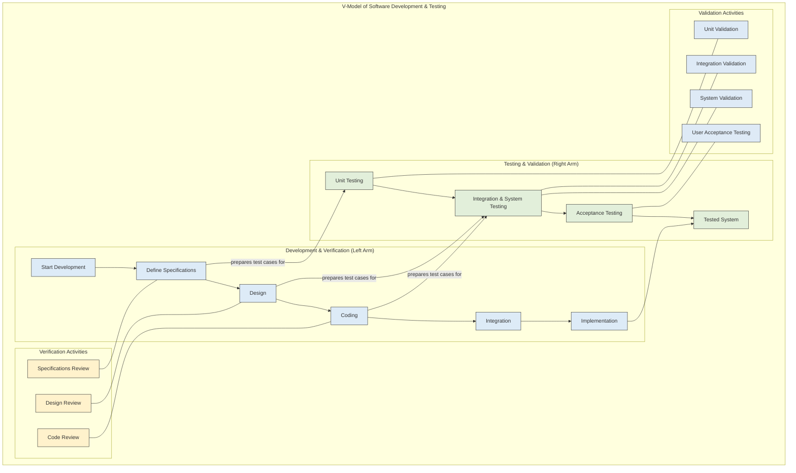

## 1. Goals of Software Testing

Software testing has evolved into a complete process with defined goals, moving beyond merely debugging. These goals guide the study and execution of test cases and are categorized into three major areas: Immediate, Long-term, and Post-implementation.

### 1.1. Immediate Goals
These are the direct outcomes of performing testing and can be set in individual phases of the Software Development Life Cycle (SDLC).

- **Bug Discovery**:
  - The primary goal is to **find errors at any stage of software development**
  - **Earlier bug discovery leads to a higher success rate** of software testing

- **Bug Prevention**:
  - Involves analyzing bug behavior and rectifying the software so that similar errors do not appear in later stages or future projects
  - While errors cannot be entirely eliminated, they can be minimized

### 1.2. Long-term Goals
These goals impact the product's quality over the long run, after the SDLC cycle is complete.

- **Reliability**:
  - A critical factor for achieving quality
  - Represents the **confidence that the software will not fail**, which increases with rigorous testing
  - Rigorous reliability analysis is necessary to attain high quality standards

- **Quality**:
  - As software is a product, its quality is paramount from the user's perspective
  - **Thorough testing ensures superior quality**
  - Quality depends on various factors such as correctness, integrity, and efficiency

- **Customer Satisfaction**:
  - The ultimate concern from the user's viewpoint
  - Testing should be **complete and thorough**, satisfying both specified requirements from the user manual and unspecified but understood requirements
  - A complete testing process leads to reliability, which enhances quality, ultimately increasing customer satisfaction

- **Risk Management**:
  - Managers rely on software testing to **control business goals**
  - Testing provides information to management to better react to risk situations, such as potential delays in delivery or unresolved high-priority bugs
  - This advance information helps in making decisions to minimize risks

### 1.3. Post-implementation Goals
These goals are important after the software has been released.

- **Reduced Maintenance Cost**:
  - Post-release errors are significantly more costly to fix
  - A goal of testing is to minimize such costs by detecting errors early

- **Improved Testing Process**:
  - Analysis of bug history and post-implementation results can identify shortcomings in the current testing process
  - This feedback is used to **rectify and improve the testing process** for future projects

## 2. Model for Software Testing

Testing is not an intuitive activity but a **systematic process** that should be learned and performed in a planned way. A testing model considers every element and aspect related to software testing and involves various team members.

### Components of the Software Testing Model

- **System**:
  - The overarching entity for which the software is being developed
  - Comprises both hardware and software to ensure the product functions

- **Developer**:
  - Creates the software within the specified system environment
  - Must consider the **testability of the software** during design and coding, as complex or badly written software can be difficult to test

- **Software**:
  - A complex entity within the system, influenced by the environment, logic, and programmer psychology
  - Should be **designed to be testable**, avoiding unnecessary complexities

- **Tester**:
  - Initiates their tasks as soon as requirements are specified
  - Operates based on a **bug model** and determines the appropriate testing methodology

- **Bug Model**:
  - Offers insights into the **types of bugs expected**
  - Classifies bugs based on their **criticality** or the SDLC phase where testing is performed
  - Helps in deciding a testing strategy
  - Needs to be modified if unexpected or incorrect results are obtained

- **Testing Methodology**:
  - Developed by testers using inputs from the software model and bug model
  - Integrates both **testing strategy** (a roadmap of planned steps based on risk factors and testing phases) and **testing tactics** (specific techniques and tools)

- **Testing**:
  - Performed on the software following the chosen testing methodology, with a specific goal in mind

- **Results (Expected vs. Unexpected)**:
  - If testing outcomes align with desired goals, the testing is considered successful
  - If not, the software, bug model, or testing methodology must be reviewed and adjusted to achieve the desired results

## 3. Software Testing Terminology and Methodology

This section clarifies common terms used interchangeably in software testing and outlines the systematic approach to testing.

### 3.1. Software Testing Terminology

| Term | Definition |
|------|------------|
| **Failure** | The **inability of a system or component to perform a required function** according to its specifications |
| **Fault (Bug/Defect)** | A **condition within the program that causes failures** |
| **Error** | The **actual location in the program where a mistake has been made** that led to the fault (bug) |
| **Test Case** | A **well-documented procedure** designed to test a specific feature's functionality within the system |
| **Testware** | Refers to **all documents created during testing activities** |
| **Incident** | The symptom(s) associated with a failure that alerts the user to its occurrence |
| **Test Oracle** | Used to judge whether a test is successful or has failed, ensuring the correctness of the system |

**Test Case Template Components**:
- **Test Case ID**: Unique identification number
- **Purpose**: Explains why the test case is designed
- **Preconditions**: Defines necessary conditions for running inputs
- **Inputs**: Actual, specific inputs (not hypothetical)
- **Expected Outputs**: The outputs anticipated if there is no failure

### 3.2. Testing Principles
These principles serve as guidelines for testers, ensuring an effective and planned testing process.

- **Effective Testing, Not Exhaustive Testing**:
  - **Complete testing is impossible** due to the infinitely large domain of possible test combinations
  - Testers should focus on **effective testing**, using efficient techniques to cover program logic and conditions adequately, prioritizing the discovery of severe bugs

- **Everything Must Be Recorded**:
  - Testing is a **planned process** requiring thorough documentation
  - Records of every test case run, reported bugs, inputs, and corresponding outputs are essential for observations, learning, and reuse in future projects

- **Independent Testing Team**:
  - Testing should ideally be performed by a team independent of the development team

- **Focus on Invalid Inputs and Unexpected Behavior**:
  - These areas often have a **high probability of uncovering errors**

- **Testers' Participation in Reviews**:
  - Testers must be involved in **specification and design reviews**

- **Early Testing**:
  - Errors are inevitable, but **critical bugs can be prevented** from propagating to later stages by conducting thorough checks at each level of SDLC

### 3.3. Software Testing Methodology
Software testing methodology is the framework that organizes software testing to achieve its strategic and tactical goals.

#### 3.3.1. Testing Strategy
This is the planning phase, providing a roadmap with well-defined steps for the overall testing process.

- **Test Factors**:
  - Represent **risk factors or issues** related to the system under development
  - These risks must be identified, assessed for impact, and mitigated with effective strategies

- **Test Phase**:
  - Refers to the **stages of the SDLC** where testing activities are performed (e.g., Requirements, Design, Code, Unit test, Integration test, System test)

- **Test Strategy Matrix**:
  - A table used to identify the concerns that will be the focus of test planning and execution, correlating test factors with test phases

**Example Test Strategy Matrix (Conceptual)**:

| Test Factors | Requirements | Design | Code | Unit Test | Integration Test | System Test |
|-------------|-------------|--------|------|-----------|------------------|-------------|
| Portability | Is portability feature mentioned in specifications? | Design checks | Code checks | Unit tests | Integration tests | System tests |

- **Development of Test Strategy**:
  - Testing begins from the **first step of SDLC** and continues throughout the project
  - It starts at the **component level and progresses to the entire system**
  - This approach introduces the fundamental concepts of **Verification and Validation (V&V)**, forming the basis for all types of testing

#### 3.3.2. Verification and Validation (V&V)
V&V are major components of the software testing process, working in conjunction to ensure software quality.

**Verification**:
- **Definition**: The process of evaluating software to **determine whether the products of a given development phase satisfy the conditions imposed at the start of that phase**
- **Purpose**: To **check the software against its specifications at every development phase** to detect defects early and prevent their propagation
- **Nature**: It is considered **static testing** and **does not involve execution of code**
- **Scope**: Applied to all stages of SDLC; its scope decreases as development progresses towards module completion
- **Benefits**: Exposes more errors, reduces the cost of fixing bugs, and enhances software quality

**Verification Activities**:
1. **Verification of Requirements and Objectives**
   - Testers verify objectives in the SRS to ensure user needs are understood
   - Also prepare the **System Test Plan** and **Acceptance Test Plan**
   - Verification checks for **correctness, unambiguousness, consistency, completeness, updation, and traceability** in requirements

2. **Verification of High-Level Design (HLD)**
   - HLD addresses SRS requirements, documented in the Software Design Document (SDD)
   - Testers verify HLD and prepare **Function Test Plan** and **Integration Test Plan**
   - Verification checks architectural design, data design, and user interface design

3. **Verification of Low-Level Design (LLD)**
   - LLD provides detailed design of modules and data. Testers verify LLD details and consistency with HLD
   - Also prepares the **Unit Test Plan**
   - Verification includes SRS and SDD of each module, consistency of data structures, interfaces, and algorithms with design notations

4. **Verification of Coding (Unit Verification)**: Often white-box oriented, verification of modules

**Validation**:
- **Definition**: The process of evaluating a system or component **during or at the end of the development process to determine whether it satisfies specified requirements**. It tests the software as a whole in conformance with customer expectations
- **Purpose**: Provides the **last chance to discover bugs** before the product is released to the customer and enhances software quality
- **Nature**: It is considered **dynamic testing** and **includes the execution of code**
- **Scope**: Replaces verification in later stages of SDLC

**Validation Activities**:
- **Validation Test Plan**: Starts when SRS is prepared. Testers perform verification and concurrently prepare corresponding validation test plans
  - Includes Acceptance Test Plan, System Test Plan, Function Test Plan, Integration Test Plan, and Unit Test Plan
- **Validation Test Execution**: Execution of all planned validation tests
  - **Unit Validation Testing**: Validating the smallest building block of software to ensure it meets baseline functionality
  - **Integration Testing**: Combining and testing multiple components to uncover bugs present when modules are integrated
  - **Function Testing**: Measures the quality of functional (business) components of the system
  - **System Testing**: Fully exercising a computer-based system to test the whole system on various grounds to find bugs
  - **Acceptance Testing**: Comparing the final system with customer needs as per acceptance criteria

#### 3.3.4. Diagram: Expanded V-Testing Model with V&V Activities

#### 3.3.5. Testing Tactics
These describe the methods for performing various types of testing within a specific test strategy.

**Software Testing Techniques**:
- Methods used to design **effective test cases** to achieve maximum coverage and detect the most bugs
- Categorized into **Static Testing** and **Dynamic Testing**

**Static Testing**:
- **Does not involve execution of the software**
- Checks software products at each SDLC stage against specifications or standards (e.g., requirements, design, code, manuals)
- **Objectives**: Identify errors early, verify component conformance, provide project monitoring, improve quality and productivity
- Techniques include **Inspections, Walkthroughs, and Technical Reviews**

**Dynamic Testing**:
- **Involves executing the software**
- Divided into **Black-Box Testing** and **White-Box Testing**

**Black-Box Testing**:
- **Ignores the internal structure or logic** of the program
- Focuses on the system's functionality from a user's perspective
- Techniques include **Boundary Value Analysis, Equivalence Class Partitioning, State Table-Based Testing, Decision Table-Based Testing, Cause-Effect Graphing, and Error Guessing**

**White-Box Testing**:
- Requires a **complete understanding of the program's internal logic and structure**
- Aims to test parts of the code not covered by functional (black-box) tests
- Techniques include **Basis Path Testing, Loop Testing, Data Flow Testing, and Mutation Testing**

**Testing Tools**:
- Provide the option to **automate selected testing techniques**
- A tool is a resource that assists in performing a test process
- Testers should first understand the techniques before choosing the appropriate tools

#### 3.3.6. Diagram: Software Testing Methodology

## 4. Software Testing Life Cycle (STLC)

The STLC is a **well-defined series of steps** that ensures successful and effective software testing. It promotes early involvement of testers, which significantly benefits project schedules and costs, and helps management track milestones. Software testing is a process that runs parallel to the SDLC, starting as soon as requirements are specified.

### 4.1. Phases of STLC
The STLC typically consists of four main phases:

#### 4.1.1. Test Planning

- **Goal**: To address key issues of the testing strategy, including resources, schedules, responsibilities, risks, and priorities, serving as a roadmap
- **Alignment**: Test planning issues are in harmony with the overall project planning
- **Major Output**: The **Test Plan document**, which is developed for each level of testing
- **Activities**:
  - **Defining the test strategy**
  - **Estimating**: Number of test cases, their duration, and cost
  - **Resource Planning**: Manpower, tools, and necessary documents
  - **Risk Identification**: Pinpointing areas of potential risks
  - **Defining Test Completion Criteria**
  - **Methodology Identification**: Determining techniques and tools for various test cases
  - **Reporting Procedures**: Identifying bug classification, databases for testing, bug severity levels, and project metrics
  - **Post-Analysis Activities**: Developing test case formats and plans according to each SDLC phase, identifying test cases for automation, prioritizing test cases based on importance and criticality, defining areas for stress and performance testing, and planning test cycles for regression testing

#### 4.1.2. Test Design

- **Nature**: A **well-planned and critical phase** following test planning, not an intuitive process
- **Documentation**: All details are recorded in the **Test Design Specification document**
- **Activities**:
  - **Determining and Prioritizing Test Objectives**: Deciding the broad categories of what to test, based on reference materials like SRS and design documentation. Objectives are prioritized by scope and risk
  - **Preparing a List of Items to be Tested**: Under each objective
  - **Mapping Items to Test Cases**
  - **Selection of Test Case Design Techniques**: Choosing appropriate techniques (e.g., black-box, white-box) for maximum coverage and bug detection
  - **Creating Test Cases and Test Data**: Defining test cases with objectives, required inputs, and expected outputs. Test data must be selected with care
  - **Setting up the Test Environment and Supporting Tools**: Specifying hardware configurations, interfaces, operating systems, and tools needed
  - **Creating Test Procedure Specification**: A step-by-step description of how each test case will be run, used by the tester during execution

#### 4.1.3. Test Execution

- **Process**: All test cases, including both verification and validation activities, are executed
  - Verification test cases typically begin at the end of each SDLC phase
  - Validation test cases start after a module is complete
  - Execution can be manual or automated
- **Documentation**: Test results are recorded in **test incident reports, test logs, testing status, and test summary reports**

**Responsibilities by Testing Level**:

| Test Execution Level | Person Responsible |
|----------------------|-------------------|
| **Unit** | Developer of the module |
| **Integration** | Testers and Developers |
| **System** | Testers, Developers, End-users |
| **Acceptance** | Testers, End-users |

#### 4.1.4. Post-Execution/Test Review

- **Goal**: To analyze bug-related issues and gather feedback to ensure the maximum number of bugs are removed. This is the primary objective of all previous testing activities
- **Activities**:
  - **Understanding and Reproducing Bugs**
  - **Analyzing the Nature and Cause of Bugs**
  - **Reliability Analysis**
  - **Coverage Analysis**: Used to determine when to stop testing
  - **Overall Defect Analysis**: Identifies risk areas and helps focus efforts on quality improvement

### 4.2. Diagram: Software Testing Life Cycle (STLC)

```mermaid
graph TD
    A[Test Planning] --> B[Test Design]
    B --> C[Test Execution]
    C --> D[Test Review & Analysis]
    D -->|Continuous Improvement| A
    D -->|Metrics & Reports| E[Process Feedback]
    E --> A

    subgraph TP["Test Planning Phase"]
        A1[Define Test Strategy]
        A2[Estimate Effort & Resources]
        A3[Identify Risks & Mitigations]
        A4[Define Completion Criteria]
        A5[Select Methodologies & Tools]
        A6[Establish Reporting Procedures]
        A7[Plan Test Environment]
    end

    subgraph TDZ["Test Design Phase"]
        B1[Define Test Objectives]
        B2[Identify Test Items]
        B3[Design Test Cases]
        B4[Select Test Techniques]
        B5[Create Test Data]
        B6[Prepare Test Environment]
        B7[Develop Test Procedures]
    end

    subgraph TE["Test Execution Phase"]
        C1[Execute Test Cases]
        C2[Log Results & Defects]
        C3[Track Test Progress]
        C4[Manage Test Cycles]
        C5[Perform Regression Testing]
    end

    subgraph TRA["Test Review & Analysis Phase"]
        D1[Analyze Defects]
        D2[Evaluate Test Coverage]
        D3[Assess Quality Metrics]
        D4[Identify Improvement Areas]
        D5[Prepare Test Summary Reports]
    end

    %% Connections from main phases to details
    A -.-> A1
    A -.-> A2
    A -.-> A3
    A -.-> A4
    A -.-> A5
    A -.-> A6
    A -.-> A7

    B -.-> B1
    B -.-> B2
    B -.-> B3
    B -.-> B4
    B -.-> B5
    B -.-> B6
    B -.-> B7

    C -.-> C1
    C -.-> C2
    C -.-> C3
    C -.-> C4
    C -.-> C5

    D -.-> D1
    D -.-> D2
    D -.-> D3
    D -.-> D4
    D -.-> D5

    %% Styling nodes
    style A fill:#D4E6F1,stroke:#3498DB,stroke-width:2px
    style B fill:#E8F8F5,stroke:#2ECC71,stroke-width:2px
    style C fill:#FCF3CF,stroke:#F4D03F,stroke-width:2px
    style D fill:#F5EEF8,stroke:#9B59B6,stroke-width:2px
    style E fill:#D0ECE7,stroke:#1ABC9C,stroke-width:2px

```

