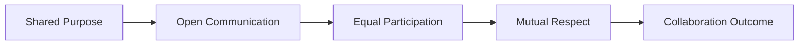
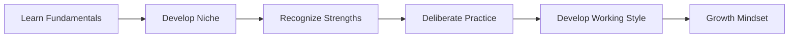
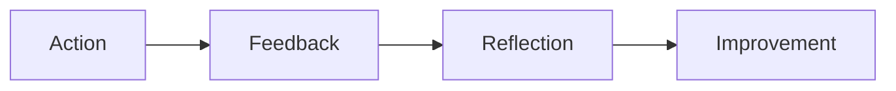
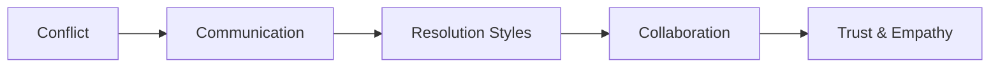

## A. Collaboration
1. **Definition**: Intentional process where individuals work together toward a common purpose, sharing information, responsibilities, and outcomes.
2. **Key Features**
    a. Equal participation, open communication, shared goals, and mutual respect.
    b. Theory of Mind (ToM): Recognizing one's own perspective and that others have distinct perspectives born from their own context.
3. **Benefits**
    a. Increased creativity, better problem-solving, higher team morale, and shortened cycle times.
    b. Reduction of communication barriers and increased trust and innovation.

## B. Mentorship
1. **Definition**: Guidance and support provided by more experienced individuals to less experienced ones, but can occur in any direction (senior-to-junior, junior-to-senior, peer-to-peer).
2. **Key Features**
    a. Knowledge sharing, skill development, feedback, and encouragement.
    b. Ethic of learning from everyone, regardless of seniority.
3. **Benefits**: Accelerates learning, builds confidence, strengthens team bonds, and fosters a culture of continuous improvement.

| Type             | Description                         | Benefit                      |
| ---------------- | ----------------------------------- | ---------------------------- |
| Senior-to-Junior | Experienced guides less experienced | Skill transfer, confidence   |
| Junior-to-Senior | Newcomer shares fresh perspective   | Innovation, learning         |
| Peer-to-Peer     | Colleagues support each other       | Collaboration, shared growth |

## C. Cultivating Mindset

1. **Definition**: Mindset is a personal belief about oneself and one's abilities; can be fixed (abilities are innate) or growth (abilities can be developed).
2. **Cultivation Steps**
    a. Learn fundamentals
    b. Develop a niche
    c. Recognize strengths and progress
    d. Practice deliberately and with quality
    e. Develop personal and team working styles
3. **Benefits**
    a. Enables adaptation, resilience, and continuous improvement.
    b. Growth mindset leads to more learning, better handling of failure, and higher performance.

## D. Mindsets and Learning Organizations
1. **Fixed Mindset**
    a. Belief that abilities are static; failure is seen as a personal flaw.
    b. Leads to blameful culture, stagnation, and avoidance of challenges.[3]
2. **Growth Mindset**
    a. Belief that abilities can be developed; failure is a learning opportunity.
    b. Fosters blameless culture, continuous learning, and improvement.
3. **Learning Organization**
    a. Organization that deliberately collects, grows, and shares knowledge.
    b. Encourages feedback, experimentation, and adaptation.

| Mindset | View on Failure | Impact on Organization         |
| ------- | --------------- | ------------------------------ |
| Fixed   | Blame, avoid    | Stagnation, fear, low growth   |
| Growth  | Learn, adapt    | Innovation, trust, improvement |

## E. Feedback
1. **Definition**: Information given to individuals or teams about their performance, with the goal of improvement.
2. **Types**
    a. Praise for effort (promotes growth mindset)
    b. Praise for innate ability (promotes fixed mindset)
3. **Key Features**
    a. Frequent, actionable, and specific feedback is most effective.
    b. Short feedback cycles enable rapid adjustment and learning.
4. **Benefits**
    a. Individual growth, skill development, and organizational improvement.
    b. Identifies high performers and areas for support.

## F. Review and Ranking
1. **Definition**: Formal evaluation of individual or team performance, often used for promotions, compensation, or development.
2. **Stack Ranking**
    a. Forced distribution (top 20% rewarded, bottom 10% fired) can harm collaboration and morale.
    b. Turns reviews into zero-sum games, inhibits communication and teamwork.
3. **Modern Approach**
    a. Focus on continuous feedback, growth, and collaboration.
    b. Use reviews to support development, not just competition.

| Approach          | Description                      | Impact on Collaboration          |
| ----------------- | -------------------------------- | -------------------------------- |
| Stack Ranking     | Forced distribution, competition | Reduces trust, inhibits teamwork |
| Continuous Review | Frequent, developmental          | Builds trust, supports growth    |

## G. Conflict Resolution Styles
1. **Definition**: Methods for addressing disagreements and finding solutions within teams.
2.  **Styles**
    a. Competition: Assertive, win-lose
    b. Accommodation: Yield to others
    c. Avoidance: Ignore conflict
    d. Compromise: Each side gives up something
    e. Collaboration: Work together for win-win
3. **Effective Communication**
    a. Increases understanding, asserts influence, gives recognition, and builds community.
    b. Teams with more collaboration and Theory of Mind are more creative and productive.

| Style         | Description           | Outcome                |
|--------------|-----------------------|------------------------|
| Competition  | Win-lose              | May harm relationships |
| Accommodation| Yield to others       | May breed resentment   |
| Avoidance    | Ignore conflict       | Issues remain unsolved |
| Compromise   | Mutual concessions    | Partial satisfaction   |
| Collaboration| Win-win solution      | Best for team morale   |

### Conflict Resolution Visual (Mermaid)

## H. Empathy and Trust
1. **Empathy**
    a. Ability to understand and appreciate others' perspectives and feelings.
    b. Developed by listening, asking questions, imagining other perspectives, and appreciating differences.
2. **Trust**
    a. Belief in the reliability and fairness of others.
    b. Built through swift trust, self-disclosure, "trust but verify," and perception of fairness.
3. **Benefits**
    a. Increased productivity, better collaboration, and more effective conflict resolution.
    b. Foundation for successful DevOps and learning organizations.
### Empathy and Trust Table
| Concept | How to Develop                | Benefits                        |
|---------|------------------------------|----------------------------------|
| Empathy | Listen, ask, imagine, appreciate | Better communication, teamwork  |
| Trust   | Swift trust, self-disclosure, fairness | Reliability, openness, innovation |

