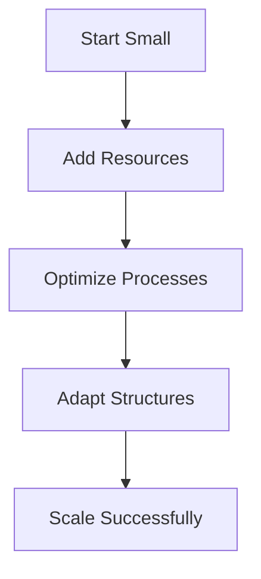
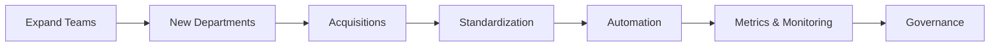

## A. Understanding Scaling

1. **Definition**: Scaling is the process of increasing capacity, capability, or reach—whether for systems, teams, or organizations—while maintaining or improving performance.
2. **Key Features**  
    a. Involves adding resources, optimizing processes, and adapting structures to handle growth.  
    b. Can be vertical (more power per unit) or horizontal (more units working together).
3. **Challenges**  
    a. Complexity increases with scale, requiring better coordination, communication, and automation.  
    b. Risk of bottlenecks, duplication, and loss of agility.

## B. Scaling for Teams
1. **Team Growth Strategies**  
    a. Increase team size, split into sub-teams, or add specialized roles.  
    b. Use clear communication channels and defined responsibilities.
2. **Coordination Tools**: Agile ceremonies (standups, retrospectives), collaboration platforms (Slack, Jira), and documentation.
3. **Maintaining Culture**  
    a. Foster shared values, trust, and open feedback as teams grow.  
    b. Use mentorship and onboarding to integrate new members.
4. **Avoiding Pitfalls**  
    a. Prevent silos by encouraging cross-team collaboration.  
    b. Balance autonomy with alignment to organizational goals.

| Strategy              | Description                              | Benefit                        |
| --------------------- | ---------------------------------------- | ------------------------------ |
| Increase Size         | Add more members to team                 | More capacity, diverse skills  |
| Split Teams           | Create smaller, focused sub-teams        | Specialization, agility        |
| Add Roles             | Introduce specialists (QA, DevOps, etc.) | Expertise, efficiency          |
| Coordination Tools    | Use platforms and ceremonies             | Better communication           |
| Mentorship/Onboarding | Support new members                      | Culture retention, faster ramp |

## C. Scaling for Organization

1. **Organizational Growth Strategies**  
    a. Expand teams, create new departments, or acquire other organizations.  
    b. Standardize processes and tools for consistency.
2. **Process Optimization**  
    a. Automate repetitive tasks, streamline workflows, and document best practices.  
    b. Use metrics to monitor performance and identify bottlenecks.
3. **Maintaining Alignment**  
    a. Communicate vision and goals clearly across all levels.  
    b. Foster a culture of learning and adaptability.
4. **Governance and Structure**  
    a. Implement clear reporting lines, decision-making frameworks, and accountability.  
    b. Balance centralization (efficiency) with decentralization (innovation).

| Strategy           | Description                           | Benefit                        |
| ------------------ | ------------------------------------- | ------------------------------ |
| Expand Teams       | Grow existing teams or add new ones   | Increased capacity             |
| New Departments    | Create specialized units              | Focus, expertise               |
| Acquisitions       | Merge with or buy other organizations | Rapid growth, new capabilities |
| Standardization    | Unify processes and tools             | Consistency, easier scaling    |
| Automation         | Automate tasks and workflows          | Efficiency, reduced errors     |
| Metrics/Monitoring | Track performance and bottlenecks     | Data-driven decisions          |
| Governance         | Clear structure and accountability    | Alignment, risk management     |

