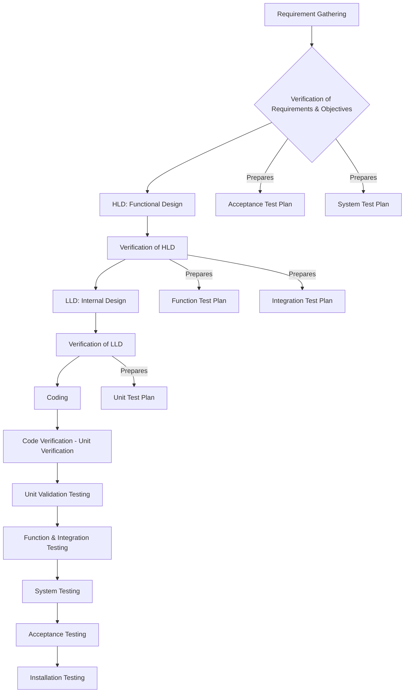
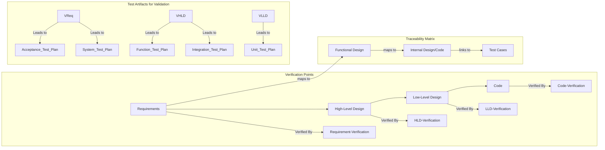

### **1. Verification**

**Definition and Concept** **Verification** is a crucial set of activities in software testing that **ensures the correct implementation of specific functions in a software product**. It involves checking the software against its specifications at every development phase to detect defects early, thereby preventing their propagation. Essentially, verification asks, "**Are we building the product right?**".

Verification is primarily considered **static testing**, meaning it involves examining documents, designs, and code without executing the actual program. This distinguishes it from dynamic testing, which requires code execution. Common methods used in verification include **reviews, walkthroughs, inspections, and desk-checking**.

**Need for Verification** Performing verification in the early stages of the Software Development Life Cycle (SDLC) is mandatory under the Verification and Validation (V&V) process for several reasons:

- **Prevents Mismatch:** Without early verification, there's a significant risk of a mismatch between the product required by the user and the product delivered. This is particularly critical for non-functional requirements, where lack of clarity can lead to increased bugs.
- **Exposes More Errors:** Early verification activities are highly effective in exposing a greater number of errors.
- **Decreases Cost of Fixing Bugs:** Detecting and fixing bugs in earlier phases is significantly less costly than if they propagate to later stages of development or after release.
- **Enhances Software Quality:** By identifying and resolving issues early, verification directly contributes to improving the overall quality of the software.

**Goals of Verification** The formalized goals of verification include:

- **Everything Must Be Verified:** In principle, every phase of the SDLC and all intermediate work products (e.g., requirements, designs, code) must undergo verification.
- **Results May Not Be Binary:** Verification results are not always a simple acceptance or rejection. Often, approximations are accepted, or modifications are suggested, indicating a degree of satisfaction rather than an absolute pass/fail.
- **Even Implicit Qualities Must Be Verified:** Beyond explicitly stated requirements in the Software Requirement Specification (SRS), any implicit qualities desired in the software must also be verified.

**Verification and Validation (V&V) in SDLC** Software testing is a process that runs parallel to the SDLC, starting as soon as requirements are specified. The overall testing strategy is broadly divided into verification and validation. While verification checks if the product is built correctly according to specifications, validation ensures the right product is built according to customer expectations.

The V-testing model effectively illustrates this relationship, showing development activities on one arm and corresponding testing activities (verification on the left, validation on the right) on the other.

---
### **2. Verification of Requirements**

**Purpose and Activities** **Verification of Requirements** involves checking all requirements gathered from the user's perspective. This phase is critical because it has a **high potential for detecting bugs** that, if missed, would be much more expensive to fix later.

During this phase, the tester performs two parallel activities:

1. **Prepares Acceptance Criteria:** Defines the goals, requirements, and acceptable limits for each in the proposed system.
2. **Prepares the Acceptance Test Plan:** This plan will be referenced during the Acceptance Testing phase of validation.

Similarly, for the **verification of objectives** specified in the Software Requirement Specification (SRS):

1. The tester **verifies all objectives mentioned in the SRS** to ensure a thorough understanding of user needs before project progression.
2. The tester **prepares the System Test Plan** based on the SRS, which will be used during System Testing.

It is essential to consider both **functional and non-functional requirements** during this verification. While functional requirements might be straightforward, non-functional aspects like performance, security, and quality often pose significant challenges in understanding, quantifying, planning, and execution.

**How to Verify Requirements and Objectives** Effective verification of requirements hinges on a well-structured and verifiable SRS. An SRS is considered verifiable if every stated requirement can be objectively checked against a procedure to confirm software compliance. Ambiguous language (e.g., "good quality," "usually") should be avoided, and requirements should be quantified whenever possible (e.g., "Module X will produce output within 15 seconds").

Key points against which every requirement in the SRS should be verified include:

- **Correctness:**
    - Refer to other documentation or applicable standards.
    - Interact with customers or users if requirements are unclear.
    - Assess if the requirement is realistic and achievable with existing technology.
- **Unambiguous:**
    - Each requirement should have only one interpretation.
    - Each characteristic of the final product should be described using a single, unique term to prevent redundancy or confusion.
- **Consistent:**
    - No specification should contradict or conflict with another.
    - Check for conflicts between real-world objects, logical actions, terminology, project goals, and hardware constraints.
- **Completeness:**
    - Verify that all significant requirements (functionality, performance, design constraints, attributes, external interfaces) are fully specified.
    - Check if responses to all possible inputs (valid and invalid) are defined.
    - Ensure all figures and tables are properly labeled and referenced.
- **Updation:**
    - For new specifications, verify all previous steps and feasibility.
    - For changes to existing specifications, verify that the change can be implemented within the current design.
- **Traceability:**
    - **Backward Traceability:** Each requirement should reference its source in previous documents.
    - **Forward Traceability:** Each requirement should have a unique name or reference number in all subsequent documents, facilitating future development or enhancement referencing.

---

### **3. High-Level Design (HLD) Verification**

**Purpose and Content of HLD** **High-Level Design (HLD)** is the phase where the requirements from the SRS are translated into a design solution, focusing on the overall system architecture. It describes the **macro-level or overall system design**, including the system's architecture, database design, and relationships between modules. This design is typically documented in a **Software Design Document (SDD)**.

An HLD document should contain:

1. **Overall architecture diagrams** with technology details.
2. **Functionalities** of the entire system with external interfaces.
3. A **list of modules**.
4. A **brief functionality description** for each module.
5. **Interface relationships** among modules, including dependencies and identified database tables with key elements.

**Tester's Parallel Activities** Similar to requirements verification, the tester performs two parallel activities during HLD:

1. **Verifies the High-Level Design:** The tester checks the functionality of the decomposed subsystems or components. Since low-level details are not considered at this stage (black-box view), the focus is on how the system will interface with the outside world. The tester ensures that all components and their interfaces align with user requirements and that every SRS requirement maps to the design.
2. **Prepares Test Plans:** The tester prepares a **Function Test Plan** (based on SRS for Function Testing) and an **Integration Test Plan** (for Integration Testing).

**How to Verify High-Level Design** HLD is a critical phase for finding bugs, as the cost of fixing an undetected bug increases significantly with each subsequent phase. Therefore, HLD verification must be conducted meticulously, referring to the SDD, which should adhere to standards like those provided by IEEE.

High-level design is typically divided into three parts for verification:

1. **Data Design:**
    
    - **Focus:** Creates a model of data and/or information from the customer/user's perspective. It involves designing data structures and algorithms to manipulate them for high-quality applications.
    - **Verification Points:**
        - **Size Estimation:** Check if data structure sizes are estimated appropriately.
        - **Overflow Provisions:** Verify provisions for overflow in data structures.
        - **Data Consistency:** Check consistency of data formats with requirements.
        - **Usage Consistency:** Verify data usage is consistent with its declaration.
        - **Relationships:** Check relationships among data objects in the data dictionary.
        - **Database Consistency:** Ensure consistency of databases and data warehouses with SRS requirements.
        - **Naming and Models:** Check for meaningful data structure names, specified database organization and content, and correctness of the data model and design rules.
2. **Architectural Design:**
    
    - **Focus:** Represents the structure of software components, their properties, and interactions. It involves classifying the system into subsystems or modules.
    - **Verification Points:**
        - **Requirement Coverage:** Ensure every functional requirement in the SRS is addressed in the design.
        - **Exception Handling:** Check that all exception handling conditions are considered.
        - **Mapping Verification:** Verify the process of transform mapping and transaction mapping used for the transition from the requirement model to architectural design.
        - **Module Functionality:** Check the functionality of each module according to specified requirements.
        - **Inter-dependence and Interfaces:** Verify the inter-dependence and interfaces between modules.
        - **Modularity:** A good design should exhibit **low coupling and high cohesion** between modules. Testers must verify these factors, as they impact reliability and maintainability.
        - **Correctness and Flexibility:** The architecture should be correct, unambiguous, consistent with SRS constraints, and flexible enough for future extensions.
3. **Interface Design:**
    
    - **Focus:** Establishes effective communication mediums between various entities: different software modules, the software system and external non-human entities, and the user and the software system.
    - **Verification Points:**
        - **Interface Consistency:** Check all interfaces (module-to-module, software-to-external entity, human-to-computer) for clarity, definition, and consistency.
        - **Data Flow:** Ensure the required data is passed at each interface.
        - **Response Time:** Verify that response times for all interfaces are within required ranges, especially critical for real-time systems.
        - **Help Facility:** Verify the representation of help and that the user can return to normal interaction from it.
        - **Error Messages and Warnings:** Verify clarity of problem and constructive advice for recovery.
        - **Typed Command Interaction:** Check the mapping between menu options and corresponding commands.

---

### **4. Low-Level Design (LLD) Verification**

**Purpose and Content of LLD** **Low-Level Design (LLD)** refines the High-Level Design by providing **micro-level or detailed design** for each module and data component. This detailed design is sufficient for programmers to directly write code. An LLD document describes each module elaborately, and there may be a separate document for each. It elaborates on the actual logic for every system component and delves deep into each module specification.

**Tester's Parallel Activities** In this pre-coding phase, testers also perform two parallel activities:

1. **Verifies the LLD:** The tester checks the detailed logic and design of each module, ensuring consistency with the higher-level abstractions defined in the HLD.
2. **Prepares the Unit Test Plan:** This plan will be referenced during Unit Testing (a validation activity).

**How to Verify Low-Level Design** LLD verification is the last pre-coding phase, making it crucial for catching internal design bugs. For verification, the SRS and SDD specific to individual modules are referenced.

Key points to consider during LLD verification include:

- **Module SRS and SDD:** Verify the SRS and SDD for each individual module.
- **Design Notation Consistency:** In LLD, data structures, interfaces, and algorithms are represented by design notations (e.g., pseudocode, DFDs). Verify the consistency of every item with its chosen design notation.
- **Traceability Matrix:** Organizations should use a **two-way traceability matrix** between the SRS and both HLD and LLD. This matrix ensures that every requirement specified in the SRS is addressed and verified in the design, providing a one-to-one mapping.

**Table: Traceability Matrix Example** A traceability matrix links requirements to their implementation and testing, ensuring comprehensive coverage.

|Requirement/Feature|Functional Design|Internal Design/Code|Test Cases|
|:--|:--|:--|:--|
|R1|F1, F4, F5|abc.cpp, abc.h|T5, T8, T12, T14|
|R2|F2|xyz.cpp|T1, T3|
|R3|F3, F6|pqr.java|T6, T9|
|R4|F7|lmn.py|T2, T7, T10|

- **HLD to LLD Traceability:** Confirm that HLD is traceable to LLD and that high-level and low-level abstractions are consistent.
- **Operational Detail:** Ensure every subsystem is detailed enough to be operational.
- **Pseudo-code and Algorithms:** Verify that pseudo-code follows guidelines and syntax rules of a Program Design Language (PDL), and that algorithms are consistent with their defined functionality.
- **Modularity Support:** Check if the LLD's design notation supports modular software development and interface specification.
- **Data Representation:** Verify that the design notation can represent local and global data, and that it's easy to modify.
- **Logic and Data Integrity:** Ensure logic in each algorithm is clear, correct, and complete. Verify data is properly defined, initialized, consistently used, and that no variables are missing or unused.
- **Interfaces:** Confirm all interfaces are correctly considered and implemented, subsystems accept data within allowable ranges, and data conversion is correct.
- **Error Conditions:** Check for considerations of round-off or truncation effects, valid indices in pseudo-code, infinite loops, and arithmetic overflow/underflow.
- **Database Models:** Verify the clarity of physical data models for databases.

---

### **5. Code Verification**

**Purpose and Nature** **Code verification** is the process of examining the source code of a module to ensure it correctly implements the design specifications and adheres to coding standards. Since the low-level design is converted into source code, there is always a possibility of deviation, making code verification essential. This phase marks the point where operational software is finally obtained.

**How to Verify Code** Code verification is most efficiently performed by the developer who created the code, as they possess the deepest understanding of its intricacies. The developer can thoroughly check every statement, control structure, loop, and logical path to ensure comprehensive testing.

**Unit verification is largely white-box oriented**, meaning it involves examining the internal structure and logic of the code, rather than just its external functionality.

Key points to consider during code verification (often as part of unit verification) include:

- **Traceability:**
    
    - **Design to Code:** Verify that every design specification from both HLD and LLD has been accurately translated into code, typically using a traceability matrix.
    - **Interfaces:** Ensure interfaces implemented in the code are traceable to the SDD and SRS.
- **Language Specification and Standards:**
    
    - **Checklist Usage:** Examine the code against a language-specific checklist for compliance with syntax rules, coding standards, and common errors. This includes checking if the code conforms to applicable coding standards and is well-structured and consistently formatted.
    - **Data Declaration:**
        - Confirm all data considered in the design is declared in the code.
        - Verify variable types, dimensions, and proper type consistency.
        - Check for correct variable initialization.
        - Identify variables with names similar to library functions or reserved keywords.
        - Detect any declared but unused variables.
        - Ensure correct declaration of pointer, global, and user-defined type variables.
    - **Data Reference:**
        - Check for variables referenced but not declared or initialized.
        - Verify array subscript values are within specified limits and are of integer type.
        - Ensure correct and consistent referencing of parameters passed in procedures.
        - Verify correct referencing of pointer, Boolean, and user-defined data type variables.
    - **Interfaces:**
        - Verify parameter order, types, and sizes match in prototypes, calling modules, and called modules.
        - Ensure the return type of a module matches its prototype and expected type.
        - Check for consistent referencing of global variables.
        - Confirm correct inclusion of library files.
        - Verify that called modules correctly return to their calling modules.
- **Computation and Logic:**
    
    - **Data Type Consistency:** Check for inconsistent data types of variables used in computation.
    - **Zero Division:** Ensure no computation involves division by zero.
    - **Arithmetic Precedence:** Verify correct arithmetic precedence and handling of mixed-mode operations.
    - **Control Structures:**
        - Ensure correct termination of loops and absence of infinite loops.
        - Verify conditions are correctly implemented in conditional statements.
        - For `switch-case` structures, confirm unique case labels, proper exit from each case group, and the presence of a `default` label.
        - Minimize or avoid `goto` statements.
- **Input/Output:**
    
    - **Format Compliance:** Ensure input and output statements conform to the specified language format.
    - **Range Validation:** Verify specified input and output ranges are correct.
    - **File Handling:** Check if files are correctly declared, opened before use, parameters in `File Open` are specified correctly, and all opened files are closed.
    - **Error Detection:** Verify End of File conditions are detected.
    - **User Interface Text:** Confirm texts displayed to the user are meaningful, appropriate, and free from spelling or grammatical mistakes.
- **Module and Subsystem Verification:**
    
    - **LLD to Code Traceability:** Check for traceability between LLD and the module's code.
    - **Completeness:** Ensure all modules considered in LLD have been coded, and no module is missing.
    - **Functional Consistency:** Verify that the module's code matches the pseudo-code in the LLD and does not contain logical mistakes that contradict its functional specification.
    - **Modularity:** Identify if any module has not been referenced, or if its implementation is overly complex and could be restructured.
- **General Coding Practices:**
    
    - **Comments:** Check for appropriate, meaningful, and understandable comments, especially for complex logic.
    - **Documentation:** Ensure all source code files mention the corresponding function number.
    - **Formatting and Readability:** Verify proper indentations, matching braces for all structures, and overall code readability. Consider if compact but complex code can be replaced with more readable alternatives.
    - **Cleanliness:** Ensure no leftover stubs or test drivers are present in the final code.

**Table: SDLC Phase, Test Plan, and Validation Testing** This table illustrates how test plans are prepared in parallel with verification activities at each SDLC phase, which are then used for corresponding validation testing.

|SDLC Phase|Test Plan|Corresponding Validation Testing|
|:--|:--|:--|
|Requirement Gathering|Acceptance Test Plan|Acceptance Testing|
|Requirement Specification/Objectives|System Test Plan|System Testing|
|Functional Design/High-Level Design|Function and Integration Test Plan|Function and Integration Testing|
|Internal Design/Low-level Design|Unit Test Plan|Unit Testing|

**Mermaid Diagram: Traceability Flow** This diagram visually represents the concept of traceability from requirements to test cases, a crucial aspect of verification activities.

