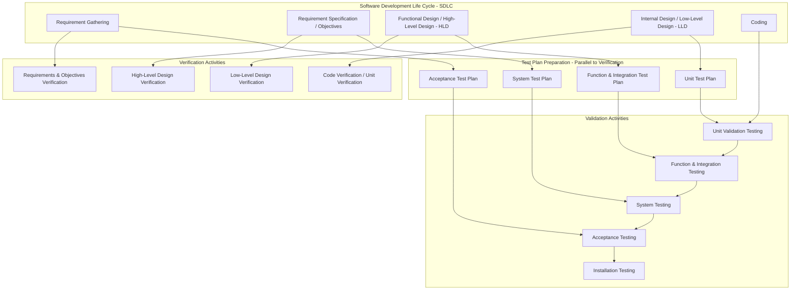
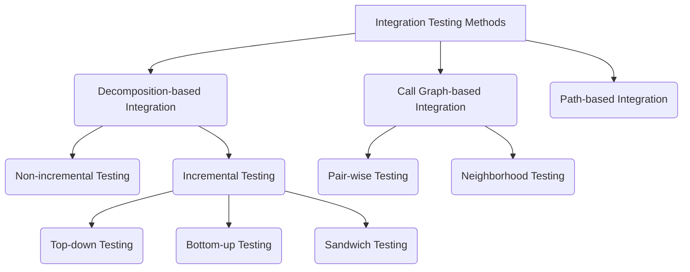
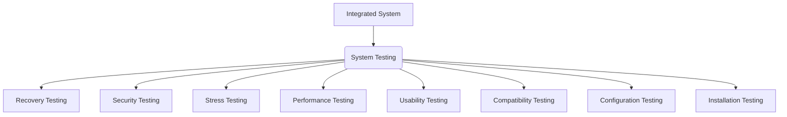

**1. Validation**
Validation is a critical part of the software testing process that determines if a system or component satisfies its specified requirements **during or at the end** of the development process. It is considered the next step after verification.

*   **Purpose**:
    *   To ensure the software meets the **requirements and expectations of the customer**.
    *   To determine whether the product's actual behavior matches the desired behavior, as described in the functional design specification.
    *   Validation activities are structured to focus on a particular SDLC phase and class of errors, which helps avoid redundant testing and prevents overlooking significant error categories.
*   **Nature**: Validation is largely performed using **black-box testing techniques**, where the internal structure of the program is ignored, and only functional requirements are considered.
*   **Execution**: Validation test cases are initiated after the completion of a module. It is executed on the software code, typically with the help of a dedicated testing team.
*   **Relation to Verification**: Verification and Validation (V&V) are fundamental components of software testing. While verification focuses on "Are we building the product right?" (checking each development phase's output against its input specifications), validation focuses on "Are we building the right product?" (checking the final product against user needs and requirements). The **V-model** illustrates this relationship, with verification activities occurring on the left side of the "V" during development phases and corresponding validation activities occurring on the right side during testing phases.
*   **Validation Activities/Levels of Testing**: The sources identify several activities as part of validation testing, often referred to as levels of testing:
    *   **Unit Testing**
    *   **Integration Testing**
    *   **Function Testing**
    *   **System Testing**
    *   **Acceptance Testing**
    *   **Installation Testing**

**Table: SDLC Phase, Test Plan, and Corresponding Validation Testing**

| SDLC Phase                                    | Test Plan                          | Validation Testing               |
| :-------------------------------------------- | :--------------------------------- | :------------------------------- |
| **Requirement Gathering**                     | Acceptance Test Plan               | Acceptance Testing               |
| **Requirement Specification/Objectives**      | System Test Plan                   | System Testing                   |
| **Functional Design/High-Level Design (HLD)** | Function and Integration Test Plan | Function and Integration Testing |
| **Internal Design/Low-Level Design (LLD)**    | Unit Test Plan                     | Unit Testing                     |

**Mermaid Diagram: Verification and Validation (V&V) Activities**

**2. Unit Testing**
Unit testing is a fundamental validation activity performed on the **smallest testable module or component** of a software system.

*   **Definition**: It is the process of testing individual components (functions, procedures, methods, or modules) in isolation to ensure they function as expected.
*   **Purpose**:
    *   To confirm the behavior of a single module according to its functional specifications.
    *   To ensure the software meets at least a **baseline level of functionality** before integration and system testing.
    *   Debugging is easier at the unit level than in an integrated system.
*   **Focus Areas**: Unit testing is largely white-box oriented and focuses on verifying aspects within a single module:
    *   **Interfaces**: Ensure proper flow of information into and out of the unit.
    *   **Local Data Structures**: Maintain data integrity within the module.
    *   **Boundary Conditions**: Check module behavior at the limits of input.
    *   **Independent Paths**: Exercise all unique execution paths through the control structure (to ensure all statements are executed at least once).
    *   **Error Handling Paths**: Test how the module responds to and manages error conditions.
*   **Role of Stubs and Drivers (Test Harness)**: Since units are tested in isolation, they often interact with other modules that might not be ready. To emulate these interactions, **test harnesses** are used.
    *   **Driver**: A software module that invokes the unit under test, provides inputs, controls execution, and reports results.
    *   **Stub**: A simple piece of software that acts as a placeholder or "stand-in" for subordinate units that the module under test calls or references.
    *   While stubs and drivers add to the project's cost and time, they are essential for effective unit testing when dependencies are not yet complete.
*   **Responsibility**: Typically performed by the **developer** of the module.
*   **Test Plan**: A Unit Test Plan is prepared during the Low-Level Design (LLD) phase of the SDLC.

**Table: Unit Testing Focus Areas**

| Focus Area               | Description                                                                                             |
| :----------------------- | :------------------------------------------------------------------------------------------------------ |
| **Interfaces**           | Verify that information properly flows in and out of the program unit under test.                       |
| **Local Data Structures** | Ensure the local data structure maintains data integrity.                                               |
| **Boundary Conditions**  | Check that the module is working correctly at its operational boundaries (min/max values, etc.).        |
| **Independent Paths**    | Exercise all independent paths through the control structure to ensure statement coverage.              |
| **Error Handling Paths** | Test how the module handles and responds to various error conditions.                                   |

**3. Integration Testing**
Integration testing is a validation technique that combines and tests multiple unit-tested modules to expose inconsistencies and ensure proper interactions between them.

*   **Definition**: The process of combining all unit-tested modules and performing tests on their aggregated system.
*   **Purpose**: To uncover bugs caused specifically by **interfacing between modules** during their combination. Unit testing, by nature, cannot test these interfaces.
*   **Issues Addressed**:
    *   Inconsistency between modules (e.g., improper call or return sequences).
    *   Data loss across interfaces.
    *   Modules not producing desired results when combined.
    *   Mismatch of data types and valid ranges between modules.
*   **Integration Process**: Integration is not a random process; it is systematic and guided by the system design and the availability of units. Testers must be aware of the system design to integrate units correctly.
*   **Approaches for Integration Testing**:
    1.  **Decomposition-based Integration**: Integrates modules based on their functional decomposition in a hierarchical (tree-like) structure. It tests the interfaces among separately tested modules.
        *   **Non-incremental**: All modules are integrated together at once (often called "Big-Bang").
        *   **Incremental**: Modules are integrated one by one and tested progressively.
            *   **Top-down Integration**: Starts with high-level modules and moves downwards through the design hierarchy. **Stubs** are used to simulate lower-level modules that are not yet developed.
            *   **Bottom-up Integration**: Starts with low-level modules and moves upwards. **Drivers** are used to simulate higher-level modules.
            *   **Sandwich Integration**: A hybrid approach combining both top-down and bottom-up strategies.
    2.  **Call Graph-based Integration**: Focuses on the call relationships between modules, including pair-wise and neighborhood testing.
    3.  **Path-based Integration**: Identifies and tests specific execution paths that span across multiple modules. In object-oriented systems, the "Method-Message Path" (MM-path) is a key concept.
*   **Responsibility**: Performed by **testers and developers**.
*   **Test Plan**: An Integration Test Plan is prepared during the Functional Design/High-Level Design (HLD) phase of the SDLC. It outlines the necessary steps to integrate and test individual modules, ensuring synchronized development.

**Mermaid Diagram: Integration Testing Methods**

**4. Function Testing**
Function testing is a validation activity where all specified functions and external interfaces of an integrated system are tested against its external specifications.

*   **Definition**: The process of detecting discrepancies between the functional specifications of a software and its actual behavior. It is also known as **functional testing**.
*   **Purpose**:
    *   To measure the quality of the functional components of the system.
    *   To verify that the system behaves correctly from the user's perspective, according to requirements.
    *   To ensure each component performs according to specification, responds correctly to inputs, moves data correctly between business events, and is initiated in the correct order to meet business objectives.
*   **Process Steps**:
    1.  **Test Planning**: Define the scope, schedule, and deliverables for the function test cycle, resulting in a test plan document.
    2.  **Partitioning/Functional Decomposition**: Break down the system into its functional components or areas. The testing organization may review or create these partitions.
    3.  **Requirement Definition**: Ensure specified requirements are available in proper documents and itemized under appropriate functional partitions.
    4.  **Test Case Design**: Design and implement test cases to validate product performance in accordance with requirements. These are itemized under functional partitions and mapped to requirements.
    5.  **Traceability Matrix Formation**: Create a function coverage matrix to list functions, their testing priority, and the test cases covering them. This helps in coverage analysis.
    6.  **Test Case Execution**: Execute the defined test cases and record the results. Testing may be deferred if the application's current state doesn't support a specific function's testing.
*   **Responsibility**: Primarily **testers**.
*   **Test Plan**: A Function Test Plan is prepared during the Functional Design/High-Level Design (HLD) phase. This plan needs a traceability matrix that maps every function to its requirement and lists functions to be tested.

**Table: Function Coverage Matrix Example**

| Functions/Features | Priority | Test Cases      |
| :----------------- | :------- | :-------------- |
| F1                 | 3        | T2, T4, T6      |
| F2                 | 1        | T1, T3, T5      |
| F3                 | 2        | T1, T2, T7, T8  |

**5. System Testing**
System testing is a validation level focused on testing the **entire integrated system** to verify its compliance with the specified requirements and to ensure it works correctly in various environments for different users.

*   **Definition**: A level of software testing where a complete and integrated system is evaluated to determine if it meets its specified requirements.
*   **Purpose**: To test the validity of the whole system against its requirement specifications for various users and environments. It aims to fully exercise the computer-based system on diverse grounds where bugs might occur, not just test specific functions.
*   **Categories of System Tests**: System testing encompasses several types of specialized tests:
    *   **Recovery Testing**: Assesses the system's ability to restart and recover operations after a failure, restoring integrity and reprocessing transactions.
    *   **Security Testing**: Evaluates security features to protect against unauthorized access, ensure data confidentiality, and verify that users can only perform authorized tasks.
    *   **Stress Testing**: Tests the system by pushing it beyond its specified operational limits (e.g., high load, limited resources) to observe its behavior and recovery mechanisms during and after extreme conditions.
    *   **Performance Testing**: Measures system performance against quantified requirements, including aspects like response time, throughput, resource utilization, database load, and scalability.
    *   **Usability Testing**: Evaluates the user interface and overall user experience to ensure the system is user-friendly, efficient, and satisfactory for its potential users.
    *   **Compatibility Testing**: Checks the system's ability to operate correctly across different hardware, software configurations, and operating systems.
    *   **Configuration Testing**: Evaluates system performance and availability under various hardware and software configurations, including changes and reconfigurations.
    *   **Installation Testing**: Verifies the successful installation, updating, and uninstallation of the software application.
*   **Implementation Steps**:
    1.  **Partition Requirements**: Divide requirements into logical categories and plan for each.
    2.  **System Description**: Provide an overview of the system's inputs, outputs, and functions.
    3.  **Features to be Tested**: Identify the functionalities of the test items based on various system testing criteria.
    4.  **Strategy and Reporting Format**: Define the testing strategy (e.g., black-box techniques) and reporting mechanisms.
    5.  **Requirement Coverage Matrix**: Develop a matrix that maps specific subtests and their priorities to test cases.
    6.  **Suspension Criteria**: Specify conditions that would halt testing (e.g., critical bugs).
    7.  **Resource Requirements**: List necessary documents, equipment, software, and personnel.
    8.  **Test Team**: Enlist team members and their assignments.
    9.  **Participating Organizations**: Identify and coordinate with all organizations involved in large integrated systems.
    10. **Extent and Constraints**: Indicate the scope of testing (total or partial) and any limitations.
    11. **Schedule Estimation**: Plan the timeline for testing milestones, aligning with the overall project schedule.
*   **Responsibility**: Performed by **testers, developers, and end-users**.
*   **Test Plan**: A System Test Plan is prepared in the Requirement Specification/Objectives phase. It requires clear and specific formulation of general requirements to design test cases.

**Mermaid Diagram: System Testing Categories**

**6. Acceptance Testing**
Acceptance testing is the final formal testing conducted to determine whether a software system satisfies its predefined acceptance criteria and to enable buyers (customers) to decide whether to accept the system.

*   **Definition**: A formal testing process that compares the final system with the customer's needs and the agreed-upon acceptance criteria.
*   **Purpose**: To ensure customer satisfaction and confirm that the software is fit for its intended use in a real-world scenario. The goal is to gain user/customer acceptance within defined limits.
*   **Acceptance Criteria**: Must be clearly defined and include functional, performance, interface quality, and overall software quality requirements. The criticality of each acceptance feature needs to be established; failure on high-criticality requirements should prevent system acceptance.
*   **Types of Acceptance Testing**:
    1.  **Alpha Testing**:
        *   **Location**: Performed with customers (or internal testers simulating customers) at the **developers' site** (lab environment).
        *   **Purpose**: To identify all possible issues/bugs before the product's public release. It simulates typical user tasks using both black-box and white-box techniques.
        *   **Entry Criteria**:
            *   Test Lab environment setup.
            *   QA Build ready for execution.
            *   Test Management tool for uploading test cases and logging defects.
            *   Traceability Matrix (ensuring each design requirement has at least one verifying test case).
        *   **Exit Criteria**:
            *   All test cases executed and passed.
            *   All severity issues fixed and closed.
            *   Delivery of Test Summary Report.
            *   No more additional features included.
            *   Sign-off on Alpha testing.
    2.  **Beta Testing**:
        *   **Location**: Performed by actual customers at their **own site** (real-world environment).
        *   **Purpose**: "Real-world" testing where a "beta-version" of the product is released to a limited number of actual users to gather feedback from diverse usage scenarios.
        *   **Guidelines**:
            *   Select technically knowledgeable actual users.
            *   Use real data for testing.
            *   Involve developers to support beta testers.
            *   Strictly manage any new feature additions, as they can significantly delay the release.
        *   **Exit Criteria**:
            *   Collecting responses/feedback from beta testers.
            *   Preparing a report of all serious bugs found.
            *   Notifying developers of bug-fixing issues.
*   **Responsibility**: Performed by **testers and end-users**.
*   **Test Plan**: An Acceptance Test Plan is prepared in the Requirement Gathering phase. It must clearly define all acceptance criteria.

**Table: Comparison of Alpha and Beta Testing**

| Feature           | Alpha Testing                                                               | Beta Testing                                                                |
| :---------------- | :-------------------------------------------------------------------------- | :-------------------------------------------------------------------------- |
| **Location**      | Developer's site / Controlled lab environment                               | Customer's (End-user's) own site / Real-world environment                   |
| **Participants**  | Internal employees/testers (simulating users)                               | Actual end-users/customers (limited group)                                  |
| **Purpose**       | Identify all possible issues/bugs before product release to the public      | "Real-world" testing; gather feedback from actual usage in diverse scenarios |
| **Techniques**    | Utilizes both black-box and white-box techniques                            | Primarily black-box techniques (users do not have internal code access)     |
| **Environment**   | Highly controlled and monitored test lab                                    | Uncontrolled, actual user environment                                       |
| **New Features**  | Strictly managed; adding features can revert the testing timeline           | Not recommended during the beta process to maintain focus on current build  |
| **Bug Detection** | Focuses on comprehensive bug detection by simulating usage                  | Focuses on finding bugs and usability issues in a real operational context  |
| **Involvement**   | Close collaboration between testers and developers                          | Less direct involvement of developers; more feedback-driven                 |

---
