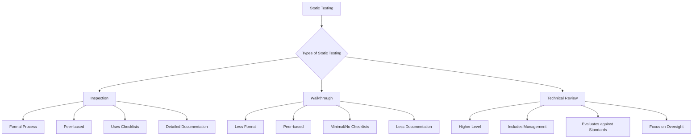
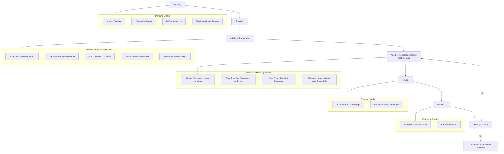
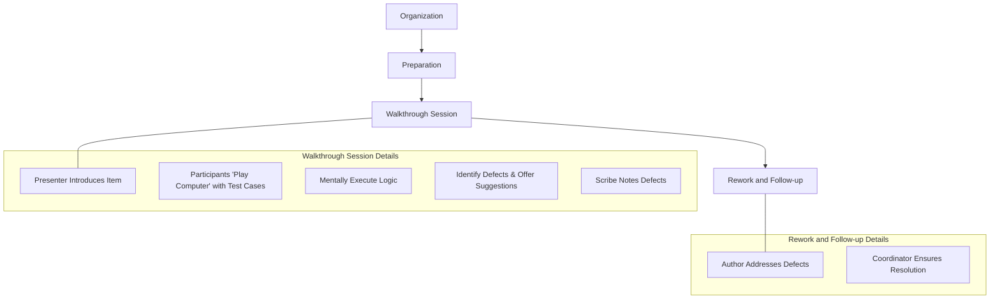

**Static testing** is a software testing technique that involves **examining software and its associated documents without executing the software**. It is a form of **verification**, which ensures that the developed product is correct and fulfills its requirements. This technique assesses the structural characteristics of source code, design specifications, or any notational representation that conforms to well-defined syntactic rules.

**Key Characteristics and Purpose**

- **Verification Activity**: Static testing is inherently a verification activity, performed at early stages of the Software Development Life Cycle (SDLC).
- **Early Bug Detection**: Its primary benefit is to **identify errors as early as possible** in any phase of the SDLC, reducing the chances of bugs propagating to later stages, which is crucial for cost-effectiveness.
- **Complementary to Dynamic Testing**: Static testing is explicitly described as being complementary to dynamic testing, revealing bugs that dynamic testing might miss.
- **Non-Execution Based**: It does not demonstrate that the software is operational or that a function is working; instead, it checks the software product at each SDLC stage for conformance with required specifications or standards.
- **Items for Static Testing**: Requirements, design specifications (SDD), test plans, source code, user manuals, and maintenance procedures are all items that can be statically tested.
- **Improve Software Quality and Productivity**: A core objective is to improve the overall quality of the software and increase productivity by catching defects when they are cheapest to fix.
- **Information for Project Monitoring**: It provides valuable information that can be used for project monitoring and control.

**Objectives of Static Testing**

1. **To identify errors in any phase of SDLC as early as possible.**
2. **To verify that the components of software are in conformance with its requirements.**
3. **To provide information for project monitoring.**
4. **To improve the software quality and increase productivity.**

**Types of Static Testing** Static testing is generally categorized into three main types:

- **Inspections**
- **Walkthroughs**
- **Technical Reviews**

---

### **Inspection**

**Inspection** is a **formal and rigorous in-process manual examination of an item** (any product or partial product of the software development process) by a group of peers, typically with the aid of checklists, to detect bugs. It is considered the most widely used technique for static testing due to its formal process and effectiveness in early defect detection.

**Inspection Team** A minimum of four team members are generally required for the inspection process:

- **Author/Owner/Producer**: The individual responsible for creating the program or document under inspection. They are also responsible for fixing any defects discovered during the inspection.
- **Inspector**: A peer (not a manager or supervisor) who is not directly related to the product under inspection. Their role is to identify errors, omissions, and inconsistencies in the programs and documents.
- **Moderator**: The key person who manages the entire inspection process. Responsibilities include scheduling, leading, controlling the session, and ensuring its successful execution. They review logs, compile defect lists for the author, conclude the meeting, and follow up to ensure all bugs are addressed.
- **Recorder**: This individual records all results and defects found during the inspection meeting.
- **Optional Roles**: Presenter, Reviewers, Observer.

**Inspection Process Stages**

1. **Planning**:
    - Identify the product to be inspected and assign a moderator.
    - Define the objective of the inspection (e.g., defect detection, specific error types like design or interface errors).
    - Readiness criteria must be met, including completeness, minimal functionality, readability, complexity, and availability of requirements/design documents.
2. **Overview**:
    - The inspection team is given background information on the product.
    - The author presents the rationale, context, function, intended use, and development approach of the product.
3. **Individual Preparation**:
    - Inspectors review the product independently, often using **checklists** and comparing against standard documents to ensure compliance and correctness.
    - They record defects found in a log and note the time spent, submitting these logs to the moderator.
    - The moderator reviews these logs to ensure adequate preparation and identify areas needing attention.
4. **Inspection Meeting/Examination**:
    - The meeting begins with the author discussing issues raised in the compiled log file.
    - The team reaches a consensus on whether identified issues are indeed errors and should be admitted by the author. New errors discovered during discussion are also recorded.
    - The moderator concludes the meeting by summarizing the errors found in a Change Request (CR) list. A CR includes a brief description, priority (major/minor), assigned person for follow-up, and a deadline.
5. **Rework**:
    - The author fixes all bugs listed in the summary report from the inspection meeting and reports back to the moderator.
6. **Follow-up**:
    - The moderator verifies that all reported bugs have been addressed and fixed.
    - A report is prepared, and the document is approved for release. If issues remain, another inspection meeting may be called.

**Benefits of the Inspection Process**

- **Bug Prevention**: By catching defects early, the process helps prevent their propagation to later stages.
- **Learning**: Team members learn from the defects found and the overall process.
- **Process Improvement**: Provides feedback for continuous improvement of the development process.
- **Immediate Feedback**: Authors receive immediate evaluation and feedback from peers, leading to improvements in future products.

**Variants of Inspection Process** Many modifications to Fagan's original formal inspection concept have been proposed:

- **Active Design Reviews (ADRs)**: Multiple reviews focusing on specific bug types, conducted by experts using questionnaires to ensure active reviewer participation.
- **Formal Technical Asynchronous Review Method (FTArm)**: Inspections conducted without a simultaneous meeting, utilizing hypertext documents for individual, asynchronous comments from inspectors.
- **Gilb Inspection**: Defect detection is primarily carried out by individual inspectors rather than in a group, incorporating a dedicated checking phase.
- **Humphrey’s Inspection Process**: Emphasizes bug finding and logging during the preparation phase, including an analysis phase to consolidate individual defect logs.
- **N-Fold Inspections**: Involves multiple independent inspection teams to enhance defect detection effectiveness and speed.
- **Phased Inspection**: Divides the inspection into ordered phases, each designed to verify a particular feature or domain, conducted by experts in that area.

**Reading Techniques in Inspection** These techniques guide inspectors to effectively detect defects:

- **Ad hoc method**: No specific guidelines; defect detection relies on the inspector's individual skills and experience.
- **Checklists**: Lists of items to focus the inspector's attention on common defects or organizational rules. These should be developed in consultation with experienced staff and regularly updated.
- **Scenario-based reading**: Provides specific instructions and different scenarios to inspectors, helping them focus on various types of defects (e.g., defect-based reading, function-point based scenarios, task-driven reading).

---

### **Walkthrough**

**Structured Walkthroughs** are a **less formal and less rigorous technique than formal inspections**. While often considered a variant of the inspection process, it can also be categorized separately for static testing.

**Key Characteristics**

- **Less Formal**: Compared to inspections, walkthroughs are more informal, with fewer steps and less rigid adherence to procedures.
- **No Checklists/Minimal Documentation**: They typically do not use a checklist to guide the process or produce extensive written reports, and defect tracking can be inconsistent.
- **"Play Computer" Approach**: Participants "play computer" by mentally executing small, paper-based test cases (representative inputs and expected outputs) through the program's logic. The program's state is often monitored on paper or other presentation media.
- **Peer-Based Review**: An author presents their developed artifact to an audience of peers, who then question and comment to identify defects.
- **No Prior Preparation by Audience**: Usually, there is no requirement for prior preparation by the audience.

**Structured Walkthrough Team** A typical structured walkthrough team includes:

- **Coordinator**: Organizes, moderates, and follows up on walkthrough activities.
- **Presenter/Developer**: Introduces the item being inspected (optional).
- **Scribe/Recorder**: Notes down defects found and suggestions proposed by members.
- **Reviewer/Tester**: Actively finds defects in the item.
- **Maintenance Oracle**: Focuses on long-term implications and future maintenance of the project.
- **Standards Bearer**: Assesses adherence to established standards.
- **User Representative/Accreditation Agent**: Represents and articulates the needs and concerns of the end-user.

**Walkthrough Process Steps**

1. **Organization**
2. **Preparation**
3. **Walkthrough**
4. **Rework and Follow-up** (similar to inspection process for follow-up)

---

### **Review**

A **technical review** is a higher-level static testing technique compared to inspection or walkthrough, distinguished by the **inclusion of management representatives** in the review team.

**Purpose and Focus**

- **Evaluate Against Standards**: Its primary purpose is to **evaluate the software against development standards, guidelines, and specifications**.
- **Management Oversight**: It provides management with evidence that the development process is being carried out according to stated objectives.
- **Oversight Focus**: Review agendas tend to focus less on minute technical issues and more on overall oversight than an inspection.
- **Defect Recording**: The goal is to evaluate the system relative to specifications and standards, recording defects and deficiencies.

**Review Team Composition**

- Generally comprises **management-level representatives** and **project management**.

**Moderator's Role and Key Measurement Indicators** The moderator plays a crucial role by gathering and distributing documentation to all team members for examination before the review. They also prepare a set of indicators to measure various points:

- **Appropriateness of the problem definition and requirements.**
- **Adequacy of all underlying assumptions.**
- **Adherence to standards.**
- **Consistency.**
- **Completeness.**
- **Documentation.**

A **checklist** may also be prepared by the moderator to help the team focus on key points.

**Outcome** The result of a technical review should be a document that records the events of the meeting, identifies deficiencies, and includes recommendations. Appropriate actions are then taken to correct any identified deficiencies and address recommendations.

---

### **Comparison of Inspection, Walkthrough, and Review**

Here's a table summarizing the key differences between these static testing techniques:

|Feature|Inspection|Walkthrough|Technical Review|
|:--|:--|:--|:--|
|**Formality**|**Most Formal and rigorous**|Less formal and less rigorous than inspections|Higher-level technique compared to inspection/walkthrough|
|**Primary Goal**|Formal defect detection|Informal defect identification and discussion|Evaluate software against standards/specs; provide management oversight|
|**Team Composition**|Author, Inspector, Moderator, Recorder (minimum 4)|Coordinator, Presenter, Scribe, Reviewer, Maintenance Oracle, Standards Bearer, User Rep.|Management-level representatives, Project Management|
|**Use of Checklists**|**Rigorous use of checklists**|Generally **does not use checklists**|Moderator may prepare a checklist for key points|
|**Documentation**|Detailed logs, summary reports, Change Requests (CRs)|Minimal documentation of issues, often inconsistent|Document recording meeting events, deficiencies, and recommendations|
|**Meeting Structure**|Structured, with distinct phases (Planning, Overview, Prep, Meeting, Rework, Follow-up)|Less structured, author presents, peers question|Focused on oversight, less on technical specifics; often by agenda|
|**Participation**|Peers, specialists|Peers ("play computer" with test cases)|Management, project management, some technical experts|
|**Decision-Making**|Consensus on identified errors|Informal discussion, comments|Evaluation relative to standards; recording defects/deficiencies|

---

### **Mermaid Diagrams**

**1. Static Testing Techniques Hierarchy**

**2. Inspection Process Flowchart**

**3. Structured Walkthrough Process Flowchart**

