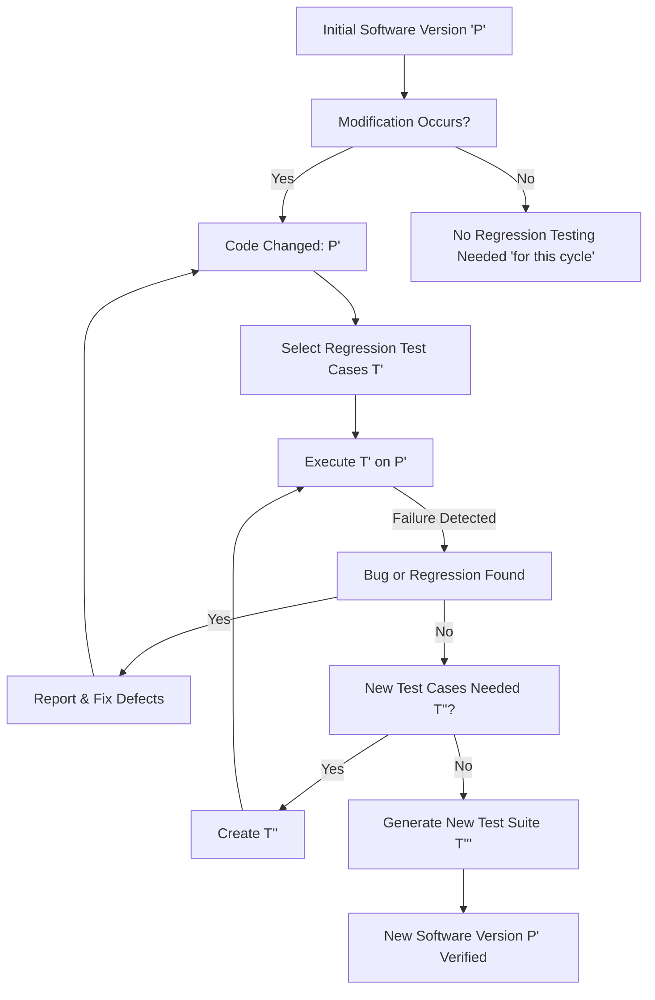
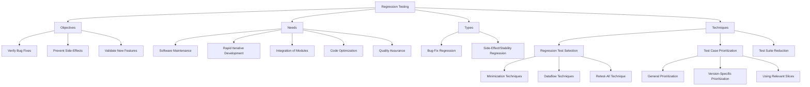

**Regression testing** is a crucial aspect of software testing used to verify that modifications to software, such as bug fixes, new feature additions, or requirement updates, do not adversely affect other parts of the software that were previously working correctly. The IEEE Software Glossary defines it as the selective retesting of a system or component to verify that modifications have not caused unintended effects and that the system or component still complies with its specified requirements. This process is essential for maintaining software quality, even though it can be time-consuming and frustrating due to the need to re-execute existing test suites, potentially with additional new test cases.

### Need for Regression Testing

Regression testing is indispensable in various software development and maintenance scenarios due to the high probability of introducing new bugs or side-effects when changes are made to the codebase. The need for regression testing arises from:

1.  **Software Maintenance**:
    *   **Corrective Maintenance**: Diagnosing and fixing errors, including those discovered by users, requires re-validation to ensure the fix works and doesn't break other features.
    *   **Adaptive Maintenance**: Modifying the system to remain compatible with changes in its environment, such as operating systems or database management systems, necessitates testing to confirm continued functionality.
    *   **Perfective Maintenance**: Implementing new or changed user requirements and functional enhancements means the updated software must be tested thoroughly to ensure existing features are not negatively impacted.
    *   **Preventive Maintenance**: Changes made to improve software maintainability or reliability, designed to prevent future problems, still need regression testing to ensure they do not introduce current issues.

2.  **Rapid Iterative Development (e.g., Agile)**: In iterative development models, software is delivered in short cycles, and new versions are frequently built by modifying previous ones. This agile approach increases the likelihood of introducing bugs with each change, making regression testing critical to maintain stability and quality. Automation is particularly important in such environments to ensure comprehensive testing within short timelines.

3.  **First Step of Integration**: When new modules are added to an existing system, particularly during integration testing, these additions can alter data flow paths and potentially affect the functioning of previously integrated modules. Regression testing helps to identify and mitigate these unexpected side-effects.

4.  **Bug Fixing and Requirement Updation**: Any time a bug is reported and subsequently fixed, or when requirements are updated leading to code changes, a set of regression tests must be performed. This ensures the bug fix was successful, the modifications didn't introduce new issues in unchanged parts, and new requirements are correctly implemented.

5.  **Code Optimization**: Even when code is modified for performance optimization, regression testing is necessary to confirm that these changes have not introduced new defects or altered the expected behavior of the system.

6.  **Enhancing Software Quality**: Regression testing has a strong positive influence on software quality by helping to detect important bugs and retaining the quality of the software over successive versions.

### Objectives of Regression Testing

The primary objectives of regression testing are focused on validating changes and maintaining the overall integrity and quality of the software. These objectives include:

1.  **Verify Bug Fixes**: The most immediate objective is to confirm that the reported bug has been successfully addressed. This involves re-running the exact test cases that initially exposed the problem. If the software still fails these tests, it indicates that the bug has not been fixed correctly, and further regression testing might be halted until the primary fix is validated.
2.  **Prevent Side-Effects / Maintain Stability**: A critical objective is to ensure that any new modifications (whether bug fixes or feature enhancements) have not introduced new defects or negatively impacted the functionality of other, unchanged parts of the software. This involves retesting a substantial portion of the product to prove that the changes have no detrimental effect on previously working components and to assess the overall integrity of the program.
3.  **Validate New Requirements**: When new features or updated requirements are incorporated into the software, regression testing ensures that these new additions are correctly implemented and integrated without causing any regressions in existing functionalities.

### Types of Regression Testing

Regression testing can be categorized into different types based on the nature of the changes made and the scope of retesting required.

1.  **Bug-Fix Regression**:
    *   This type of regression testing is performed specifically after a bug has been identified and subsequently fixed.
    *   Its main goal is to repeat the original test cases that initially exposed the problem to verify that the bug is indeed resolved.

2.  **Side-Effect Regression / Stability Regression**:
    *   This involves retesting a significant portion of the product, or even the entire product, to ensure that the recent changes (e.g., bug fixes, new features, or code optimizations) have not introduced unintended negative effects on previously stable and correctly functioning parts of the software.
    *   The aim is to prove that the overall integrity and stability of the program have been maintained, rather than just verifying the success of specific software fixes.

Additionally, while not a "type" in the same vein, the concept of **regression testability** is important:
*   **Regression Testability**: This refers to how effectively and efficiently a program, its modifications, or a test suite can be regression-tested. A program is considered regression-testable if most single statement modifications require rerunning only a small proportion of the existing test suite. Considering testability early in development can lead to significant cost savings in maintenance.
*   **Regression Number**: This is a metric calculated to assess regression testability. It represents the average number of test cases in the test suite that are affected by a single instruction modification. It's computed using information about the test suite's coverage of the program.

### Regression Testing Techniques

To address the challenges of retesting an entire, potentially large, test suite, several techniques are employed to make regression testing more efficient and effective.

1.  **Regression Test Selection Technique**:
    *   **Aim**: This technique attempts to reduce the time required to retest a modified program by selecting an optimal subset of the existing test suite, rather than running all tests.
    *   **Characteristics**: It minimizes resources by selecting fewer test cases, analyzes the relationship between test cases and the software elements they cover, and uses information about code changes to guide selection. It is particularly needed as test suites tend to grow over time, leading to potentially broken, obsolete, uncontrollable, or redundant test cases.
    *   **Typical Steps (Selective Retest Technique)**:
        1.  **Select `T'`**: Choose a subset of the original test suite `T` to execute on the modified program `P'`.
        2.  **Test `P'` with `T'`**: Run the selected tests to establish the correctness of `P'` concerning `T'`.
        3.  **Create `T''`**: If necessary, generate new functional or structural test cases for `P'`.
        4.  **Test `P'` with `T''`**: Run the new tests to establish the correctness of `P'` concerning `T''`.
        5.  **Create `T'''`**: Form a new, updated test suite and execution profile for `P'` from `T`, `T'`, and `T''`.
    *   **Associated Problems**:
        *   **Regression test selection problem**: Deciding which subset `T'` of `T` to execute on `P'`.
        *   **Coverage identification problem**: Identifying parts of `P'` or its specifications that require additional testing (`T''`).
        *   **Test suite execution problem**: Managing the execution of the selected and new test cases.
        *   **Test suite maintenance problem**: Updating the test suite `T` to `T'''`.
    *   **Selection Criteria Based on Code**:
        *   **Fault-revealing test cases**: Tests that cause the modified program `P'` to fail.
        *   **Modification-revealing test cases**: Tests for which the output of `P` and `P'` differ.
        *   **Modification-traversing test cases**: Tests that execute new or modified code in `P'`.
    *   **Techniques for Selection**:
        *   **Minimization techniques**: Aim to select the smallest possible set of test cases from `T` that cover all modified or affected portions of `P`. For example, using linear equations to map test cases to basic code blocks.
        *   **Dataflow techniques**: Select test cases that exercise data interactions which have been affected by the modifications, such as deleted, new, or modified definition-use pairs.
        *   **Retest-all technique**: The simplest approach, where all existing test cases are re-executed on the modified program.
    *   **Evaluating Techniques**:
        *   **Inclusiveness**: Measures how well a technique selects modification-revealing tests. A technique is "safe" if it is 100% inclusive.
        *   **Precision**: Measures how well a technique omits non-modification-revealing tests.
        *   **Efficiency**: Considers the space and time requirements for selecting and executing the test suite.

2.  **Test Case Prioritization Technique**:
    *   **Aim**: This technique reorders the regression test suite so that test cases with the highest priority are executed earlier in the testing process. The goal is to discover defects introduced by changes earlier.
    *   **Types of Prioritization**:
        *   **General Test Case Prioritization**: Prioritizing test cases based on their general usefulness over a series of future modified versions, without specific knowledge of the upcoming changes.
        *   **Version-Specific Test Case Prioritization**: Prioritizing test cases for a specific modified version (`P'`) of the program `P`, utilizing knowledge about the actual changes made.
    *   **Prioritization for Regression Test Suite**: This specifically involves identifying and prioritizing test cases corresponding to modified and affected modules.
    *   **Prioritization using Relevant Slices**: This technique helps prioritize test cases by identifying the portions of the software that have been affected by changes. By understanding these "relevant slices," testers can focus on running tests that are most likely to expose bugs related to the modifications, thereby making regression testing more time-efficient.

3.  **Test Suite Reduction Technique**:
    *   **Aim**: This technique focuses on reducing testing costs by permanently eliminating redundant test cases from the test suite. Redundancy can be in terms of code coverage or functionalities exercised.

### Tables

**Table 1: Need for Regression Testing Scenarios**

| Scenario                  | Description                                                                                                                                                                                                                                                        |
| :------------------------ | :----------------------------------------------------------------------------------------------------------------------------------------------------------------------------------------------------------------------------------------------------------------- |
| **Software Maintenance**  | Modifications due to corrective (bug fixes), adaptive (environment changes), perfective (enhancements), or preventive (maintainability improvements) maintenance can inadvertently introduce new defects.                                                              |
| **Iterative Development** | In agile or other rapid development cycles, frequent code changes and new versions increase the risk of regressions, requiring continuous re-validation.                                                                                                                |
| **Integration of Modules**| Adding new modules or integrating existing ones can establish new data paths or interactions, potentially affecting previously stable parts of the software.                                                                                                            |
| **Bug Fixes**             | Verifying that a reported bug has been successfully fixed and that the fix itself has not created new problems or broken existing functionalities.                                                                                                                  |
| **Requirement Updates**   | When software requirements evolve or are updated, the corresponding code changes need to be validated to ensure they are correctly implemented and do not cause regressions.                                                                                        |
| **Code Optimization**     | Changes made to optimize performance or internal logic require regression testing to confirm that the functional behavior of the system remains unchanged.                                                                                                              |

**Table 2: Objectives of Regression Testing**

| Objective                     | Description                                                                                                                                                                                                                         |
| :---------------------------- | :---------------------------------------------------------------------------------------------------------------------------------------------------------------------------------------------------------------------------------- |
| **Verify Bug Resolution**     | To confirm that reported defects have been successfully fixed by re-executing the original test cases that exposed the problem.                                                                                                       |
| **Prevent Side-Effects**      | To ensure that new changes (bug fixes, enhancements) do not introduce new defects or negatively impact previously stable functionalities in other parts of the software, thereby maintaining the overall integrity.                    |
| **Validate New Functionality**| To confirm that newly added features or updated requirements are correctly incorporated into the system without causing any regressions or conflicts with existing functionalities.                                                    |

**Table 3: Types of Regression Testing**

| Type of Regression Testing    | Focus                                                                                                                             | Primary Goal                                                                                                                                                             |
| :---------------------------- | :-------------------------------------------------------------------------------------------------------------------------------- | :----------------------------------------------------------------------------------------------------------------------------------------------------------------------- |
| **Bug-Fix Regression**        | Performed after a bug is reported and fixed.                                                                                      | Repeat test cases that initially exposed the problem to verify the bug fix.                                                                                              |
| **Side-Effect Regression / Stability Regression** | Involves retesting a substantial part of the product due to changes.                                                              | Prove that changes have no detrimental effect on previously working parts and ensure the overall integrity of the program.                                                 |

### Mermaid Diagrams

#### Mermaid Diagram 1: Regression Testing Process Flow

#### Types of Regression Testing and Techniques

