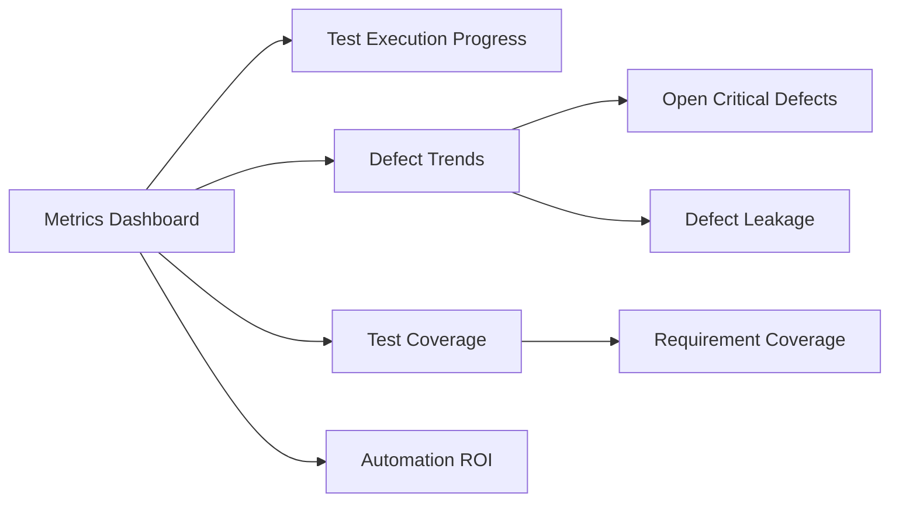

## Why Are Measurement Objectives Important?
- **Objectivity:** Quantify quality, effectiveness, and efficiency of testing processes.
- **Goal Setting:** Define and track clear, measurable testing targets.
- **Progress Tracking:** Monitor test coverage, defect trends, and productivity.
- **Process Improvement:** Reveal bottlenecks and guide optimization strategies.
- **Informed Decisions:** Provide actionable data for release readiness and risk assessment.
- **Stakeholder Communication:** Communicate project status and quality with evidence.

## Measurement Hierarchy

## Categories of Software Testing Metrics

| **Metric Category**                | **What It Measures**                                  | **Example**                     |
| ---------------------------------- | ----------------------------------------------------- | ------------------------------- |
| **Process Metrics**                | Efficiency and effectiveness of testing processes     | Test prep time, execution rate  |
| **Product Metrics**                | Software/application quality                          | Defect density, defect severity |
| **Project Metrics**                | Overall project health, cost, schedule, productivity  | Cost, schedule variance         |
| **Automation/Operational Metrics** | Automation ROI, execution speed, stability, flakiness | Automated coverage, run time    |
## Key Measurement Objectives with Examples

| **Objective**                         | **Metric Example**              | **Formula (if applicable)**                              | **Purpose**               |
| ------------------------------------- | ------------------------------- | -------------------------------------------------------- | ------------------------- |
| Assess test progress                  | Test Execution Rate             | (Executed/Planned Test Cases) ×100                       | Track completion/schedule |
| Measure test coverage                 | Test Coverage                   | (Covered Elements/Total Elements)×100                    | Assess thoroughness       |
| Assess product quality                | Defect Density                  | Defects/KLOC or Function Points                          | Reveal code quality       |
| Evaluate defect removal effectiveness | Defect Removal Efficiency (DRE) | (Defects found pre-release) / (Total defects found) ×100 | Test effectiveness        |
| Monitor automation value              | Automation Coverage             | (Automated Cases/Total Cases) ×100                       | Automation ROI            |
| Predict release readiness             | Test Pass Rate                  | (Passed/Executed Tests) ×100                             | Go/no-go release signal   |
| Track defect response                 | Defect Resolution Time          | Avg. time to resolve a defect                            | Process efficiency        |
## SMART Criteria for Measurement Objectives
Effective measurement objectives should be:
- **Specific:** Clearly state what is measured (e.g., "Increase test coverage from 70% to 85%").
- **Measurable:** Use quantifiable data (e.g., percentages, counts).
- **Achievable:** Set realistic targets.
- **Relevant:** Support project and business goals.
- **Time-bound:** Set deadlines (e.g., "by Q3 end").​

## Typical Measurement Process

## Examples of Popular Software Testing Metrics

| **Metric**                 | **Category**    | **Purpose/Insight**                         |
| -------------------------- | --------------- | ------------------------------------------- |
| Test Coverage              | Process/Product | Ensures requirements/code are well tested   |
| Defect Density             | Product         | Indicates code/component defect-proneness   |
| Defect Leakage             | Product/Project | Reveals missed defects (found post-release) |
| Defect Removal Efficiency  | Product/Process | Measures how well defects are removed       |
| Execution Rate             | Process         | Evaluates test progress vs. plan            |
| Test Automation Coverage   | Process         | Shows extent of test automation             |
| Mean Time to Detect (MTTD) | Project         | Average time to discover defects            |
| Mean Time to Repair (MTTR) | Project         | Average time to fix defects                 |
| Requirement Coverage       | Product         | Tracks alignment to business needs          |
## Visualizing Metrics: Example Dashboard Layout

## Takeaways & Best Practices
- Begin with **clear measurement objectives** tied to project and business value.
- Use a **balanced set of core metrics** (progress, quality, coverage, productivity, automation).
- **Visualize** metrics for actionable insights (e.g., dashboards, trend charts).
- Review and **refine objectives and metrics** regularly to reflect project evolution.
- Limit tracked metrics to those that **directly address your objectives** to avoid overload.
**Bottom line:** Measurement objectives translate business/testing goals into actionable, data-driven insights for software testing and quality assurance.