## 1. Attribute-Metric Mapping: Core Table

| **Attribute**           | **Description**                                      | **Corresponding Metrics**                                                                                             | **How It's Used**                      |
| ----------------------- | ---------------------------------------------------- | --------------------------------------------------------------------------------------------------------------------- | -------------------------------------- |
| **Test Effectiveness**  | Ability to find defects and confirm software quality | - Defect Detection Percentage (DDP)   - Test Pass/Fail Rate   - Defect Removal Efficiency (DRE)                 | Measures how well tests find issues    |
| **Test Coverage**       | Portion of requirements/code covered by tests        | - Requirements Coverage   - Code Coverage (statement, branch, path)   - Functional Coverage                     | Reveals thoroughness/gaps in testing   |
| **Test Efficiency**     | Productivity/efficiency of test process              | - Test Execution Rate   - Test Case Preparation Productivity   - Test Case Execution Productivity               | Optimizes process performance          |
| **Product Quality**     | Quality of the software produced                     | - Defect Density   - Defect Severity Index   - Customer Reported Defects   - Escaped Defects                 | Indicates code/component reliability   |
| **Defect Management**   | Capture, classification, and resolution of problems  | - Defect Density   - Defect Distribution   - Defect Aging   - Defect Leakage   - Defect Resolution Time   | Identifies risky modules & bottlenecks |
| **Testing Progress**    | Status and rate of testing activities                | - Test Execution Progress   - Test Completion Criteria/Exit Criteria   - Schedule Variance                      | Tracks and predicts project status     |
| **Test Automation ROI** | Value derived from test automation                   | - Automation Coverage   - Automation Efficiency   - Automation Script Effectiveness   - Automation Stability | Shows effectiveness of automation      |
| **Release Readiness**   | Readiness for release/production                     | - Defects Remaining   - Test Pass Rate   - Open Critical Bugs   - Regression Test Pass Rate                  | Decides go/no-go for release           |
## 2. Visual Guide: Attribute & Metrics Hierarchy (Mermaid)

```mermaid 
graph TD
  A[Software Quality Attributes]
  A --> B1[Test Effectiveness]
  A --> B2[Test Coverage]
  A --> B3[Test Efficiency]
  A --> B4[Product Quality]
  A --> B5[Defect Management]
  A --> B6[Testing Progress]
  A --> B7[Test Automation ROI]
  A --> B8[Release Readiness]

  B1 --> C1[Defect Detection %]
  B1 --> C2[Pass/Fail Rate]
  B1 --> C3[Defect Removal Efficiency]
  B2 --> C4[Coverage of Code/Req]
  B3 --> C5[Test Case Productivity]
  B3 --> C6[Test Cycle Time]
  B4 --> C7[Defect Density]
  B4 --> C8[Severity Index]
  B5 --> C9[Defect Leakage]
  B5 --> C10[Defect Aging]
  B6 --> C11[Test Execution Progress]
  B6 --> C12[Schedule Variance]
  B7 --> C13[Automation Coverage]
  B7 --> C14[Automation Script Effectiveness]
  B8 --> C15[Open Critical Bugs]
  B8 --> C16[Regression Pass Rate]
```

## 3. Expanded Table: Common Attributes and Sample Metric Formulas

|**Metric**|**Formula/Description**|**What Attribute It Measures**|
|---|---|---|
|**Defect Density**|Defects Found / KLOC (Thousands of Lines of Code)|Product Quality, Defect Management|
|**Defect Detection Percentage**|(Defects Found During Testing) / (Total Defects Found incl. after release) × 100|Test Effectiveness|
|**Test Coverage**|(Covered Code or Requirements / Total) × 100|Test Coverage|
|**Test Case Effectiveness**|(Defects Found by Test Cases) / (Total Defects Found) × 100|Test Effectiveness|
|**Test Execution Rate**|(Test Cases Executed / Planned) × 100|Test Efficiency, Testing Progress|
|**Defect Removal Efficiency (DRE)**|(Defects removed before release / Total Defects found) × 100|Test Effectiveness, Defect Management|
|**Test Automation Coverage**|(Automated Test Cases / Total Test Cases) × 100|Test Automation ROI|
|**Defect Aging**|Average time open for defects|Defect Management|
|**Regression Stability**|(Stable Regression Runs / Total Regression Runs) × 100|Release Readiness, Product Quality|
|**Schedule Variance**|(Actual Time - Estimated Time) / Estimated Time × 100|Testing Progress|

## 4. Example Dashboards & Visuals (Concept)

- **Progress Bar:** Showing Test Execution Rate over time
- **Pie/Doughnut Chart:** Requirement Coverage, Defect Severity proportions
- **Trend Line:** Defect Density trend by module/release
- **Stacked Bar Chart:** Test Automation Growth over iterations