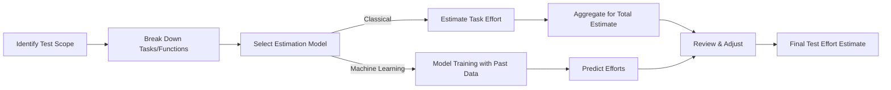

## 1. Overview of Estimation Models
- **Purpose:** Estimate time, resources, and cost for all testing activities (test design, execution, defect management, reporting, etc.).
- **Application:** Used during test planning, project proposals, and milestone setting.
## 2. Classical Estimation Models & Techniques

| Model / Technique              | Core Idea                                                | Typical Steps                                                                               | Strengths/Use Cases                                    |
| ------------------------------ | -------------------------------------------------------- | ------------------------------------------------------------------------------------------- | ------------------------------------------------------ |
| Work Breakdown Structure (WBS) | Break test efforts into granular, manageable tasks       | List tasks → Estimate each → Roll up for total                                              | Ensures no activity missed; best for detailed planning |
| Function Point Analysis (FPA)  | Estimate effort based on number/complexity of functions  | Identify functions (simple/medium/complex) → Assign points → Multiply by per-point estimate | Good for requirement-based projects                    |
| Three-Point Estimation         | Use best, worst, and most-likely case scenarios          | Get 3 estimates per task → Combine (see formula below)                                      | Accounts for uncertainty and variability               |
| Wideband Delphi                | Expert consensus via rounds of discussion and estimation | Experts estimate → Discuss → Revise → Average                                               | Leverages team experience, reduces bias                |
| Use-Case Point Method          | Effort based on the number and complexity of use cases   | Identify use cases → Assign points based on complexity → Aggregate                          | Good for user-story oriented projects                  |
| Percentage Distribution        | Allocate % of overall effort to testing phase            | Pick ratio (e.g., Testing = 30% of total dev effort)                                        | Simple, quick for rough planning                       |
| Ad-hoc/Experience-based        | Relies on individual or team's prior experience          | Estimator uses judgment and past project memory                                             | Fast, no formal process required                       |
## Key Formulas ​

## a) Function Point Analysis (FPA):
- **Total Effort = Total Functional Points × Estimate per Point**
- Assign small, medium, or large points to functionalities based on complexity.
## b) Three-Point Estimation:
- **Effort Estimate (E)** = (Best Case + 4 × Most Likely + Worst Case) / 6
- **Standard Deviation (SD)** = (Worst Case − Best Case) / 6
## 3. Modern: Machine Learning–Based Estimation

| ML Technique                 | How it Works                                                 | Tools / Notes                 |
| ---------------------------- | ------------------------------------------------------------ | ----------------------------- |
| K-Nearest Neighbor (KNN)     | Predicts based on the most similar past projects             | Python (sklearn, pandas)      |
| Support Vector Regression    | Regression model for effort prediction based on key features | Python (sklearn, SVR)         |
| Multilayer Perceptron (MLP)  | Neural networks learn complex relationships                  | TensorFlow, Keras             |
| Decision Trees               | Tree-like model chooses best splits for estimating effort    | scikit-learn, XGBoost         |
| Ensembles (bagging/boosting) | Combine several ML models for higher accuracy                | VotingRegressor, RandomForest |

| Aspect        | Classical (WBS, FPA, Delphi)         | ML-based Estimation                      |
| ------------- | ------------------------------------ | ---------------------------------------- |
| Data Required | Current project specs, expert input  | Large historical dataset                 |
| Flexibility   | Good for small/medium/new projects   | High for big/complex orgs                |
| Accuracy      | Moderate, improves with expert skill | High if data is relevant/clean           |
| Speed         | Faster for small/short-term efforts  | Fast prediction, slow to set up          |
| Transparency  | Easily explainable estimates         | Can be a black box                       |
| Tooling       | Spreadsheets, estimation meetings    | Python (sklearn, pandas, XGBoost, Keras) |

## 4. Best Practices for Accurate Estimation

- **Always break work down:** More granular tasks lead to better estimates.
- **Use multiple techniques:** Cross-check results using two or more models.
- **Leverage historical data:** Refer to past projects for benchmarks, or use ML if feasible.
- **Account for risks:** Add buffers for uncertainty.
- **Regularly update:** Refine estimates as more info emerges during the project.
## 5. Quick Reference Table: When to Use Which Model

| Project Setting                | Recommended Model       |
| ------------------------------ | ----------------------- |
| Many unknowns, new tech        | Wideband Delphi         |
| Repetitive, requirements-based | Function Point Analysis |
| Complex features, big org data | ML / Ensemble Models    |
| Small team, short project      | Ad-Hoc/Experience-based |
| Clear use-case structure       | Use-Case Estimation     |
