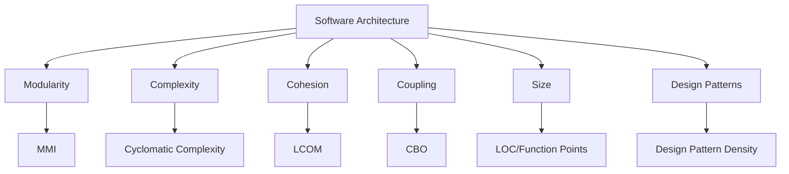

## 1. Why Measure Architecture?
- Early detection of architectural issues reduces future rework and cost.
- Quantifiable feedback supports design decisions, trade-offs, and ongoing improvements.
- Metrics make architectural qualities visible and comparable across sprints or releases.

## 2. Key Attributes & Corresponding Metrics

|Attribute|Corresponding Metrics|Description/Formula|Interpretation/Impact|
|---|---|---|---|
|Modularity|Modularity Maturity Index (MMI)|Composite index of modular qualities|High MMI → Easier maintenance|
|Cohesion|LCOM (Lack of Cohesion in Methods), Functional Cohesion|Degree of relatedness within a module|High cohesion → Reliable module behavior|
|Coupling|Coupling Between Objects (CBO), Afferent/Efferent Coupling|Degree of interdependence between modules|Low coupling → Lower ripple effect risk|
|Complexity|Cyclomatic Complexity (CC), Weighted Methods per Class (WMC)|Number of independent code paths|High complexity → Harder to test/maintain|
|Size|Component/Module Size (LOC, Function Points)|Module/component size in code statements/functions|Very large size → Refactoring needed|
|Design Pattern Density|% of architecture with implemented patterns|Ratio of classes using design patterns|High density → Mature, scalable architecture|
|Changeability|Change Failure Rate, Lead Time for Changes|% of changes causing failures; time to deploy|Lower rates → Safer, more maintainable|
|Scalability|Throughput, Response Time, Service Granularity|Ability to add/remove resources efficiently|Higher scalability → Supports growth|
|Maintainability|Defect Density, Defect Leakage, Technical Debt|Defects per size, missed defects post-release|High maintainability → Fewer bugs/faster fixes|
|Testability|Test Coverage, Integration Coverage|% code/components covered by tests|High coverage → Easier to validate changes|
## 3. Diagram: Relationships Among Architectural Metrics

## 4. Interpreting Architectural Metrics: Table

| Metric Name             | Good Value             | Bad Value            | What to Watch For                   |
| ----------------------- | ---------------------- | -------------------- | ----------------------------------- |
| Coupling (CBO, A/E)     | < 5                    | > 10                 | Ripple effect, refactoring cost     |
| Cohesion (LCOM)         | ~0–2                   | > 4                  | Unrelated functions in same module  |
| Cyclomatic Complexity   | < 10                   | > 15                 | Hard to test/maintain, bugs         |
| Size (LOC, FP per comp) | < 300 LOC/component    | > 1000 LOC/component | Large, unreadable, hard to refactor |
| Pattern Density         | 30–50% (frameworks)    | < 10%                | Few reusable, extensible elements   |
| Technical Debt          | < 10% development time | > 30%                | Costs of fixing architectural flaws |
| Lead Time for Change    | < 1 week               | > 2 weeks            | Delays in feature delivery          |
## 5. Visual Flow: Using Metrics for Early Risk Detection

## 6. Best Practices for Applying Architectural Metrics in QA
- Use multiple metrics for triangulation: No single metric tells the full quality story.
- Track metrics over time (per sprint/release) for trend analysis.​
- Automate data collection using tools: e.g., SonarQube, Google Lighthouse, Prometheus, Datadog.
- Balance architectural metrics with outcome metrics: e.g., defect rates, crash rates, recovery times.    
- Peer reviews and architectural documentation support metric credibility.