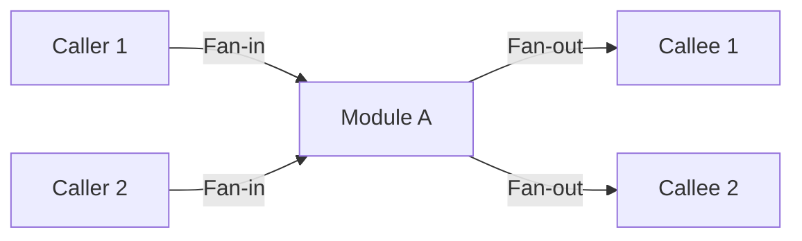
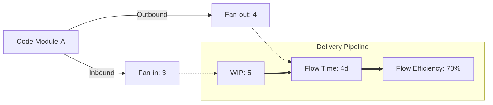

## 1. Core Concepts

- Purpose: To measure how information is received, transformed, and output by components or processes.
- Relevance: High flows and intricate connections can increase system complexity, introduce risks, and drive up testing and maintenance costs.​
- Types:
    - Code/module-level IF Metrics: Based on internal data flow between software modules or procedures (e.g., Henry and Kafura's Metric).
    - Process/delivery Flow Metrics: Track how efficiently work moves through stages, as used in DevOps and modern software delivery.​
## 2. Classical Information Flow Metrics (Henry & Kafura, Others)

## Key Terms:
- Fan-in: Number of local flows into a module (other modules or data structures from which it gathers info).
- Fan-out: Number of local flows that leave a module (modules or structures it affects/updates).    
## Main Metric – Information Flow Complexity
- Henry and Kafura's Metric:

$$
IF(A) = (\text{Fan-in}(A) \times \text{Fan-out}(A))^2
$$

- Interpretation:
    - High values indicate modules with heavy communication both in and out—potential hotspots for defects and maintenance issues.
    - Used to identify procedures that are stress points or bottlenecks and may be targets for refactoring or in-depth testing.​
## Variants and Related Metrics

|Metric|Formula/Description|What it Indicates|
|---|---|---|
|Fan-in|Calls received + data inputs (by ref/var) + globals read|How much module depends on external info|
|Fan-out|Calls made + data outputs + globals written|Module's impact on others|
|IFIO|IFIN × IFOUT (see [aivosto](https://www.aivosto.com/project/help/pm-proc-infoflow.html)​)|Predicts implementation effort|
|IC1|Incorporates control flow & info flow for complexity|Overall procedure complexity|

## 3. Modern Flow Metrics in Software Delivery/DevOps

| Metric Name       | What it Measures                                    | Typical Formula/Unit       | Why it Matters                         |
| ----------------- | --------------------------------------------------- | -------------------------- | -------------------------------------- |
| Flow Time         | Elapsed time from work start to finish              | Duration (days/hours)      | Indicates time-to-market (value speed) |
| Flow Velocity     | Amount delivered in an interval                     | Features/defects per wk/mo | Gauges throughput                      |
| Flow Efficiency   | % active work vs. total flow time                   | (Active/Total Time) × 100  | Reveals bottlenecks, process waste     |
| Flow Load         | Number of concurrent work items                     | Count (WIP)                | Helps avoid overload/bottlenecks       |
| Flow Distribution | Types of work delivered (features, bugs, tech debt) | % by category              | Ensures resource balance               |

---

## 4. How to Use IF Metrics in QA and Testing

| Use Case                           | Module/Code Level      | DevOps/Lifecycle Level     |
| ---------------------------------- | ---------------------- | -------------------------- |
| Identify complexity hot spots      | High IF(A) score       | Low Flow Efficiency        |
| Predict maintenance/testing effort | High IFIO              | High Flow Time/Load        |
| Optimize communication patterns    | Lowered Fan-in/out     | Improved Flow Efficiency   |
| Set testing priorities             | Target high IF modules | Focus on bottleneck stages |

- QA teams use these metrics to focus on testing complex/high-risk modules and to streamline the software delivery process.
- Combining code-level and flow metrics provides holistic visibility—from code-module health to value stream performance.

---

## 5. Visualization: Comparing IF Metrics & Flow Metrics

## 6. Best Practices
- Monitor both code-level and process-level IF metrics for quality and efficiency.
- Use high IF or low flow efficiency to trigger reviews and testing focus.
- Track IF metrics with trends—don’t rely on a single point-in-time measurement.
- Use tools (e.g., SonarQube for code, Propelo SEI/Flow Framework for delivery metrics) to automate tracking.

## 7. Summary Table: Key Information Flow Metrics

|Metric|Level|What It Reveals|
|---|---|---|
|Henry-Kafura IF(A)|Code/module|Structural complexity, test targets|
|Fan-in, Fan-out|Code/module|Dependence and impact; redesign triggers|
|IFIO|Code/module|Expected implementation effort|
|Flow Time|Delivery|Value stream speed, process friction|
|Flow Efficiency|Delivery|Process waste/bottleneck detection|
|Flow Load/Velocity|Delivery|Work in progress, project throughput|

