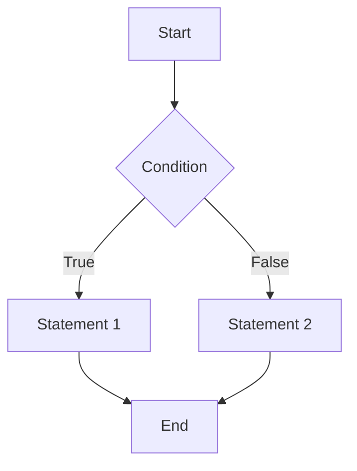
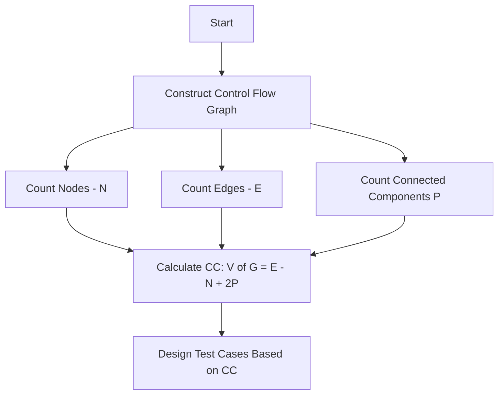

## 1. What Is Cyclomatic Complexity?
- It measures the number of linearly independent paths in a program’s control flow graph (CFG).
- Represents distinct paths that need at least one test case each for complete path coverage.
- Indicates program complexity: higher values signal more complex, error-prone, and harder-to-maintain code.
- Applies at various granularities: functions, modules, methods, classes, or entire programs.
## 2. Control Flow Graph (CFG)
- A directed graph representing the flow of a program:
    - **Nodes:** Individual program statements or groups without branches.
    - **Edges:** Transfer of control between nodes.

Example CFG:

## 3. Mathematical Formulas to Calculate Cyclomatic Complexity

| Formula                   | Description                                                                         |
| ------------------------- | ----------------------------------------------------------------------------------- |
| 1. V(G)=E−N+2PV(G)=E−N+2P | EE: number of edges, NN: number of nodes, PP: number of connected components in CFG |
| 2. V(G)=P+1V(G)=P+1       | PP: number of predicate (decision) nodes in the CFG                                 |
| 3. V(G)=R+1V(G)=R+1       | RR: number of regions formed by edges on the plane                                  |

Where usually P=1P=1 for a connected graph.

## 4. Step-by-Step Calculation Example

Given a program with 7 nodes and 8 edges, and a single connected component P=1P=1:

- V(G)= E−N+2P = 8−7+2(1) = 3V(G) = E−N+2P = 8−7+2(1) = 3
- Interpretation: at least 3 test cases are needed to cover all independent paths.

## 5. Interpretation and Importance

|Cyclomatic Complexity Value|Meaning & Recommended Action|
|---|---|
|1 - 10|Simple, well-structured code. Testability is high; test effort low.|
|10 - 20|Moderate complexity. Testing and maintenance effort medium.|
|20 - 40|Complex code with potential problems; refactoring recommended.|
|> 40|Very complex, error-prone, and hard to maintain or test. Needs major redesign.|

- High CC often correlates with defects and maintenance difficulties.
- Helps prioritize testing (more tests on complex modules).
- Provides a risk metric for code modification and regression scope.

## 6. Applications in Software Testing and QA
- **Test Case Design:** Minimum number of test cases = cyclomatic complexity (basis path testing).
- **Risk Assessment:** Identify high-risk modules requiring more thorough testing.
- **Code Maintainability:** Guide refactoring decisions to simplify code.
- **Testability Measurement:** High CC modules are harder to test and may need additional automation.
## 7. Tools for Measuring Cyclomatic Complexity
- **Static analysis tools** with integrated calculators (e.g., SonarQube, Visual Studio Code Metrics, PMD, Checkstyle).
- IDE plugins provide instant feedback during development.

