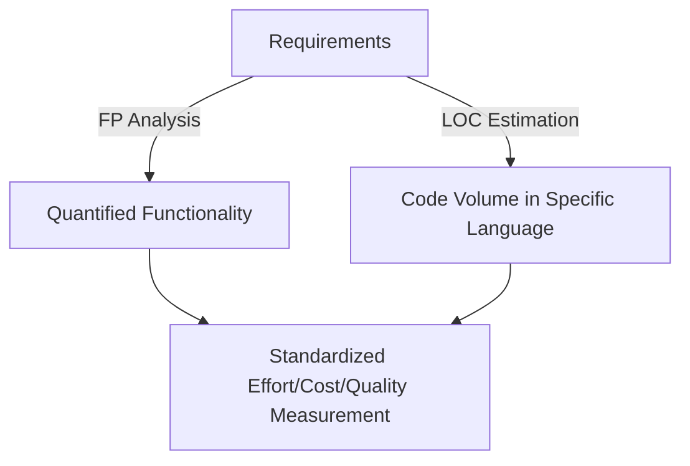

## 1. What Are Function Points?
- Definition: A function point (FP) is a unit representing the amount of business functionality an information system delivers to a user.​
- Origins: Developed by Allan Albrecht (IBM, 1979), refine by the International Function Point Users Group (IFPUG) for practical use.​
- Why Use FP?
    - Overcomes the limitations of code-based metrics (LOC).
    - Estimation from requirements/specification—supports early, user-centric predictions.​
    - Enables effort, cost, and productivity comparisons across languages and platforms.
## 2. Function Point Analysis Process

| Step                                  | Description                                                           |
| ------------------------------------- | --------------------------------------------------------------------- |
| 1. Identify functional components     | Categorize inputs, outputs, inquiries, files, and external interfaces |
| 2. Assign weights                     | Each component is weighted based on complexity (low, medium, high)    |
| 3. Calculate Unadjusted FP (UFP)      | Sum weighted counts for all components                                |
| 4. Complexity Adjustment Factor (CAF) | Assign scores (0–5) to 14 system characteristics, then compute CAF    |
| 5. Final FP calculation               | FP = UFP × CAF                                                        |
## Table: Functional Component Weighting

| Component                      | Low | Medium | High |
| ------------------------------ | --- | ------ | ---- |
| External Inputs (EI)           | 3   | 4      | 6    |
| External Outputs (EO)          | 4   | 5      | 7    |
| External Inquiries (EQ)        | 3   | 4      | 6    |
| Internal Logical Files (ILF)   | 7   | 10     | 15   |
| External Interface Files (EIF) | 5   | 7      | 10   |
## Complexity Adjustment Factor (CAF)
CAF reflects system characteristics (e.g., reliability, data communications, distributed processing, performance, usability, complexity, reusability, conversion/install, multiple installations, change facilitation).
- Rate each factor from 0 (no influence) to 5 (essential).
- Sum (F) = total adjustment score.
- **Calculate CAF:**  $$ CAF=0.65+(0.01×F)CAF = 0.65 + (0.01 \times F)CAF=0.65+(0.01×F) $$
- **Final Function Points:**  $$ FP=UFP×CAFFP = UFP \times CAFFP=UFP×CAF $$
## 3. Worked Example
Given:
- 50 user inputs (average complexity)
- 40 outputs (average)
- 35 inquiries (average)
- 6 logical files (average)
- 4 external interfaces (average)
- CAF (average): each factor rated 3, so F = 14 × 3 = 42
Step 1: UFP Calculation $$ UFP = (50 \times 4) + (40 \times 5) + (35 \times 4) + (6 \times 10) + (4 \times 7) = 628 $$Step 2: CAF Calculation $$ CAF = 0.65 + (0.01 \times 42) = 1.07 $$
Step 3: FP Calculation $$ FP = UFP \times CAF = 628 \times 1.07 = 671.96 $$

## 4. Mermaid Diagram: Function Point Analysis Workflow

## 5. Applications in Testing and QA
- Effort and Cost Estimation: FP-based estimates support test planning and resource allocation.
- Comparing Productivity: FP provides a standard unit for productivity metrics across teams and technologies.
- Defect Density: Used in metrics such as defects per FP for quality benchmarking.
- Test Coverage Planning: Ensuring all functional points have dedicated test cases.    
## 6. Advantages over LOC-Based Metrics
- User-centric: Measures delivered business value, not code volume.
- Language-independent: Useful for cross-platform and multi-language systems.
- Early and objective: Can be applied at the requirements phase.
## 7. Visual Summary: FP vs LOC Metrics

